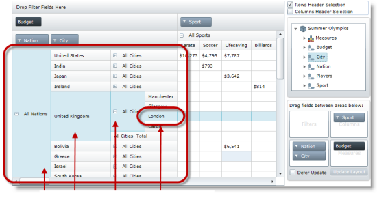

////
|metadata|
{
    "name": "xampivotgrid-row-header-highlighting",
    "controlName": ["xamPivotGrid"],
    "tags": ["Grids","How Do I","Layouts","Styling","Templating"],
    "guid": "22304253-97f9-4cc6-9811-42617c165b04",
    "buildFlags": [],
    "createdOn": "2016-05-25T18:21:58.2453283Z"
}
|metadata|
////

= Row Header Highlighting (xamPivotGrid)

== Topic Overview

=== Purpose

Introduces the  _xamPivotGrid_™ control’s Row Header Highlighting feature.

=== Required background

Prerequisite materials to understand this topic.

[options="header", cols="a,a"]
|====
|Topic|Purpose

| link:xampivotgrid.html[xamPivotGrid]
|An overview of the _xamPivotGrid_ control.

|====

=== In this topic

* <<_Ref320692146,Introduction>>

** <<_Ref320692156,Row Header Highlighting Summary>>

* <<_Ref320692166,Enabling Row Header Highlighting>>

** <<_Ref320692175,Property settings>>
** <<_Ref320692182,Code>>

* <<_Ref320692189,Configuring Row Selection with Row Header Highlighting>>

** <<_Ref320692197,Description>>
** <<_Ref320692204,Code>>

* <<_Ref320692212,Related Content>>

[[_Ref320692146]]
== Introduction

[[_Ref320692156]]
=== Row Header Highlighting Summary

Row Header Highlighting is an optional feature that enables the user to highlight a grid’s row header along with the entire row’s data cells when selected. This is an option of the row selection feature of the _xamPivotGrid_.

The benefit of highlighting the row header cell together with the rest of the selected row is that it enhances the visual impact of the displayed data by emphasizing existing groupings and hierarchies in the grid. The following screen shot illustrates just how effective highlighting can be in drawing attention to the cell value and how it relates to the data hierarchy in which it resides.

The Row Header Highlighting option can be toggled between disabled, its default state, and enabled by setting the  _xamPivotGrid_ control’s link:{ApiPlatform}controls.grids.xampivotgrid.v{ProductVersion}~infragistics.controls.grids.pivotselectionsettings~allowrowheaderselection.html[AllowRowHeaderSelection] property.

[[_Ref320692166]]
== Enabling Row Header Highlighting

[[_Ref320692175]]
=== Property settings

To highlight a row header once it is selected set link:{ApiPlatform}controls.grids.xampivotgrid.v{ProductVersion}~infragistics.controls.grids.pivotselectionsettings~allowrowheaderselection.html[AllowRowHeaderSelection] to _True_.

[options="header", cols="a,a"]
|====
|Use this property:
|And set it to:

| link:{ApiPlatform}controls.grids.xampivotgrid.v{ProductVersion}~infragistics.controls.grids.pivotselectionsettings~allowrowheaderselection.html[AllowRowHeaderSelection]
|`True`

|====

[[_Ref320692182]]
=== Code

*In XAML:*
[source,xaml]
----
AllowRowHeaderSelection="True"
----

*In C#:*
[source,csharp]
----
this.pivotGrid.SelectionSettings.AllowRowHeaderSelection = true;
----

*In Visual Basic:*
[source,vb]
----
Me.pivotGrid.SelectionSettings.AllowRowHeaderSelection = True
----

[[_Ref320692189]]
== Configuring Row Selection with Row Header Highlighting

[[_Ref320692197]]
=== Description

To enable the user to highlight the row header along with the rest of the row by selecting it, you will have to add the `AllowRowHeaderSelection="True"` declaration to the `ig:PivotSelectionSettings` object.

[[_Ref320692204]]
=== Code

*In XAML:*
[source,xaml]
----
<ig:XamPivotGrid 
    x:Name="pivotGrid" DataSource="{Binding DataSource}">
    <ig:XamPivotGrid.SelectionSettings>
        <ig:PivotSelectionSettings 
            AllowRowHeaderSelection="True"
            CellSelection="Single"
            CellSelectionAction="SelectRow"
            RowSelection="Single" />
    </ig:XamPivotGrid.SelectionSettings>
</ig:XamPivotGrid>
----

*In C#:*
[source,csharp]
----
this.pivotGrid.SelectionSettings.AllowRowHeaderSelection = true;
this.pivotGrid.SelectionSettings.CellSelection = Infragistics.Controls.Grids.PivotSelectionType.Single;
this.pivotGrid.SelectionSettings.CellSelectionAction = Infragistics.Controls.Grids.PivotCellSelectionAction.SelectRow;
this.pivotGrid.SelectionSettings.RowSelection = Infragistics.Controls.Grids.PivotSelectionType.Single;
----

*In Visual Basic:*
[source,vb]
----
Me.pivotGrid.SelectionSettings.AllowRowHeaderSelection = True
Me.pivotGrid.SelectionSettings.CellSelection = Infragistics.Controls.Grids.PivotSelectionType.[Single]
Me.pivotGrid.SelectionSettings.CellSelectionAction = Infragistics.Controls.Grids.PivotCellSelectionAction.SelectRow
Me.pivotGrid.SelectionSettings.RowSelection = Infragistics.Controls.Grids.PivotSelectionType.[Single]
----

[[_Ref320692212]]
== Related Content

=== Topics

The following topics provide additional information related to this topic.

[options="header", cols="a,a"]
|====
|Topic|Purpose

| link:xampivotgrid-understanding-xampivotgrid.html[xamPivotGrid Overview]
|This section serves as an introduction to the _xamPivotGrid_ control's key features and functionalities. The topics listed here will give you a better idea of why you would want to use the _xamPivotGrid_ control in your applications.

|====