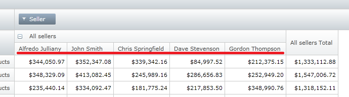

////
|metadata|
{
    "name": "xampivotgrid-sorting-rows-and-columns",
    "controlName": ["xamPivotGrid"],
    "tags": ["Extending","Grids","Sorting"],
    "guid": "61088192-227e-4b47-aa03-4cfa95dca76a",
    "buildFlags": [],
    "createdOn": "2016-05-25T18:21:58.0343177Z"
}
|metadata|
////

= Sorting Rows and Columns with FlatDataSource

When using FlatDataSource, the XamPivotGrid™ provides the capability for the user to sort the order in which the columns and rows appear. This topic explains this functionality of the FlatDataSource. For XmlaDataSource, the order of the level members is determined by the OLAP server.

== Implementing Custom Sort Logic

To create custom sort logic for each hierarchy, using the FlatDataSource component. This can be achieved by providing OrderByKeyExpression in each HierarchyLevelDescriptor that you want to modify. A notable example would be modifying the sort order of cells containing full names (first name + last name) so that the cells are sorted by the last names and not by the first names (default).

The following screenshot demonstrates how to name columns in the Seller grid are arranged by last name.

This can be implemented with the following code snippet:

*In C#:*
[source,csharp]
----
HierarchyDescriptor<Sale> sellerHierarchy =
    new HierarchyDescriptor<Sale>(p => p.Seller);
sellerHierarchy.AddLevel(p => "All sellers", "All sellers");
sellerHierarchy.AddLevel(p => p.Seller.Name, "Individual seller");
char[] separators = {' '};
Expression<Func<Sale, String>> expression = 
    sale => sale.Seller.Name.Split(separators)[1];
sellerHierarchy.LevelDescriptors[1].OrderByKeyExpression = expression;
this.AddHierarchyDescriptor(sellerHierarchy);
----

*In Visual Basic:*
[source,vb]
----
Dim sellerHierarchy As _
    New HierarchyDescriptor(Of Sale)(Function(p) p.Seller)
sellerHierarchy.AddLevel(Function(p) "All sellers", "All sellers")
sellerHierarchy.AddLevel(Function(p) p.Seller.Name, "Individual seller")
Dim separators As Char() = {" "c}
Dim expression As _
    Expression(Of Func(Of Sale, [String])) = _
        Function(sale) sale.Seller.Name.Split(separators)(1)
sellerHierarchy.LevelDescriptors(1).OrderByKeyExpression = expression
Me.AddHierarchyDescriptor(sellerHierarchy)
----

The snippet defines a hierarchy descriptor for the Seller property in the Sale class. The property's type is String and all values are names (two word strings separated by a space – e.g. "John Smith"). In the second and third rows each level of the hierarchy is defined. Then the next two lines define a lambda expression that will be used to evaluate the order. Func gives the types of the left and right sides of => operator. _sale_ is of type Sale and  _sale.Seller.Name.Split(separators)[1]_ is of type String. The right part is what gets sorted. So each name of seller is split in two with separator space and the second name (Last name) is used for sorting.

*Related Topic*

link:xampivotgrid-us-sorting-data.html[Sorting Data]