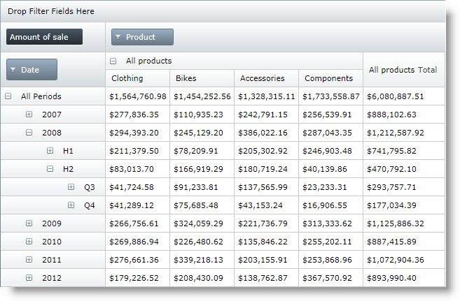
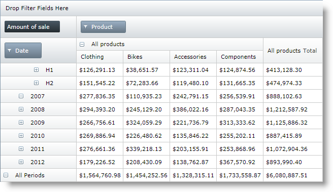

////
|metadata|
{
    "name": "xampivotgrid-super-compact-layout",
    "controlName": ["xamPivotGrid"],
    "tags": ["Drilldown","Grids","How Do I","Layouts","Templating"],
    "guid": "b60da199-8098-46ad-84a5-04379c1e468f",
    "buildFlags": [],
    "createdOn": "2016-05-25T18:21:58.2762927Z"
}
|metadata|
////

= Super-Compact Layout (xamPivotGrid)

== Topic Overview

=== Purpose

This topic introduces the Super-Compact layout feature of the  _xamPivotGrid_™ and explains, with code examples, how to configure it.

=== Required background

The following topics are prerequisites to understanding this topic:

[options="header", cols="a,a"]
|====
|Topic|Purpose

| link:xampivotgrid-understanding-xampivotgrid.html[xamPivotGrid Overview]
|This topic is an introduction to the _xamPivotGrid_ control's key features and functionalities.

| link:xampivotgrid-getting-started-with-xampivotgrid.html[Getting Started with xamPivotGrid]
|This topic demonstrates how to get started with the _xamPivotGrid_ control by providing step-by-step procedure for adding this control to a {PlatformName} application.

|====

=== In this topic

This topic contains the following sections:

* <<_Ref333573827,Introduction>>
* <<_Ref333573834,Enabling the Super-Compact Layout>>

** <<_Ref333573838,Overview>>
** <<_Ref333573841,Super-Compact Layout Configuration Summary>>
** <<_Ref330295239,Super-Compact layout configuration summary chart>>
** <<_Ref330295257,Property settings>>
** <<_Ref330295911,Example – parent above children>>
** <<_Ref333573862,Example – parent beneath children>>

* <<_Ref330295269,Code Example: Super-Compact Layout>>

** <<_Ref333573868,Description>>
** <<_Ref333573871,Code>>

* <<_Ref330295289,Related Content>>

** <<_Ref330295295,Topics>>
** <<_Ref330295299,Samples>>

[[_Ref333573827]]
[[_Ref330295234]]
== Introduction

[[_Ref333573832]]

=== Super-Compact layout summary

The Super-Compact layout of the pivot grid is an alternative layout of the  _xamPivotGrid_   control designed for saving horizontal space. Instead of showing each child level of the row hierarchy in header cells placed *on the right* of their parent header cell (as with the Standard layout), the child-level header cells are placed either *beneath* *or above* it. In order to differentiate different levels of the hierarchy, each of them outset to the right by a specified distance.

The link:xampivotgrid-us-compact-layout.html[Compact layout] is another option similar to the Super-Compact layout. It also displays row header cells as nodes to minimize the horizontal space that they occupy, leaving just the expand/collapse toggles in front of child-cells. With the Compact layout however you have no control over the indentation of child-cells as you have with the Super-Compact layout. So the Super-Compact layout provides you with more options when saving horizontal space is essential and additionally allows you to visually emphasize on the tree-like structure of the row hierarchies.

[cols="a"]
|====
|[[_Hlk333591570]] *Standard layout* 

|image::images/xamPivotGrid_Super-Compact_Layout_01.png[]

|*Compact Layout (children above parents)*

|image::images/xamPivotGrid_Super-Compact_Layout_02.png[]

|*Super-Compact Layout (children beneath parents)*

|image::images/xamPivotGrid_Super-Compact_Layout_03.png[]

|====

By default, the  _xamPivotGrid_   is instantiated with its Normal layout so you need to explicitly enable the Super-Compact layout if you want to use it.

Like with all layouts, you can specify whether parent nodes to be displayed above or beneath their child nodes and set the horizontal indent for the levels.

[[_Ref333573834]]
== Enabling the Super-Compact Layout

[[_Ref333573838]]

=== Overview

Enabling the Super-Compact layout is done by setting the link:{ApiPlatform}controls.grids.xampivotgrid.v{ProductVersion}~infragistics.controls.grids.xampivotgrid~allowsupercompactlayout.html[AllowSuperCompactLayout] property of the  _xamPivotGrid_   to  _True_  . Additional configurations can be done as explained in <<_Ref333591732,Super-Compact Layout Configuration Summary>>.

[[_Ref333573841]]
[[_Ref333591732]]
== Super-Compact Layout Configuration Summary

[[_Ref330295239]]

=== Super-Compact layout configuration summary chart

The following table lists the configurable aspects of the  _xamPivotGrid_   control regarding the super-compact layout.

[options="header", cols="a,a,a"]
|====
|Configurable aspect|Details|Properties

|The indent of the child-header cells
|The indentation of the row header cells in a level is configurable.
|
* link:{ApiPlatform}controls.grids.xampivotgrid.v{ProductVersion}~infragistics.controls.grids.xampivotgrid~supercompactlayoutindent.html[SuperCompactLayoutIndent] 

|Parent node placement
|Parent cells can be displayed above or beneath their children.
|
* link:{ApiPlatform}controls.grids.xampivotgrid.v{ProductVersion}~infragistics.controls.grids.xampivotgrid~parentinfrontforrows.html[ParentInFrontForRows] 

*Other related properties:*

* link:{ApiPlatform}controls.grids.xampivotgrid.v{ProductVersion}~infragistics.controls.grids.xampivotgrid~parentinfrontforcolumns.html[ParentInFrontForColumns] 

|====

.Note:
[NOTE]
====
Setting link:{ApiPlatform}controls.grids.xampivotgrid.v{ProductVersion}~infragistics.controls.grids.xampivotgrid~allowsupercompactlayout.html[AllowSuperCompactLayout] to  _True_   will set the link:{ApiPlatform}controls.grids.xampivotgrid.v{ProductVersion}~infragistics.controls.grids.xampivotgrid~allowcompactlayout.html[AllowCompactLayout] (enabling the  _Compact layout_  ) to  _False_   and, if the Compact layout has been used prior to setting this property to  _True,_   the Compact layout will be disabled.
====

[[_Ref330295251]]

[[_Ref330295257]]

=== Property settings

The following table maps the desired configuration to property settings.

[options="header", cols="a,a,a"]
|====
|In order to:|Use this property:|And set it to:

|Enable the Super-Compact layout
| link:{ApiPlatform}controls.grids.xampivotgrid.v{ProductVersion}~infragistics.controls.grids.xampivotgrid~allowsupercompactlayout.html[AllowSuperCompactLayout]
|`True`

|Set the indent for child levels
| link:{ApiPlatform}controls.grids.xampivotgrid.v{ProductVersion}~infragistics.controls.grids.xampivotgrid~supercompactlayoutindent.html[SuperCompactLayoutIndent]
|An integer number of your choice. (Negative numbers are treated as _0_ .)

|Show parents above of children
| link:{ApiPlatform}controls.grids.xampivotgrid.v{ProductVersion}~infragistics.controls.grids.xampivotgrid~parentinfrontforrows.html[ParentInFrontForRows]
|`True`

|====

[[_Ref330295261]]

=== Example – parent above children

The screenshot below demonstrates how the  _xamPivotGrid_   looks as a result of the following settings:

[options="header", cols="a,a"]
|====
|Property|Value

| link:{ApiPlatform}controls.grids.xampivotgrid.v{ProductVersion}~infragistics.controls.grids.xampivotgrid~allowsupercompactlayout.html[AllowSuperCompactLayout]
|`True`

| link:{ApiPlatform}controls.grids.xampivotgrid.v{ProductVersion}~infragistics.controls.grids.xampivotgrid~supercompactlayoutindent.html[SuperCompactLayoutIndent]
|30

| link:{ApiPlatform}controls.grids.xampivotgrid.v{ProductVersion}~infragistics.controls.grids.xampivotgrid~parentinfrontforrows.html[ParentInFrontForRows]
|`True`

|====

[[_Ref330295263]]

=== Example – parent beneath children

The screenshot below demonstrates how the  _xamPivotGrid_   looks as a result of the following settings:

[options="header", cols="a,a"]
|====
|Property|Value

| link:{ApiPlatform}controls.grids.xampivotgrid.v{ProductVersion}~infragistics.controls.grids.xampivotgrid~allowsupercompactlayout.html[AllowSuperCompactLayout]
|`True`

| link:{ApiPlatform}controls.grids.xampivotgrid.v{ProductVersion}~infragistics.controls.grids.xampivotgrid~supercompactlayoutindent.html[SuperCompactLayoutIndent]
|30

| link:{ApiPlatform}controls.grids.xampivotgrid.v{ProductVersion}~infragistics.controls.grids.xampivotgrid~parentinfrontforrows.html[ParentInFrontForRows]
|`False`

|====

[[_Ref330295269]]
== Code Example: Super-Compact Layout with Parents Above Children and 30 Pixels Identation

[[_Ref333573868]]

=== Description

The code example below demonstrates how to enable the Super-Compact layout feature of the  _xamPivotGrid_   and configure it to display parent row header cells above their children with an indentation of 30 pixels.

[[_Ref333573871]]

=== Code

*In XAML:*

[source,xaml]
----
Code
<ig:XamPivotGrid x:Name="pivotGrid"
                         DataSource="{StaticResource DataSource}"
                         AllowSuperCompactLayout="True"
                         SuperCompactLayoutIndent="30"
                         ParentInFrontForColumns="
                         ParentInFrontForRows="True"/>
----

[[_Ref330295289]]
== Related Content

[[_Ref330295295]]

=== Topics

The following topics provide additional information related to this topic.

[options="header", cols="a,a"]
|====
|Topic|Purpose

| link:xampivotgrid-us-compact-layout.html[Compact Layout]
|This topic explains the Compact Layout feature of the _xamPivotGrid_ .

| link:xampivotgrid-customizing-cells-with-templates.html[Customizing Cells with Templates]
|This topic explains how to create custom templates for data and header cells of the _xamPivotGrid_ .

| link:xampivotgrid-us-conditional-formating.html[Conditional Formating]
|This topic explains how to do conditional (value-based) formatting in the _xamPivotGrid_ control and provides a code example.

| link:xampivotgrid-us-column-resizing.html[Column Resizing]
|This topic explains how to allow the user to change the width of the columns of the _xamPivotGrid_ and how to customize the resizing behavior

|====

[[_Ref330295299]]

=== Samples

The following samples provide additional information related to this topic.

[options="header", cols="a,a"]
|====
|Sample|Purpose

|
ifdef::sl[] 

link:{SamplesURL}/pivot-grid/#/compact-and-super-compact-layout[Compact and Super-Compact Layout] 

endif::sl[] 

ifdef::wpf[] 

link:{SamplesURL}/pivot-grid/compact-and-super-compact-layout[Compact and Super-Compact Layout] 

endif::wpf[]
|This sample demonstrates the Super-Compact layout feature of the xamPivotGrid that enables you to visualize row hierarchies in a tree-like view.

|====