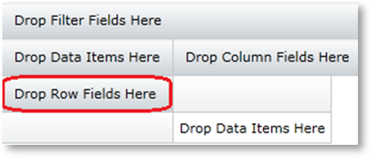
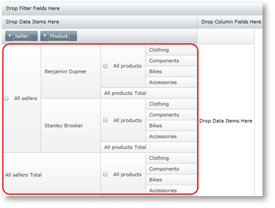
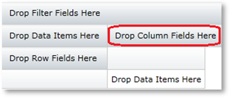
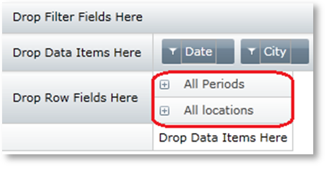
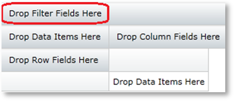
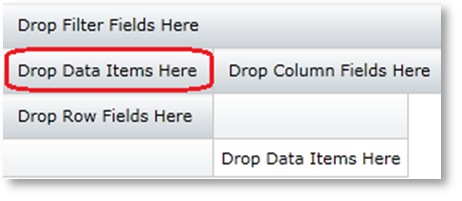
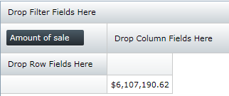
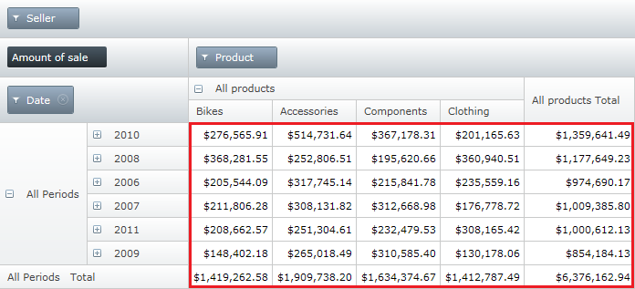
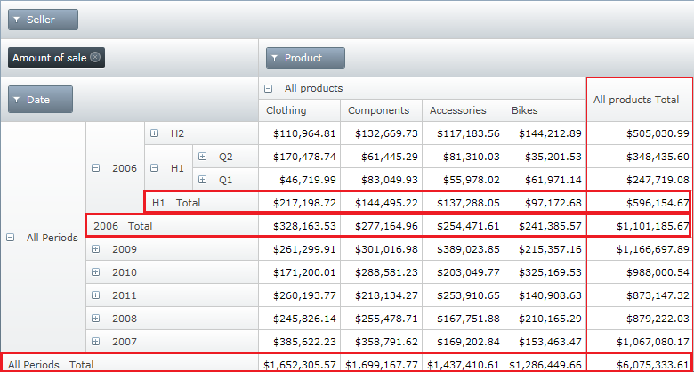

////
|metadata|
{
    "name": "xampivotgrid-understanding-xampivotgrid",
    "controlName": ["xamPivotGrid"],
    "tags": ["Data Presentation","Drilldown","Getting Started","Grids"],
    "guid": "{DDFE988E-239E-43B7-A274-004BD0B1E1E6}",
    "buildFlags": [],
    "createdOn": "2016-05-25T18:21:57.9363116Z"
}
|metadata|
////

= xamPivotGrid Overview

This section serves as an introduction to the link:{ApiPlatform}controls.grids.xampivotgrid{ApiVersion}~infragistics.controls.grids.xampivotgrid.html[xamPivotGrid]™ control's key features and functionalities. The topics listed here will give you a better idea of why you would want to use xamPivotGrid in your applications.

* <<xamPivotGrid,About xamPivotGrid>>
* <<ControlElements,Control Elements>>
* link:xampivotgrid-dataselector.html[About xamPivotDataSelector]

[[xamPivotGrid]]
== *About xamPivotGrid*

The xamPivotGrid control is a data summarization and information visualization tool that allows you to build complex business analysis applications. It uses the OLAP (Online Analytical Processing) approach to present the results of multi-dimensional queries in an easy to comprehend manner. The link:{ApiPlatform}controls.grids.xampivotgrid{ApiVersion}~infragistics.controls.grids.xampivotgrid.html[xamPivotGrid] control can take a number of data sources and build extensive reports based on the input data. The end user can then swiftly go through the results and then instantly change a perspective to get a better angle on the data. That ultimately results in a more effective use of the data.

The xamPivotGrid control can slice, dice, drill down or up, roll-up and pivot data taken from an OLAP cube. It can handle Flat Data too. With the arsenal of features available in the control, xamPivotGrid allows you to build sophisticated data-driven applications. The topics in this section will give you more information about xamPivotGrid and how to take advantage of its capabilities.

[[ControlElements]]
== *Control Elements*

The xamPivotGrid control has a number of UI components that you can interact with at runtime. You can add a number of dimension hierarchies in the row and column header areas in order to create slices of data. Adding hierarchies to the filters area allows you to extract only the relevant information and if you add a measure (auto-generated from numeric dimensions) in the measures area that would change the aggregate information for the current slice. The following paragraphs show you where the areas are and what you can do with them.

== Rows and row headers

The row headers area in an empty grid is circled in red.

When you add a hierarchy to this area (see how you can accomplish this in the “link:xampivotgrid-us-defining-hierarchies-and-providing-metadata-with-flatdata.html[Defining hierarchies and providing metadata with FlatData]” topic under the “link:xampivotgrid-using-xampivotgrid.html[Using xamPivotGrid]” section), a new slice with the current columns will be created. Adding more hierarchies to the same area effectively dices the data. The rows area shows the hierarchy tree of the current slice’s rows as you can see from the diagram below. (Note that the default state of the tree is collapsed).

== Columns and column headers

The column headers area in an empty grid is circled in red.

When you add a hierarchy to this area a new slice with the current rows will be created. Adding more hierarchies to the same area dices the data. The columns area shows the hierarchy tree of the current slice’s columns as you can see from the diagram below. Using the expansion indicators on each hierarchy allows you to drill down or up into the data. When you expand the column items you would get a hierarchy tree similar to the one in the rows sample.

== Filters

The filters area on an empty grid looks like this:

When you add a hierarchy to this area, xamPivotGrid will show only data that is relevant to the selected members of the specific dimension.

== Measures

The measures area on an empty grid is located as shown on the following image.

A measure can be any numeric dimension of the input data. When you add a measure, the xamPivotGrid control will show aggregate computation data for the specific slice. If no rows or columns are specified, the grid will display the total sum of the dimension values belonging to all items in the input data. In the following image, the measure is “Amount of sale” and the number is the sum of all sales for all products, all sellers, all product lines, etc. in the data source.

== Data Cells

When you have provided hierarchies to base the slice of data on, measures to quantify the results and filters to narrow the scope of the displayed information, the xamPivotGrid control will show something similar to the following image.

The area circled in red is the data cells area. This area shows the data computed as a result of the slice you have requested – a query to the data source characterized by the hierarchies in the rows and columns, filtered by the filter hierarchies and computed based on the measures. You can either set the xamPivotGrid to display the numeric format of the data in each cell or you could provide a template or style for each cell to suit your specific needs (More on that in the “link:xampivotgrid-us-conditional-formating.html[Conditional formatting]” topic under the “link:xampivotgrid-using-xampivotgrid.html[Using xamPivotGrid]” section).

The data cells area does not display only the raw data, but also totals and sub-totals for each expanded hierarchy level. The following image shows the total columns and rows.

[[xamPivotDataSelector]]