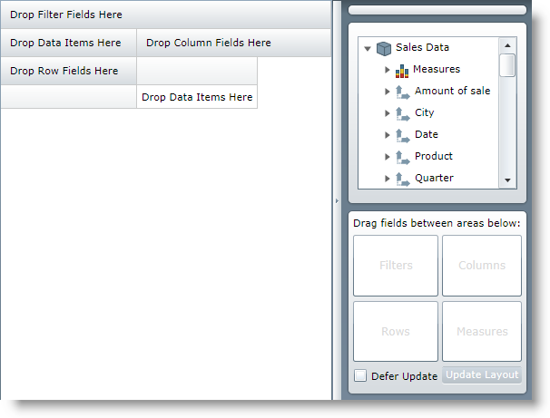
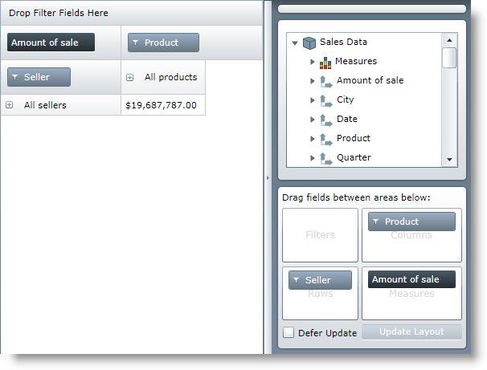

////

|metadata|
{
    "name": "xampivotgrid-us-assigning-hierarchies-and-measures",
    "controlName": ["xamPivotGrid"],
    "tags": ["How Do I"],
    "guid": "e048dc88-2ddb-4b9c-b0b2-968e2b719aa2",  
    "buildFlags": [],
    "createdOn": "2016-05-25T18:21:58.0652809Z"
}
|metadata|
////

= Assigning Hierarchies and Measures (xamPivotGrid)

After you have loaded a cube with data you need to select hierarchies on which to base the slice of data to be computed. The type of the datasource does not matter here.

Before assigning hierarchies:

After assigning hierarchies:

There are several ways to add hierarchies to rows, columns or filters and to select measures.

== From XAML During Initialization

This is probably the most convenient way to select default values for the area items. All that you need to do is provide the UniqueNames of each hierarchy that you want to add to the respective property of the DataSource. Here is a sample snippet.

*In XAML:*

----
         <igOlap:XmlaDataSource x:Key="DataSource"
                  ServerUri="http://server/olap/msmdpump.dll"
                  Database="Adventure Works DW Standard Edition"
                  Cube="Sale"
                  Columns="[Product].[Product]"
                  Rows="[Seller].[Seller]"
                  Measures="AmountOfSale" />
----

Note that the unique names of the hierarchy levels for the Filters, Columns and Rows must be in brackets. If you want to provide more than one area item, separate them with a comma. The Measures do not need brackets. If you are using FlatData, ServerUri and Database are not needed.

== From Code-behind During Initialization

When you are doing the same task from code-behind it is not as simple as writing the UniqueName strings, you need to generate AreaItem objects.

When you are selecting these for the first time you can use two helper methods: GenerateInitialCube(), GenerateInitialItems() from DataSourceBase and one more in XMLADataSource - GenerateInitialDatabase(). The following snippet shows how to create the FlatDataSource equivalent from the previous snippet.

*In C#:*

----
     FlatDataSource flatDataSource = new FlatDataSource()
     {
         //Data is the IEnumerable to be used as a source
         ItemsSource = Data;                 Cube = DataSourceBase.GenerateInitalCube("Sale"),
         Rows = DataSourceBase.GenerateInitialItems("[Seller].[Seller]"),
         Columns = DataSourceBase.GenerateInitialItems("[Product].[Product]"),
         Measures = DataSourceBase.GenerateInitialItems("AmountOfSale")
     };
----

*In Visual Basic:*

----
     Dim flatDataSource As New FlatDataSource()
     'Data is the IEnumerable to be used as a source
     flatDataSource.ItemsSource = Data
     flatDataSource.Cube = _
             DataSourceBase.GenerateInitalCube("Sale")
     flatDataSource.Rows = _
             DataSourceBase.GenerateInitialItems("[Seller].[Seller]")
     flatDataSource.Columns = _
             DataSourceBase.GenerateInitialItems("[Product].[Product]")
     flatDataSource.Measures = _
             DataSourceBase.GenerateInitialItems("AmountOfSale")
----

== From Code-behind During Runtime

When you have created the initial items, either from code or XAML, you can’t just replace the collections with items. You can only modify them. So if you want to change any of the hierarchies or measures during runtime you will have to clear, remove, or add separate items to the existing collections. You will also have to generate the specific items.

*In C#:*

----
     var DataSource = this.pivotGrid.DataSource;
     IHierarchy hierarchy =             DataSource.Cube.Dimensions["Seller"].Hierarchies.First();
     IFilterViewModel filterViewModel =                 DataSource.CreateFilterViewModel(hierarchy);
     DataSource.Columns.Clear();
     DataSource.Columns.Add(filterViewModel);
----

*In Visual Basic:*

----
     Dim DataSource = Me.pivotGrid.DataSource
     Dim hierarchy As IHierarchy = _
             DataSource.Cube.Dimensions("Seller").Hierarchies.First()
     Dim filterViewModel As IFilterViewModel = _
             DataSource.CreateFilterViewModel(hierarchy)
     DataSource.Columns.Clear()
     DataSource.Columns.Add(filterViewModel)
----

This snippet gets the first defined hierarchy for the Seller dimension, converts it to a filter view model and assigns it to the Columns collection of the grid. Rows, Columns and Filters use these classes. Measures are assigned in a similar way, but with different types.

*In C#:*

----
     var DataSource = this.pivotGrid.DataSource;
     IMeasure hierarchy = DataSource.Cube.Measures["AmountOfSale"];
     IMeasureViewModel filterViewModel =                DataSource.CreateMeasureViewModel(hierarchy);
     DataSource.Measures.Clear();
     DataSource.Measures.Add(filterViewModel);
----

*In Visual Basic:*

----
     Dim DataSource = Me.pivotGrid.DataSource
     Dim hierarchy As IMeasure = DataSource.Cube.Measures("AmountOfSale")
     Dim filterViewModel As IMeasureViewModel = _
             DataSource.CreateMeasureViewModel(hierarchy)
     DataSource.Measures.Clear()
     DataSource.Measures.Add(filterViewModel)
----

== Through xamPivotDataSelector

If you want to change the filters, columns, rows or measures in runtime but you don’t want to use code you can use the xamPivotDataSelector™ described in the link:xampivotgrid-dataselector.html[DataSelector] topic. It is as easy as drag and drop. All you need to do is select a database, cube and measures group from the three combo boxes for XMLA data source or just a cube for FlatData. When you do that a tree with all measures and dimension hierarchies will be loaded (click to expand the tree, the default value is collapsed) and then you can either drag the hierarchies and measures to the respective areas in the grid or drag them to the areas in the boxes provided by the data selector.

Related Topics

link:xampivotgrid-us-defining-hierarchies-and-providing-metadata-with-flatdata.html[Defining Hierarchies And Providing Metadata with FlatData]

link:xampivotgrid-us-expanding-hierarchies-in-runtime-from-code.html[Expanding Hierarchies in Runtime From Code]