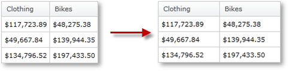

////

|metadata|
{
    "name": "xampivotgrid-us-column-resizing",
    "controlName": ["xamPivotGrid"],
    "tags": ["Application Scenarios","Grids","How Do I","Styling"],
    "guid": "92602863-f1e8-43ab-a793-585c30a77c32",  
    "buildFlags": [],
    "createdOn": "2016-05-25T18:21:57.9793147Z"
}
|metadata|
////

= Column Resizing (xamPivotGrid)

The xamPivotGrid™ control allows the user to change the width of the columns. This resizing behavior can be easily customized through a number of properties and a couple of events.

The resizing can be enabled at two levels – grid-wide and per column. By default, resizing is enabled for all grid columns. The ColumnResizingSettings property contains most of the customization properties that can be changed. You can set the minimum column width as well as change the indicator style from this property. You can also enable or disable resizing of cells in the cell area, you can change the way the column resizing happens – immediate, with an indicator or none at all. You can also enable or disable the multiple columns resizing - a behavior that occurs when several columns are selected and they can be resized together. You can also specify whether you want to enable auto-resizing on double click. Here is a snippet that customizes xamPivotGrid’s resizing settings.

*In C#:*

----
     PivotColumnResizingSettings resizingSettings = 
         this.pivotGrid.ColumnResizingSettings;
     resizingSettings.AllowCellAreaResizing = true;
     resizingSettings.AllowColumnResizing = 
             PivotColumnResizingType.Indicator;
     resizingSettings.AllowDoubleClickToSize = true;
     resizingSettings.AllowMultipleColumnResize = false;
     resizingSettings.IndicatorStyle = 
         this.Resources["ResizingIndicatorStyle"] as Style; 
     resizingSettings.MinColumnWidth = 5;
----

*In Visual Basic:*

----
    Dim resizingSettings As PivotColumnResizingSettings = _
        Me.pivotGrid.ColumnResizingSettings
    resizingSettings.AllowCellAreaResizing = True
    resizingSettings.AllowColumnResizing = _
        PivotColumnResizingType.Indicator
    resizingSettings.AllowDoubleClickToSize = True
    resizingSettings.AllowMultipleColumnResize = False
    resizingSettings.IndicatorStyle = _
        TryCast(Me.Resources("ResizingIndicatorStyle"), Style)
    resizingSettings.MinColumnWidth = 5
----

*In XAML:*

----
        <igPivot:XamPivotGrid DataSource="{StaticResource DataSource}" >
            <igPivot:XamPivotGrid.ColumnResizingSettings>
                <igPivot:PivotColumnResizingSettings 
                    AllowCellAreaResizing="True"
                    AllowColumnResizing="Indicator"
                    AllowDoubleClickToSize="True"
                    AllowMultipleColumnResize="
                    IndicatorStyle="{StaticResource IndicatorStyle}"
                    MinColumnWidth="5">
                </igPivot:PivotColumnResizingSettings>
            </igPivot:XamPivotGrid.ColumnResizingSettings>
        </igPivot:XamPivotGrid>
----

Note that the unique names of the hierarchy levels for the Filters, Columns and Rows must be in

In addition to the settings, you have access to two useful events – ColumnResizing and ColumnResized. In the event arguments of both these events you have a collection of the columns that are being resized. In the ColumnResizing event, you also have a Cancel property, which if set to true, you will effectively disable the resizing. With this information about the columns, you can create a custom resizing behavior based on each column.

The following snippet does two things. First, if the resized column is just one and is specific (with key ColumnNotToResize) the resize is canceled; if not, the header cell style is changed for the time of resizing and set back to another style when the drag is complete.

*In C#:*

----
    this.pivotGrid.ColumnResizing += (sender1, e1) =>
    {
        if (e1.Columns.Count == 1 && 
                    e1.Columns.First().Key == "ColumnNotToResize")
        {
            e1.Cancel = true;
        }
        foreach (PivotHeaderCell cell in 
        this.pivotGrid.GridLayout.VisibleColumnsHeaderCells)
        {
            foreach (PivotColumnBase column in e1.Columns)
            {
                if (cell.Column == column)
                {
                    cell.Style = 
                    this.Resources["hcResizingStyle"] as Style;
                }
            }
        }
    };
    this.pivotGrid.ColumnResized += (sender2, e2) =>
    {
        foreach (PivotHeaderCell cell in 
        this.pivotGrid.GridLayout.VisibleColumnsHeaderCells)
        {
            foreach (PivotColumnBase column in e2.Columns)
            {
                if (cell.Column == column)
                {
                    cell.Style = 
                    this.Resources["hcNotResizingStyle"] as Style;
                }
            }
        }
    };
----

*In Visual Basic:*

----
    AddHandler Me.pivotGrid.ColumnResizing, AddressOf ColumnResizing
    AddHandler Me.pivotGrid.ColumnResized, AddressOf ColumnResized
    Private Sub ColumnResizing(ByVal sender As Object, _
                              ByVal e As CancellableColumnResizingEventArgs)
        If e.Columns.Count = 1 AndAlso _
           e.Columns.First().Key = "ColumnNotToResize" Then
            e.Cancel = True
        End If
        For Each cell As PivotHeaderCell In _
            Me.pivotGrid.GridLayout.VisibleColumnsHeaderCells
            For Each column As PivotColumnBase In e.Columns
                If cell.Column = column Then
                    cell.Style = _
                        TryCast(Me.Resources("hcResizingStyle"), Style)
                End If
            Next
        Next
    End Sub
    Private Sub ColumnResized(ByVal sender As Object, _
                             ByVal e As PivotColumnResizedEventArgs)
        For Each cell As PivotHeaderCell In _
            Me.pivotGrid.GridLayout.VisibleColumnsHeaderCells
            For Each column As PivotColumnBase In e.Columns
                If cell.Column = column Then
                    cell.Style = _
                        TryCast(Me.Resources("hcNotResizingStyle"), Style)
                End If
            Next
        Next
    End Sub
----

In addition to the control that xamPivotGrid provides on the resizing behavior, you can also modify each column’s own IsResizable property.

*In C#:*

----
   this.pivotGrid.GridLayout.Columns[i].IsResizable = false;
----

*In Visual Basic:*

----
   Me.pivotGrid.GridLayout.Columns(i).IsResizable = False
----

Related Topics

link:xampivotgrid-using-xampivotgrid.html[Using XamPivotGrid]

link:xampivotgrid-handlingevents.html[Handling Events]