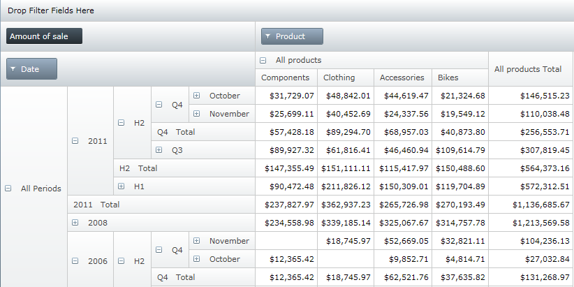
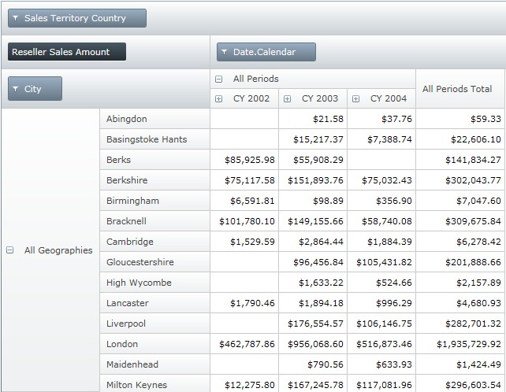
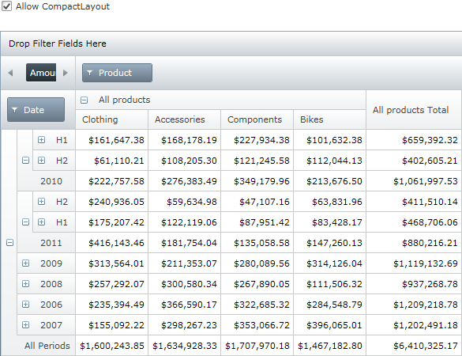

////
|metadata|
{
    "name": "xampivotgrid-us-compact-layout",
    "controlName": ["xamPivotGrid"],
    "tags": ["Data Presentation","Grids","How Do I","Layouts"],
    "guid": "980bc48a-8c05-4050-9d17-809bd2efa19b",
    "buildFlags": [],
    "createdOn": "2016-05-25T18:21:58.0033157Z"
}
|metadata|
////

= Compact Layout (xamPivotGrid)

When data has multiple hierarchy levels and you need to drill down into a single dimension’s hierarchy tree, the headers can overwhelm the visible area of the xamPivotGrid™ control. In this situation, it may be difficult for the user to use the information the control provides effectively.

The CompactLayout feature of the xamPivotGrid effectively truncates the tree structure of the headers and frees the space for important information to appear.

To put the row hierarchy tree in CompactLayout mode, you need to set the AllowCompactLayout property of the grid to true.

*In XAML:*

----
        <igPivot:XamPivotGrid 
                AllowCompactLayout="True" 
                DataSource="{StaticResource Source}" />
----

This mode works especially well with date/time hierarchies.

In addition to allowing the compact layout mode, you can also force the grid to show the total headers on top. In some situations, that might help the user to comprehend the data hierarchies better.

image::images/xamPG_6-7-2010_6-05-37_PM.png[]

*In XAML:*

----
        <igPivot:XamPivotGrid DataSource="{StaticResource DataSource}"
                              AllowCompactLayout="True"
                              ParentInFront="True"/>
----