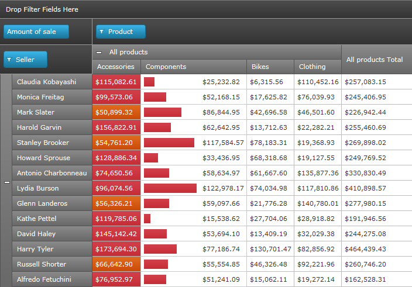

////
|metadata|
{
    "name": "xampivotgrid-us-conditional-formating",
    "controlName": ["xamPivotGrid"],
    "tags": [],
    "guid": "1f9bfbf0-0150-4ca2-a7aa-5eee36bf0218","buildFlags": [],
    "createdOn": "2016-05-25T18:21:57.991315Z"
}
|metadata|
////

= Conditional Formatting (xamPivotGrid)

xamPivotGrid™ allows you to perform value based (conditional) formatting through its CellControlAttached event, which has some special characteristics. The CellControlAttached event only fires for cells that are currently in view as a result of the xamPivotGrid’s virtualization engine. The virtualization engine ensures that the grid doesn’t waste CPU cycles and memory on objects that aren’t in view. The result is a grid that performs just as fast when bound to 10,000 records or 10,000,000.

The CellControlAttached event not only fires when a cell is brought into view, but it also fires when a cell binding is refreshed due to an underlying change in the datasource. This is when it becomes important that your underlying business objects fire INotifyPropertyChanged events appropriately.

When you attach an event handler to CellControlAttached you can use the property Cell from the arguments to find important information such as in which row or column the cell is in, what the value is, etc. Based on that info you can easily modify its style and template to alter its UI to suit your needs.

To find out the index of a column or row of a cell you can use the following snippet.

*In C#:*

----
    this.pivotGrid.CellControlAttached += pivotGrid_CellControlAttached;
    void pivotGrid_CellControlAttached(object sender, 
                               PivotCellControlAttachedEventArgs e)
    {
           var rowIndex = 
           this.pivotGrid.DataRows.IndexOf(e.Cell.DataRow);
           var columnIndex = 
           this.pivotGrid.DataColumns.IndexOf(e.Cell.DataColumn);
    }
----

*In Visual Basic:*

----
    AddHandler Me.pivotGrid.CellControlAttached, _
        AddressOf pivotGrid_CellControlAttached
...
    Private Sub pivotGrid_CellControlAttached( _
            ByVal sender As Object, _
            ByVal e As PivotCellControlAttachedEventArgs)
        Dim rowIndex = Me.pivotGrid.DataRows.IndexOf(e.Cell.DataRow)
        Dim columnIndex = Me.pivotGrid.DataColumns.IndexOf(e.Cell.DataColumn)
    End Sub
----

After you know the row and column index of the cell you can get its value using this technique:

*In C#:*

----
    ICell cellData = 
        this.pivotGrid.DataSource.Result.Cells[rowIndex, columnIndex];
    string valFormatted = cellData.FormattedValue;
    object valObject = cellData.Value;
----

*In Visual Basic:*

----
    Dim cellData As ICell = _
        Me.pivotGrid.DataSource.Result.Cells(rowIndex, columnIndex)
    Dim valFormatted As String = cellData.FormattedValue
    Dim valObject As Object = cellData.Value
----

Finally based on some condition you can apply a style to the cell control.

*In C#:*

----
    e.Cell.Style = this.Resources["StyledCell"] as Style;
----

*In Visual Basic:*

----
    e.Cell.Style = TryCast(Me.Resources("StyledCell"), Style)
----

The following snapshot shows you what the combination of these three snippets and a bit more code can do.

The full code to see how this is done can be seen in the SamplesBrowser.

Related Topics

link:xampivotgrid-us-selection-and-cell-interaction.html[Filtering]