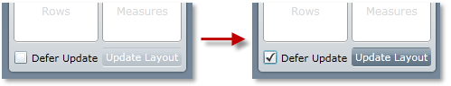

////

|metadata|
{
    "name": "xampivotgrid-us-deferred-updates",
    "controlName": ["xamPivotGrid"],
    "tags": ["How Do I","Tips and Tricks"],
    "guid": "ab8caf2a-053b-4708-8ad9-c702f52b9365",  
    "buildFlags": [],
    "createdOn": "2016-05-25T18:21:57.9973153Z"
}
|metadata|
////

= Deferred Updates (xamPivotGrid)

Sometimes you might want to queue up several operations, such as adding a new hierarchy to the columns, removing one from the rows, selecting a new filter and adding a new measure. You might not want to force the grid to update for each operation but directly compute the final Result. Potentially, this can save resources.

In this situation, you should use the Deferred Updates option of the xamPivotGrid™ control. You can use it in two ways: either from the data selector or from code.

In the first case, use the checkbox on the bottom of the data selector to enable or disable deferred updating. When the checkbox is checked (deferred updates enabled) the update button on the right will be also enabled. Clicking it will apply all pending changes and the slice and UI will be updated. If you set the checkbox’s state back to unchecked, an update will be triggered as if you have pressed the update button.

If you need to disable or enable the deferred updates from code, you should set the DeferredLayoutUpdate property in the DataSource to true or false. To force an update, use the RefreshGrid() method. It’s again in the DataSource. Setting the DeferredLayoutUpdate to false also triggers an update.

*In C#:*

----
    this.pivotGrid.DataSource.DeferredLayoutUpdate = true;
----

*In Visual Basic:*

----
    Me.pivotGrid.DataSource.DeferredLayoutUpdate = true
----

Related Topics

link:xampivotgrid-using-xampivotgrid.html[Assigning Hierarchies and Measures]