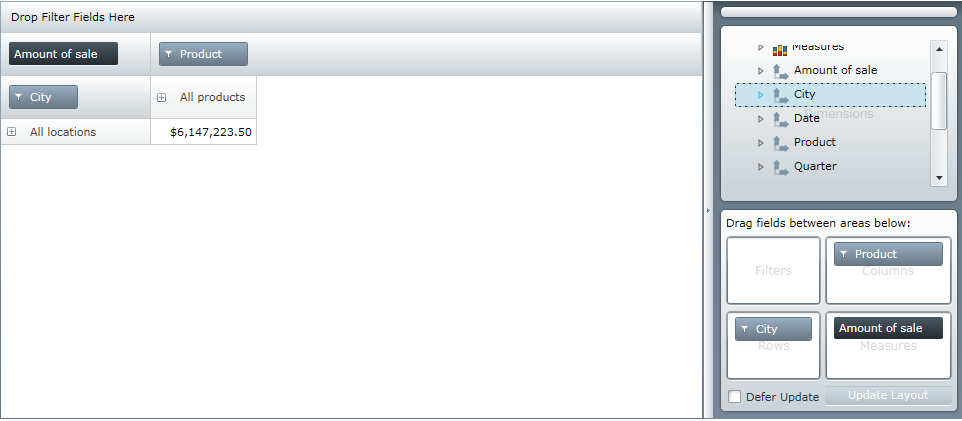
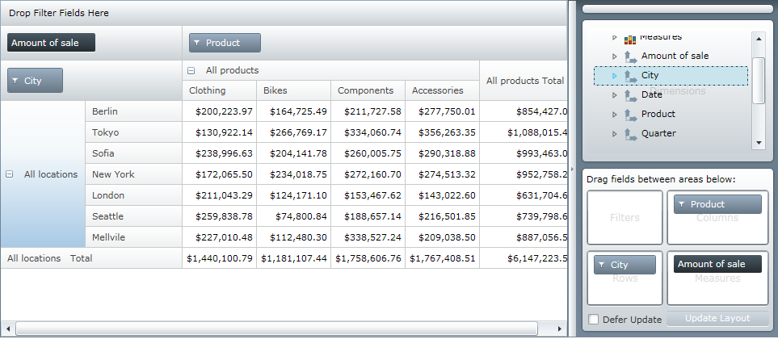

////
|metadata|
{
    "name": "xampivotgrid-us-expanding-hierarchies-in-runtime-from-code",
    "controlName": ["xamPivotGrid"],
    "tags": ["Drilldown","How Do I","Navigation","Tips and Tricks"],
    "guid": "2557000f-5e11-4fb6-8fe1-e3bca187a2c8",
    "buildFlags": [],
    "createdOn": "2016-05-25T18:21:58.0093156Z"
}
|metadata|
////

= Expanding Hierarchies Programmatically in Runtime (xamPivotGrid)

After you have loaded data in xamPivotGrid™, you may want to have specific members of the hierarchies expanded by default when the application starts. This way your end-users will be presented with the relevant data as soon as the application loads.

Quick note about the link:{ApiPlatform}olap{ApiVersion}~infragistics.olap.datasourcebase~hierarchyexpansionmode.html[HierarchyExpansionMode] property: This property is related with expansion state of hierarchy when another hierarchy is added in the same axis. For example when the columns contain one hierarchy and you expand its first level, and then you add new hierarchy before the first one. With the default behavior it will collapse the first hierarchy. If you set the HierarchyExpansionMode to DrillDown (link:{ApiPlatform}olap{ApiVersion}~infragistics.olap.datasourcebase~hierarchyexpansionmode.html[HierarchyExpansionMode Enumeration]) the expanded state of the hierarchy will be saved.

The following image shows default screen of xamPivotGrid with no expansion:

Default screen with expansion:

There are two ways to expand hierarchies with xamPivotGrid (From code that is. You can always click on the expansion indicators in each PivotHeaderCell with the mouse). The first technique is to get a reference to the PivotHeaderCell control from GridLayout and set its IsExpanded property to true. The second technique is to use the DataSource’s SwitchAxisMember method.

Let’s say that you click a random cell with data in the data cells area of xamPivotGrid. You may want to expand the column hierarchy that the clicked cell belongs to. In order to do this you can put the following snippet in the body of your application:

*In C#:*

[source]
----
   this.pivotGrid.SelectionSettings.CellSelection = 
                                           PivotSelectionType.Single;
   this.pivotGrid.SelectedCellsCollectionChanged += (sender, e) =>
   {
       foreach (PivotHeaderCell headerCell in 
       this.pivotGrid.GridLayout.VisibleColumnsHeaderCells)
       {
           if (e.NewSelectedItems.Count != 0 && headerCell.Column == 
                   e.NewSelectedItems.First().Column)
           {
               headerCell.IsExpanded = true;
               return;
           }
       }
   };
----

*In Visual Basic:*

[source]
----
    Me.pivotGrid.SelectionSettings.CellSelection = _
        PivotSelectionType.[Single]
    AddHandler Me.pivotGrid.SelectedCellsCollectionChanged, _
        AddressOf pivotGrid_SelectedCellsCollectionChanged
...
    Private Sub pivotGrid_SelectedCellsCollectionChanged( _
            ByVal sender As Object, _
            ByVal e As PivotSelectionCollectionChangedEventArgs)
        For Each headerCell As PivotHeaderCell In _
            Me.pivotGrid.GridLayout.VisibleColumnsHeaderCells
            If e.NewSelectedItems.Count <> 0 And
                headerCell.Column = _
                e.NewSelectedItems.First().Column Then
                headerCell.IsExpanded = True
                Return
            End If
        Next
    End Sub
----

If for some reason you want to set the expansion state before the UI is loaded you will have to use the second approach. The argument that you need to supply to the SwitchAxisMember method is of type IMember. The following code shows how to get that member and instruct xamPivotGrid to expand the hierarchy before the UI has loaded.

*In C#:*

----
    IResult result = this.pivotGrid.DataSource.Result;
    IMember member = result.ColumnAxis.Tuples.First().Members.First();
    this.pivotGrid.DataSource.SwitchAxisMember(member);
----

*In Visual Basic:*

----
    Dim result As IResult = Me.pivotGrid.DataSource.Result
    Dim member As IMember = _
        result.ColumnAxis.Tuples.First().Members.First()
    Me.pivotGrid.DataSource.SwitchAxisMember(member)
----

That would get the first member of the first tuple in the column data. Beware that the ColumnAxis, Tuples and Members collections might be null and it is a good idea to check if that is the case before accessing them. After getting the first member the SwitchAxisMember expands the hierarchy that corresponds to that member before the UI has updated.

Related Topics

link:xampivotgrid-us-assigning-hierarchies-and-measures.html[Assigning Hierarchies and Measures]

link:xampivotgrid-us-defining-hierarchies-and-providing-metadata-with-flatdata.html[Defining Hierarchies And Providing Metadata with FlatData]