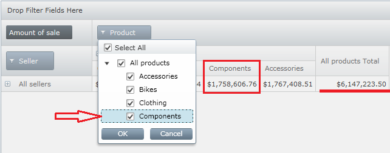
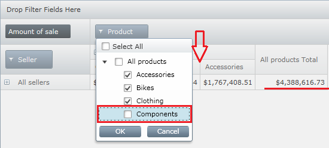
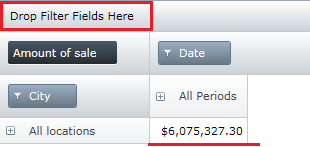
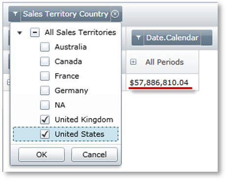
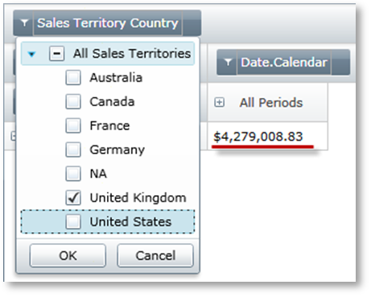

////
|metadata|
{
    "name": "xampivotgrid-us-filtering",
    "controlName": ["xamPivotGrid"],
    "tags": ["Filtering","Grids","How Do I"],
    "guid": "fb328249-75c3-4dd5-ac7c-990ec8811a30",
    "buildFlags": [],
    "createdOn": "2016-05-25T18:21:57.9852762Z"
}
|metadata|
////

= Filtering (xamPivotGrid)

Filtering the displayed data is a very useful feature integral to the process of analyzing any data. With the xamPivotGrid™ control, you have several options that you can employ to narrow down the scope of the data in the grid. You can either do it from code or you can use the UI filter menus.

== With Curly Brackets Syntax from XAML Code

xamPivotGrid recognizes the SQL curly brackets expressions. When you are specifying rows, columns, filters and measures you can use these expressions to alter the input data. For example if you want to add the country hierarchy to the columns, but want to consider only United Kingdom in the slice you can use the following code in the XAML declaration of the DataSource:

*In XAML:*

----
Columns="[Territory]{[Territory].[Country].&amp;[United Kingdom]}"
----

The names of the items you list in the curly brackets are the names as they exist in the data source. [Territory].[Country].&amp;[United Kingdom] for example contains the ampersand and the brackets as that is the UniqueName of the United Kingdom member in the database. If you want to include more than one item in the brackets, separate them with a comma. The syntax works with GenerateInitialItems() and can be used in code behind as well.

== With UI Menus at Runtime

When you add a hierarchy to one of the xamPivotGrid areas the control that is added to that area would have a filter indicator. When you press the filter indicator, a menu will open up with a tree including all levels and members of the hierarchy. You can check or uncheck them from the tree which will modify their inclusion in the filtering.

Before filtering:

After filtering:

In addition to using the menus, you can drop a hierarchy in the Filters area and if the data is related to the particular hierarchy, the slice will be updated. The result will be all data that satisfies the provided filter. The useful fact here is that the added hierarchy will be different than the one already added to the rows and columns.

The following image shows the totals without a filter in the Filters area

Note the result after creating the filter with a third, different, but related hierarchy.

The curly brackets syntax is actually equivalent to selecting items from the menu. Whatever you list within the brackets will be selected and the other items – deselected. The only difference is that when you use code, the filtering is defined with the start of the application and the end user does not need to do anything for the filter to be applied. Existing filters also can be modified at runtime without any further code.

Related Topics

link:xampivotgrid-using-xampivotgrid.html[Filtering]