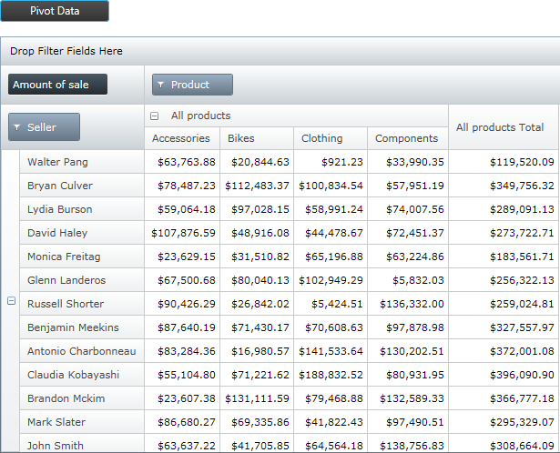
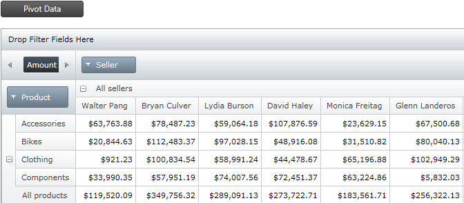

////

|metadata|
{
    "name": "xampivotgrid-us-pivotdata-command",
    "controlName": ["xamPivotGrid"],
    "tags": ["How Do I","Tips and Tricks"],
    "guid": "bf7fafbc-18cd-4a22-b98e-ddc8f5f1f4eb",  
    "buildFlags": [],
    "createdOn": "2016-05-25T18:21:58.0253164Z"
}
|metadata|
////

= Pivoting Data (xamPivotGrid)

To pivot the data in the grid means to move all column hierarchies to the rows area, all row hierarchies to the columns area, and then recalculate the Result to update the content of the grid.

*Original data*

*Pivoted data*

In order to do this, you can use the PivotGrid command. Attach it as shown in the snippet below to a button and associate it to the click event.

*In XAML:*

----
        <Button Content="Pivot Data">
            <igPivot:Commanding.Command>
                <igPivot:XamPivotGridCommandSource 
                        EventName="Click" 
                        CommandType="PivotGrid" 
                        TargetName="pivotGrid"/>
            </igPivot:Commanding.Command>
        </Button>
----

Related Topics

link:xampivotgrid-using-xampivotgrid.html[Using XamPivotGrid]