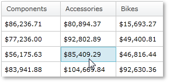
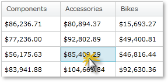

////

|metadata|
{
    "name": "xampivotgrid-us-selection-and-cell-interaction",
    "controlName": ["xamPivotGrid"],
    "tags": ["Grids","How Do I","Selection","Styling"],
    "guid": "31ef4275-7a80-4c9a-b2d6-96f8a3579e09",  
    "buildFlags": [],
    "createdOn": "2016-05-25T18:21:57.9673133Z"
}
|metadata|
////

= Cell Selection and Interactions (xamPivotGrid)

== Cell Selection

In addition to the selection of cells, columns, and rows, the grid supports marking a cell as active. Please note this refers to cells only, not columns or rows. Marking a cell as active is nearly the same thing as selecting it. Usually when you select a cell, it becomes active.

Additionally, a cell can be marked as active through the keyboard. If a cell is active and you press the up key, the cell on top of it will become active. You can easily implement keyboard navigation logic using this feature of xamPivotGrid™ by using ActiveCellChanging and ActiveCellChanged.

The following code shows how to apply a different style to the active cell.

*In C#:*

----
     this.pivotGrid.ActiveCellChanged += (sender, e) =>
     {
         //set inactive cell styles
         foreach (PivotDataRow row in this.pivotGrid.DataRows)
         {
             foreach (PivotCell cell in row.Cells)
             {
                 cell.Style = 
                     this.Resources["InactiveCellStyle"] as Style;
             }
         }
         //set active cell styles
         (sender as xamPivotGrid).ActiveCell.Style = 
             this.Resources["ActiveCellStyle"] as Style;
     };
----

*In Visual Basic:*

----
    AddHandler Me.pivotGrid.ActiveCellChanged, AddressOf ActiveCellChanged
...
    Private Sub ActiveCellChanged( _
            ByVal sender As Object, _
            ByVal e As EventArgs)
        'set inactive cell styles
        For Each row As PivotDataRow In Me.pivotGrid.DataRows
            For Each cell As PivotCell In row.Cells
                cell.Style = _
                    TryCast(Me.Resources("InactiveCellStyle"), Style)
            Next
        Next
        'set active cell styles
        TryCast(sender, xamPivotGrid).ActiveCell.Style = _
            TryCast(Me.Resources("ActiveCellStyle"), Style)
    End Sub
----

And the following shows how to deny activation of cells with values greater than 2000.

*In C#:*

----
     this.pivotGrid.ActiveCellChanging += (sender, e) =>
     {
         var doubleVal = Convert.ToDouble(
                       (e.NewActiveCell.Data as ICell).Value);
         if (doubleVal > 2000)
             e.Cancel = true;
     };
----

*In Visual Basic:*

----
    AddHandler Me.pivotGrid.ActiveCellChanging, _
            AddressOf ActiveCellChanging
...
    Private Sub ActiveCellChanging( _
            ByVal sender As Object, _
            ByVal e As PivotActiveCellChangingEventArgs)
        Dim doubleVal = Convert.ToDouble( _
            TryCast(e.NewActiveCell.Data, ICell).Value)
        If doubleVal > 2000 Then
            e.Cancel = True
        End If
    End Sub
----

== Cell Interaction

End-User interaction with data is of key importance to any data analysis application. xamPivotGrid™ provides great features regarding end-user customization. Selecting sells, rows, columns and responding to click actions are among the tools that provide this flexibility. This topic explains how to use these features.

Let’s start off with the settings. xamPivotGrid allows you to customize these settings through the SelectionSettings property. You can modify the selection type of the cells, columns and rows. The cell click action can be changed also. The following snippet shows you how to do this.

*In C#:*

----
    this.pivotGrid.SelectionSettings.CellSelectionAction = 
          PivotCellSelectionAction.SelectCell;
    this.pivotGrid.SelectionSettings.CellSelection = 
          PivotSelectionType.Multiple;
    this.pivotGrid.SelectionSettings.ColumnSelection = 
          PivotSelectionType.Single;
    this.pivotGrid.SelectionSettings.RowSelection = 
          PivotSelectionType.None;
----

*In Visual Basic:*

----
    Me.pivotGrid.SelectionSettings.CellSelectionAction = _
          PivotCellSelectionAction.SelectCell
    Me.pivotGrid.SelectionSettings.CellSelection = _
          PivotSelectionType.Multiple
    Me.pivotGrid.SelectionSettings.ColumnSelection = _
          PivotSelectionType.[Single]
    Me.pivotGrid.SelectionSettings.RowSelection = _
          PivotSelectionType.None
----

At runtime you can get the selected cells, rows or column from three collections located in the SelectionSettings object. The following code snippet shows you how to do this:

*In C#:*

----
    var cells = this.pivotGrid.SelectionSettings.SelectedCells;
    var columns = this.pivotGrid.SelectionSettings.SelectedColumns;
    var rows = this.pivotGrid.SelectionSettings.SelectedRows;
----

*In Visual Basic:*

----
    Dim cells = Me.pivotGrid.SelectionSettings.SelectedCells
    Dim columns = Me.pivotGrid.SelectionSettings.SelectedColumns
    Dim rows = Me.pivotGrid.SelectionSettings.SelectedRows
----

Interaction can be based on the three events that mark the change of the collections above: SelectedCellsCollectionChanged, SelectedRowsCollectionChanged and SelectedColumnsCollectionChanged. You can detect cell click actions through the CellClicked and CellDoubleClicked events.

The following code selects all cells in the row and selects all cells of the column of the cell that is clicked. It changes the style of the cells in the column, the style of the cells in the row, the style of the clicked cell and resets all other cells to a neutral style. If a cell is double clicked a message with its value is displayed.

*In C#:*

----
         this.pivotGrid.SelectionSettings.CellSelectionAction =                PivotCellSelectionAction.SelectCell;
         this.pivotGrid.SelectionSettings.ColumnSelection =              PivotSelectionType.Single;
         this.pivotGrid.SelectionSettings.RowSelection =                 PivotSelectionType.Single;
         this.pivotGrid.CellClicked += (sender1, e1) =>
         {
             this.pivotGrid.SelectionSettings.SelectedColumns.Add(                                               e1.Cell.DataColumn);
             this.pivotGrid.SelectionSettings.SelectedRows.Add(                                          e1.Cell.DataRow);
             foreach (PivotDataRow row in this.pivotGrid.DataRows)
             {
                 if (row != e1.Cell.DataRow)
                 {
                     foreach (PivotCell cell in row.Cells)
                     {                   var selectionSettings =                                 this.pivotGrid.SelectionSettings;
                         if (selectionSettings.SelectedColumns.Contains(                                 cell.Column as DataColumn))
                         {
                             cell.Style =               this.Resources["CellOnSelectedColumnStyle"] as Style;
                         }
                         else
                         {
                             cell.Style =               this.Resources["NotSelectedCellStyle"] as Style;
                         }
                     }
                 }
                 else
                 {
                     foreach (PivotCell cell in row.Cells)
                     {
                         if (this.pivotGrid.SelectionSettings.SelectedRows.Contains(cell.Row as DataRow))
                         {
                             cell.Style =               this.Resources["CellClickedStyle"] as Style;
                         }
                         else
                         {
                             cell.Style =               this.Resources["CellOnSelectedRowStyle"] as Style;
                         }
                     }
                 }
             }
         };
         this.pivotGrid.CellDoubleClicked += (sender2, e2) =>
         {
             MessageBox.Show(e2.Cell.Data.ToString());
         };
----

*In Visual Basic:*

----
    Me.pivotGrid.SelectionSettings.CellSelectionAction = _
        PivotCellSelectionAction.SelectCell
    Me.pivotGrid.SelectionSettings.ColumnSelection = _
        PivotSelectionType.[Single]
    Me.pivotGrid.SelectionSettings.RowSelection = _
        PivotSelectionType.[Single]
    AddHandler Me.pivotGrid.CellClicked, AddressOf CellClicked
    AddHandler Me.pivotGrid.CellDoubleClicked, AddressOf CellDoubleClicked
...
    Private Sub CellClicked( _
                ByVal sender As Object,
                ByVal e As PivotCellClickedEventArgs)
        Me.pivotGrid.SelectionSettings.SelectedColumns.Add( _
            e.Cell.DataColumn)
        Me.pivotGrid.SelectionSettings.SelectedRows.Add( _
            e.Cell.DataRow)
        For Each row As PivotDataRow In Me.pivotGrid.DataRows
            If row <> e.Cell.DataRow Then
                For Each cell As PivotCell In row.Cells
                    Dim selectionSettings = _
                        Me.pivotGrid.SelectionSettings
                    If selectionSettings.SelectedColumns.Contains( _
                        TryCast(cell.Column, DataColumn)) Then
                        cell.Style = TryCast( _
                            Me.Resources("CellOnSelectedColumnStyle"), _
                            Style)
                    Else
                        cell.Style = TryCast( _
                            Me.Resources("NotSelectedCellStyle"), _
                            Style)
                    End If
                Next
            Else
                For Each cell As PivotCell In row.Cells
                    If Me.pivotGrid.SelectionSettings.SelectedRows.Contains( _
                        TryCast(cell.Row, DataRow)) Then
                        cell.Style = TryCast( _
                            Me.Resources("CellClickedStyle"), _
                            Style)
                    Else
                        cell.Style = TryCast( _
                            Me.Resources("CellOnSelectedRowStyle"), _
                            Style)
                    End If
                Next
            End If
        Next
    End Sub
    Private Sub CellDoubleClicked( _
            ByVal sender As Object,
            ByVal e As PivotCellClickedEventArgs)
        MessageBox.Show(e.Cell.Data.ToString())
    End Sub
----

Related Topics

link:xampivotgrid-us-sorting-data.html[Sorting]

link:xampivotgrid-us-column-resizing.html[Column Resizing]

link:xampivotgrid-us-filtering.html[Filtering]

link:xampivotgrid-us-conditional-formating.html[Conditional Formating]

link:xampivotgrid-us-expanding-hierarchies-in-runtime-from-code.html[Expanding Hierarchies in Runtime From Code]

link:xampivotgrid-us-pivotdata-command.html[Assigning Hierarchies and Measures]