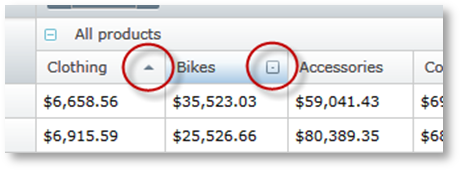

////
|metadata|
{
    "name": "xampivotgrid-us-sorting-data",
    "controlName": ["xamPivotGrid"],
    "tags": ["How Do I","Sorting"],
    "guid": "2a757279-5100-4a66-b6a2-e70b1e082775",
    "buildFlags": [],
    "createdOn": "2016-05-25T18:21:57.9733132Z"
}
|metadata|
////

= Sorting (xamPivotGrid)

Sorting in the xamPivotGrid™ control, much like the column resizing, can be configured on two levels – grid wide and column wide. Sorting is enabled for all columns by default. Each header cell has a sorting indicator with three states: Ascending, Decending, and Not Sorted. The end user can click on it to trigger sorting.

xamPivotGrid exposes two events (ColumnSorting and ColumnSorted) that allow the developer to control the sorting and create custom actions when the end user has triggered sorting. Similar to column resizing, you have a reference to the column that is being sorted in the event arguments and also the Cancel property in the ColumnSorting event arguments.

The following sample changes the style of the cells in the sorted column and restores the original when another column is sorted. Sorting on the second column is disabled.

*In C#:*
[source,csharp]
----
    this.pivotGrid.ColumnSorting += (sender, e) =>
    {
        if (this.pivotGrid.DataColumns.IndexOf(e.Column) == 1)
        {
           e.Cancel = true;
        }
    };
    this.pivotGrid.ColumnSorted += (sender, e) =>
    {
        foreach (PivotDataRow row in this.pivotGrid.GridLayout.Rows)
        {
            foreach (PivotCell cell in row.Cells)
            {
                if (cell.Column != e.Column)
                {
                    cell.Style = 
                        this.Resources["NotSortedCellStyle"] as Style;
                }
            }
            row.Cells[e.Column].Style = 
                this.Resources["SortedCellStyle"] as Style;
        }
    };
----

*In Visual Basic:*
[source,vb]
----
    AddHandler Me.pivotGrid.ColumnSorted, AddressOf ColumnSorting
    AddHandler Me.pivotGrid.ColumnSorted, AddressOf ColumnSorted
    ...
    Private Sub ColumnSorting(ByVal sender As Object, _
                              ByVal e As PivotSortingCancellableEventArgs)
        If Me.pivotGrid.DataColumns.IndexOf(e.Column) = 1 Then
            e.Cancel = True
        End If
    End Sub
    Private Sub ColumnSorted(ByVal sender As Object, _
                             ByVal e As PivotSortedColumnEventArgs)
        For Each row As PivotDataRow In Me.pivotGrid.GridLayout.Rows
            For Each cell As PivotCell In row.Cells
                If cell.Column <> e.Column Then
                    cell.Style = _
                        TryCast(Me.Resources("NotSortedCellStyle"), Style)
                End If
            Next
            row.Cells(e.Column).Style = _
                TryCast(Me.Resources("SortedCellStyle"), Style)
        Next
    End Sub
----

Sorting can be triggered from code, too. You have to set the IsSorted property of a column to trigger it. The following snippet shows how to sort the column in ascending order when a cell is clicked.

*In C#:*
[source,csharp]
----
     this.pivotGrid.SelectionSettings.CellSelectionAction = 
         PivotCellSelectionAction.SelectCell;
     this.pivotGrid.SelectedCellsCollectionChanged += (sender, e) =>
     {
         PivotDataColumn dataCol = 
             (e.NewSelectedItems.First().Column as PivotDataColumn)
         dataCol.IsSorted = PivotSortDirection.Ascending;
     };
----

*In Visual Basic:*
[source,vb]
----
    Me.pivotGrid.SelectionSettings.CellSelectionAction = _
        PivotCellSelectionAction.SelectCell
    AddHandler Me.pivotGrid.SelectedCellsCollectionChanged, _
        AddressOf SelectedCellsCollectionChanged
    ...
    Private Sub SelectedCellsCollectionChanged( _
                ByVal sender As Object, _
                ByVal e As PivotSelectionCollectionChangedEventArgs)
        Dim dataCol As PivotDataColumn = _
            TryCast(e.NewSelectedItems.First().Column, PivotDataColumn)
        dataCol.IsSorted = PivotSortDirection.Ascending
    End Sub
----

Sorting can also be done from the data source itself. This is useful when you do not use the XamPivotGrid UI, but work only with the raw data. This is how you do it.

*In C#:*
[source,csharp]
----
    ISortableOlapDatasource ss = 
       this.pivotGrid.DataSource as ISortableOlapDatasource;
    if (ss != null)
    {
       ss.Sort(
       this.pivotGrid.DataSource.Result.ColumnAxis.Tuples[0],
           SortDirection.ASC, true);
    }
----

*In Visual Basic:*
[source,vb]
----
    Dim ss As ISortableOlapDatasource = _
        TryCast(Me.pivotGrid.DataSource, ISortableOlapDatasource)
    If ss IsNot Nothing Then
        ss.Sort(Me.pivotGrid.DataSource.Result.ColumnAxis.Tuples(0), _
        SortDirection.ASC, True)
    End If
----

The Sort method accepts tree parameters. The first is the tuple you want to sort. The second is the SortDirection (Ascending and Descending). The last parameter is wether to clear previous SortDescriptors or keep them. Passing true will remove all previous sorting for the specific tuple.

Each data column has an IsSortable property. It controls whether the column can be sorted. If it is set to False, the sorting indicator in the respective header cell is hidden.

Related Topics

link:xampivotgrid-us-selection-and-cell-interaction.html[Selection and cell interaction]

link:xampivotgrid-us-filtering.html[Filtering]