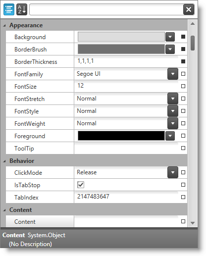

////

|metadata|
{
    "name": "xampropertygrid-adding-to-your-page",
    "tags": ["Data Binding","Getting Started","How Do I"],
    "controlName": ["xamPropertyGrid"],
    "guid": "ad2539c0-49cf-4920-944a-cad97ceb0cb4",  
    "buildFlags": [],
    "createdOn": "2014-08-28T10:36:57.920633Z"
}
|metadata|
////

= Adding xamPropertyGrid to Your Page

== Topic Overview

=== Purpose

This topic provides detailed instructions to help you get up and running as soon as possible with the link:{ApiPlatform}controls.editors.xampropertygrid.v{ProductVersion}~infragistics.controls.editors.xampropertygrid_members.html[ _xamPropertyGrid_  ].

=== Required background

The following topics are prerequisites to understanding this topic:

[options="header", cols="a,a"]
|====
|Topic|Purpose

| link:xampropertygrid-features-overview.html[Features Overview (xamPropertyGrid)]
|This topic explains the features supported by the control from developer perspective.

| link:xampropertygrid-visual-elements.html[Visual Elements (xamPropertyGrid)]
|This topic provides an overview of the visual elements of the control.

|====

=== In this topic

This topic contains the following sections:

* <<_Ref393792254, Adding xamPropertyGrid   to Your Page >>
* <<_Ref393792269, Related Content >>

[[_Ref393792254]]
== Adding  _xamPropertyGrid_  to Your Page

=== Introduction

This procedure explains step by step the operations necessary for adding the  _xamPropertyGrid_   to your page.

=== Preview

The following screenshot is a preview of the result:

=== Overview

*Following is a conceptual overview of the process:*

*1. Add Assembly references*

*2. Add Namespaces*

*3. Create xamPropertyGrid*

*4. Create an object (optional)*

*5. Bind/set object(s) for editing with the xamPropertyGrid*

=== Steps

The following steps demonstrate how to add the control to your page.

=== 1. Add Assembly references

Add the following assembly references in your project:

*{ApiPlatform}v{ProductVersion}.dll*

*{ApiPlatform}Controls.Editors.XamCalendar.v{ProductVersion}.dll*

*{ApiPlatform}Controls.Editors.XamColorPicker.v{ProductVersion}.dll*

*{ApiPlatform}Controls.Editors.XamDateTimeInput.v{ProductVersion}.dll*

*{ApiPlatform}Controls.Editors.XamMaskedInput.v{ProductVersion}.dll*

*{ApiPlatform}Controls.Editors.XamPropertyGrid.v{ProductVersion}.dll*

*{ApiPlatform}Controls.Editors.XamSlider.v{ProductVersion}.dll*

=== 2. Add Namespaces

Add the following namespaces:

*In XAML:*

[source,xaml]
----
xmlns:ig="http://schemas.infragistics.com/xaml"
----

*In C#:*

[source,csharp]
----
using Infragistics.Controls.Editors;
----

*In Visual Basic:*

[source,vb]
----
Import Infragistics.Controls.Editors
----

=== 3. Create xamPropertyGrid

Create and put the  _xamPropertyGrid_   on your page:

*In XAML:*

[source,xaml]
----
<ig:XamPropertyGrid x:Name="xamPropertyGrid1">
</ig:XamPropertyGrid>
----

=== 4. Create an object (optional)

Create the object which properties will be edited by the  _xamPropertyGrid_  .

*In C#:*

[source,csharp]
----
Button b = new Button();
----

*In Visual Basic:*

[source,vb]
----
Dim b As New Button()
----

=== 5. Bind/set object(s) for editing with the xamPropertyGrid

Set the object from the previous step (or an object of your choice) to the link:{ApiPlatform}controls.editors.xampropertygrid.v{ProductVersion}~infragistics.controls.editors.xampropertygrid~selectedobject.html[SelectedObject] property.

.Note
[NOTE]
====
You can also set an array of objects to the link:{ApiPlatform}controls.editors.xampropertygrid.v{ProductVersion}~infragistics.controls.editors.xampropertygrid~selectedobjects.html[SelectedObjects] property and edit the properties of multiple objects with similar or identical object model at once.
====

*In C#:*

[source,csharp]
----
this.xamPropertyGrid1.SelectedObject = b;
----

*In Visual Basic:*

[source,vb]
----
Me.xamPropertyGrid1.SelectedObject = b
----

[[_Ref393792269]]
== Related Content

=== Topics

The following topics provide additional information related to this topic.

[options="header", cols="a,a"]
|====
|Topic|Purpose

| link:xampropertygrid-configuring.html[Configuring xamPropertyGrid]
|This is a set of topics explaining how to configure the control.

| link:xampropertygrid-working.html[Working with xamPropertyGrid]
|This is a set of topics explaining how to work with the control.

|====