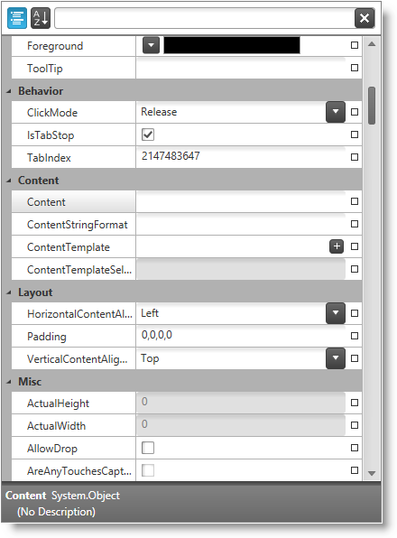

////

|metadata|
{
    "name": "xampropertygrid-features-overview",
    "tags": ["Getting Started"],
    "controlName": ["xamPropertyGrid"],
    "guid": "2ed61955-05f9-4c2e-9295-b7b638da402f",  
    "buildFlags": [],
    "createdOn": "2014-08-28T08:42:57.7818225Z"
}
|metadata|
////

= Features Overview (xamPropertyGrid)

== Topic Overview

=== Purpose

This topic explains the features supported by the control from developer perspective.

=== In this topic

This topic contains the following sections:

* <<_Ref394072159, Introduction >>
* <<_Ref394072167, Main Features >>
* <<_Ref394072173, Related Content >>

[[_Ref394072159]]
== Introduction

=== XamPropertyGrid summary

The link:{ApiPlatform}controls.editors.xampropertygrid.v{ProductVersion}~infragistics.controls.editors.xampropertygrid_members.html[ _xamPropertyGrid_  ] control provides the user with a friendly properties editing experience of a single object or multiple objects. The user has the ability to edit plain properties or complex list type properties.

Properties are edited using different editors depending of the property type. The user has the ability to browse quickly in large property lists using features like filtering, sorting or grouping.

The control provides a large number of customizations like changing the default property type editors, showing and hiding of filtering and description area, customizing the properties lists by including/excluding attached or read-only properties and many more.

The following screenshot shows the  _xamPropertyGrid_   while showing/editing a lot of object’s properties grouped by categories:

[[_Ref394072167]]
== Main Features

=== Main features summary chart

The following table summarizes the main features of the  _xamPropertyGrid_   control. Additional details are available after the summary table.

[options="header", cols="a,a"]
|====
|Feature|Description

|<<_Ref394066537,Binding to object(s)>>
|The control supports binding to a single object or multiple objects. 

.Note 

[NOTE] 

==== 

When the control is bound to multiple objects only properties available in all objects will be presented in the properties list. If you need to exclude such merged property you need to add a `MergebleProperty` attribute. For more information please look at the link:xampropertygrid-list-of-attributes.html[List of Supported Attributes] topic. 

====

|<<_Ref394072175,Brush editor>>
|The control has a robust brush editor which lets the user to edit properties of type Brush including gradient brushes.

|<<_Ref394066545,Custom editor definitions>>
|The control supports the definition of custom editors.

|<<_Ref394066572,Description area>>
|The control has a description area used for displaying information regarding the currently selected property.

|<<_Ref394066580,Expandable properties>>
|The control supports drill down into collections/lists using expandable properties.

|<<_Ref394066594,Filtering>>
|The filtering feature allows the user to specify filter criteria for property names to enable efficient browsing of long property lists.

|<<_Ref394066601,Grouping>>
|The grouping feature groups properties by category in an expandable/collapsible tree node.

|<<_Ref394072173,Property generators>>
|The control uses replaceable property generators to discover the properties it should display for the currently selected object(s).

|<<_Ref394066619,Reset property value>>
|The control allows the user to reset the value of a property to its default value.

|<<_Ref394066609,Sorting>>
|The sorting feature allows the user to sort the property list by property name.

|====

[[_Ref394066537]]

=== Binding to object(s)

The control supports binding to a single or multiple objects. Binding to multiple objects allows the user to change a property value simultaneously on multiple objects.

==== Related Topics:

link:xampropertygrid-adding-to-your-page.html[Adding xamPropertyGrid to Your Page]

[[_Ref394072175]]

=== Brush editor

In addition to built-ins editors for basic property types the  _xamPropertyGrid_   ships with a Visual Studio-like editor for manipulating properties of type Brush. It provides a UI for editing Solid, LinearGradient and RadialGradient type brushes.

[[_Ref394066545]]

=== Custom editor definitions

Each property type has its own default editor (for example enumerations are edited by useing a `ComboBox`) however you can create custom editors for specific property types, property names and/or property categories.

==== Related Topics:

link:xampropertygrid-conf-editors.html[Configuring Editors Definitions (xamPropertyGrid)]

[[_Ref394066572]]

=== Description area

The description area at the bottom of the control contains the following information about the currently selected property:

* Property type
* Property description

The description area can be shown or hidden.

==== Related Topics:

link:xampropertygrid-conf-visuals.html[Configuring Visual Appearance (xamPropertyGrid)]

[[_Ref394066580]]

=== Expandable properties

The control allows the user to drill down into more complex properties (like collections or lists) using a special expand/collapse glyph on the left of the property.

==== Related Topics:

link:xampropertygrid-work-expandable-properties.html[Expandable Properties Support (xamPropertyGrid)]

[[_Ref394066594]]

=== Filtering

The control allows the user to enter a filter value in the text box located in the filtering area at the top of the control. This filter is used as "contains" filter for displaying the property list, and the pipe symbol (i.e., "|") can be used to specify multiple filter criteria which are combined using an "Or" operator. In addition you can programmatically add custom filters (based on the "ICondition" interface) which are combined using an "and" operator with the value specified by the user.

==== Related Topics:

link:xampropertygrid-conf-properties-filtering.html[Properties List Filtering (xamPropertyGrid)]

[[_Ref394066601]]

=== Grouping

The control supports grouping of properties based on their categories - categories are assigned via the CategoryAttribute. The categories are expandable/collapsible. The properties in each category are sorted alphabetically.

==== Related Topics:

link:xampropertygrid-conf-visuals.html[Configuring Visual Appearance (xamPropertyGrid)]

[[_Ref394072173]]

=== Property generators

The control uses property generators to discover the properties to display for the currently selected object(s). The control ships with 2 built-in property generators - one uses reflection and the other uses TypeDescriptor to discover properties. You can also create your own custom property generators.

==== Related Topics:

link:xampropertygrid-property-item-generators.html[Property Item Generators (xamPropertyGrid)]

[[_Ref394066619]]

=== Reset property value

The control allows the user to reset a property to its default value using a glyph located at the right side of the property value.

==== Related Topics:

link:xampropertygrid-resetting-property-value.html[Resetting Property Value (xamPropertyGrid)]

[[_Ref394066609]]

=== Sorting

The sorting feature allows the user to sort all properties ascending regardless of their category. This forms an alphabetically sorted list containing all properties and no category groups are shown.

==== Related Topics:

link:xampropertygrid-conf-visuals.html[Configuring Visual Appearance (xamPropertyGrid)]

== Related Content

=== Topics

The following topics provide additional information related to this topic.

[options="header", cols="a,a"]
|====
|Topic|Purpose

| link:xampropertygrid-visual-elements.html[Visual Elements (xamPropertyGrid)]
|This topic provides an overview of the visual elements of the control.

| link:xampropertygrid-user-interactions.html[User Interactions and Usability (xamPropertyGrid)]
|This topic explains what actions can be performed by the user.

| link:xampropertygrid-list-of-attributes.html[List of Supported Attributes (xamPropertyGrid)]
|This topic lists the attributes which are used by the control when retrieving properties’ list from the objects.

|====