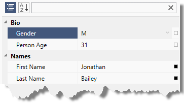
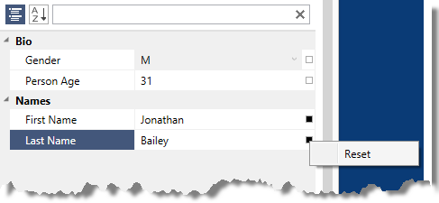

////

|metadata|
{
    "name": "xampropertygrid-resetting-property-value",
    "tags": ["How Do I"],
    "controlName": ["xamPropertyGrid"],
    "guid": "5398c4b0-2305-4c4d-8df1-2de13d729d34",  
    "buildFlags": [],
    "createdOn": "2014-08-28T11:05:06.3990392Z"
}
|metadata|
////

= Resetting Property Value (xamPropertyGrid)

== Topic Overview

=== Purpose

This topic explains how to define default property value and how to customize the options menu.

=== Required background

The following topics are prerequisites to understanding this topic:

[options="header", cols="a,a"]
|====
|Topic|Purpose

| link:xampropertygrid-features-overview.html[Features Overview (xamPropertyGrid)]
|This topic explains the features supported by the control from developer perspective.

| link:xampropertygrid-visual-elements.html[Visual Elements (xamPropertyGrid)]
|This topic provides an overview of the visual elements of the control.

| link:xampropertygrid-adding-to-your-page.html[Adding xamPropertyGrid to Your Page]
|This topic provides detailed instructions to help you get up and running as soon as possible with the _xamPropertyGrid_ .

|====

=== In this topic

This topic contains the following sections:

* <<_Ref395170996, Reset Property Value Introduction >>
* <<_Ref395175215, Define Default Property Value Summary >>
* <<_Ref395171726, Defining Default Property Value Using Attribute >>
* <<_Ref395171744, Defining Default Property Value Using Methods >>
* <<_Ref395188115, Customizing Options Menu >>
* <<_Ref395175260, Related Content >>

[[_Ref395170996]]
== Reset Property Value Introduction

=== Reset property value summary

The property value reset feature of the link:{ApiPlatform}controls.editors.xampropertygrid.v{ProductVersion}~infragistics.controls.editors.xampropertygrid_members.html[ _xamPropertyGrid_  ] control allows the user to reset each property independently to its default value if a default value has been defined. Each property has a small glyph on the right side of the property value. The following screenshot shows the states of the reset value glyph:

[cols="a,a"]
|====
|Empty square
|The property value cannot be reset (either because the current value is the default one or the property does not have a default value defined).

|Filled square
|The current property value can be reset.

|====

.Note
[NOTE]
====
A tooltip is displayed when the user hovers the mouse over the glyph. For glyphs that are rendered as an empty square the tooltip text is "*Default*". For glyphs that are rendered as a filled square the tooltip text is "*Local* " (meaning that a local non-default value has been set).
====

After clicking the reset glyph an options menu will appear. By default it contains only one option for resetting property value, however you can specify a custom options menu by setting the  _xamPropertyGrid’s_   link:{ApiPlatform}controls.editors.xampropertygrid.v{ProductVersion}~infragistics.controls.editors.xampropertygrid~optionsmenu.html[OptionsMenu] property to any `ContextMenu`. The `DataContext` of the custom `ContextMenu` will be automatically set to the link:{ApiPlatform}controls.editors.xampropertygrid.v{ProductVersion}~infragistics.controls.editors.propertygridpropertyitem_members.html[PropertyGridPropertyItem] associated with the current property.

The following screenshot shows the default options menu shown after clicking on the "full square" reset property value glyph:

[[_Ref395175215]]
== Define Default Property Value Summary

=== Define default property value configuration summary chart

The following table explains briefly the ways to define default property value. Further details are available after the table.

[options="header", cols="a,a"]
|====
|Configurable aspect|Details

|<<_Ref395171726,Defining Default Property Value Using Attribute>>
|Define default property value using the "DefaultValue" attribute.

|<<_Ref395171744,Defining Default Property Value Using Methods>>
|Define default property value using methods.

|====

[[_Ref395171726]]
== Defining Default Property Value Using Attribute

[[_Hlk368069110]]

=== Overview

You can define a default property value using in code using the "DefaultValue" attribute.

[[_Hlk337817761]]

=== Example

The following code snippet demonstrates how to define a property default value using the "DefaultValue" attribute.

*In C#:*

[source,csharp]
----
public class Person
{
  [DefaultValue("first-name-default-value")]
  public string FirstName { get; set; }
  …
}
----

*In Visual Basic:*

[source,vb]
----
Public Class Person
  <DefaultValue("first-name-default-value")> _
  Public Property FirstName() As String
    Get
      Return m_FirstName
    End Get
    Set
      m_FirstName = Value
    End Set
  End Property
  Private m_FirstName As String
End Class
----

[[_Ref395171744]]
== Defining Default Property Value Using Methods

=== Overview

If a property has a default value that cannot be expressed with a "DefaultValue" attribute, you can provide a default property value in code using the "Reset/ShouldSerialize" pattern:

[start=1]
. Define a "reset" method for each property you want to reset with the same name as the property prefixed by "Reset" and a return type of void. In this method set the property default value to its default.
[start=2]
. Define a "should serialize" method for each property you want to reset with the same name as the property prefixed by "ShouldSerialize" and a return type of `bool`. This method should return `true` when the property value can be reset.

=== Example

The following code snippet demonstrates how to define a property default value using methods.

*In C#:*

[source,csharp]
----
public class Person : INotifyPropertyChanged
{
  private string firstNameDefault = "first-name-default-value";
  public string FirstName { get; set; }
  public void ResetFirstName()
  {
    this.FirstName = this.firstNameDefault;
    this.PropertyChange("FirstName");
  }
  public bool ShouldSerializeFirstName()
  {
    return !this.firstNameDefault.Equals(this.FirstName);
  }
  …
  public event PropertyChangedEventHandler PropertyChanged;
  private void PropertyChange(string propertyName)
  {
    if (this.PropertyChanged != null)
    {
      this.PropertyChanged(this, new PropertyChangedEventArgs(propertyName));
    }
  }
}
----

*In Visual Basic:*

[source,vb]
----
Public Class Person Implements INotifyPropertyChanged
 Private firstNameDefault As String = "first-name-default-value"
  Public Property FirstName() As String
    Get
      Return m_FirstName
    End Get
    Set
      m_FirstName = Value
    End Set
  End Property
  Private m_FirstName As String
  Public Sub ResetFirstName()
    Me.FirstName = Me.firstNameDefault
    Me.PropertyChange("FirstName")
  End Sub
  Public Function ShouldSerializeFirstName() As Boolean
    Return Not Me.firstNameDefault.Equals(Me.FirstName)
  End Function
  …
  Public Event PropertyChanged As PropertyChangedEventHandler
  Private Sub PropertyChange(propertyName As String)
    RaiseEvent PropertyChanged(Me, New PropertyChangedEventArgs(propertyName))
  End Sub
End Class
----

[[_Ref395188115]]
== Customizing Options Menu

=== Overview

The default options menu is opened by clicking on the glyph positioned at right of each property value and has only one option – Reset (for resetting the property to a default value). You can customize this menu by modifying the  _xamPropertyGrid’s_   link:{ApiPlatform}controls.editors.xampropertygrid.v{ProductVersion}~infragistics.controls.editors.xampropertygrid~optionsmenu.html[OptionsMenu] property and provide a new instance of type `ContextMenu`. The DataContext of the custom ContextMenu will be automatically set to the PropertyGridPropertyItem associated with the current property.

=== Example

The following code example demonstrates how to define an options menu with the default "Reset" option and also two more options for displaying current property name and current property value.

*In XAML:*

[source,xaml]
----
<ig:XamPropertyGrid x:Name="xamPropertyGrid1">
  <ig:XamPropertyGrid.OptionsMenu>
    <ContextMenu
      ig:Commanding.CommandTarget="{Binding ElementName=xamPropertyGrid1}"
      DataContext="{Binding ElementName=xamPropertyGrid1}">
      <MenuItem Header="Reset Value">
        <ig:Commanding.Command>
          <igPrim:PropertyGridPropertyItemCommandSource
          EventName="Click"
          CommandType="ResetPropertyValue" ParameterBinding="{Binding Path=SelectedItem}" />
        </ig:Commanding.Command>
      </MenuItem>
      <MenuItem Header="Obtain Property Name" Click="MenuItemName_Click" />
      <MenuItem Header="Obtain Property Value" Click="MenuItemValue_Click" />
    </ContextMenu>
  </ig:XamPropertyGrid.OptionsMenu>
</ig:XamPropertyGrid>
----

*In C#:*

[source,csharp]
----
private void MenuItemName_Click(object sender, RoutedEventArgs e)
{
  MenuItem mi = sender as MenuItem;
  PropertyGridPropertyItem pgpi = mi.DataContext as PropertyGridPropertyItem;
  MessageBox.Show(pgpi.PropertyName, "Property Name");
}
private void MenuItemValue_Click(object sender, RoutedEventArgs e)
{
  MenuItem mi = sender as MenuItem;
  PropertyGridPropertyItem pgpi = mi.DataContext as PropertyGridPropertyItem;
  MessageBox.Show(pgpi.Value.ToString(), "Property Value");
}
----

*In Visual Basic:*

[source,vb]
----
Private Sub MenuItemName_Click(sender As Object, e As RoutedEventArgs)
  Dim mi As MenuItem = TryCast(sender, MenuItem)
  Dim pgpi As PropertyGridPropertyItem = TryCast(mi.DataContext, PropertyGridPropertyItem)
  MessageBox.Show(pgpi.PropertyName, "Property Name")
End Sub
Private Sub MenuItemValue_Click(sender As Object, e As RoutedEventArgs)
  Dim mi As MenuItem = TryCast(sender, MenuItem)
  Dim pgpi As PropertyGridPropertyItem = TryCast(mi.DataContext, PropertyGridPropertyItem)
  MessageBox.Show(pgpi.Value.ToString(), "Property Value")
End Sub
----

[[_Ref395175260]]
== Related Content

=== Topics

The following topics provide additional information related to this topic.

[options="header", cols="a,a"]
|====
|Topic|Purpose

| link:xampropertygrid-work-expandable-properties.html[Expandable Properties Support (xamPropertyGrid)]
|This topic explains how the control identifies and displays expandable properties.

| link:xampropertygrid-property-item-generators.html[Property Item Generators (xamPropertyGrid)]
|This topic explains how the control discovers properties on the selected object(s), generates the list of property items and how the process can be configured and customized.

| link:xampropertygrid-commands.html[Working with Commands (xamPropertyGrid)]
|This topic explains how to perform different operations with the control using commands.

|====

=== Samples

The following samples provide additional information related to this topic.

[options="header", cols="a,a"]
|====
|Sample|Purpose

| link:{SamplesURL}/property-grid/reset-property-value[Reset Property Value]
|This sample demonstrates two different ways for resetting property value.

|====