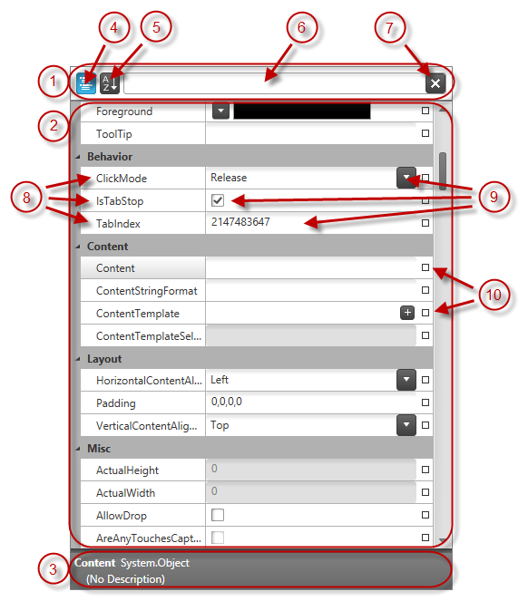

////

|metadata|
{
    "name": "xampropertygrid-visual-elements",
    "tags": ["Getting Started","Layouts"],
    "controlName": ["xamPropertyGrid"],
    "guid": "3ec70f59-1f0e-420b-a0a3-5b82b13365ed",  
    "buildFlags": [],
    "createdOn": "2014-08-28T08:44:33.907903Z"
}
|metadata|
////

= Visual Elements (xamPropertyGrid)

== Topic Overview

=== Purpose

This topic provides an overview of the visual elements of the control.

=== Required background

The following topics are prerequisites to understanding this topic:

[options="header", cols="a,a"]
|====
|Topic|Purpose

| link:xampropertygrid-features-overview.html[Features Overview (xamPropertyGrid)]
|This topic explains in details the features of the _xamPropertyGrid_ control from developer perspective.

|====

=== In this topic

This topic contains the following sections:

* <<_Ref394320297, Visual Elements of xamPropertyGrid Control >>
* <<_Ref394320304, Related Content >>

[[_Ref394320297]]
== Visual Elements of xamPropertyGrid Control

=== Visual elements summary

The following screenshot depicts the visual elements of the link:{ApiPlatform}controls.editors.xampropertygrid{ApiVersion}~infragistics.controls.editors.xampropertygrid_members.html[ _xamPropertyGrid_  ] control. The configurable elements are listed after the image.

=== Visual elements and related properties

The following table maps the visual elements of the  _xamPropertyGrid_   control and the properties that configure them.

[options="header", cols="a,a"]
|====
|Visual Element|Property/Topic

|
[start=1] 

. Filter Area 

| link:xampropertygrid-conf-visuals.html[Configuring Visual Appearance (xamPropertyGrid)]

|
[start=2] 

. Property Editing Area 

| link:xampropertygrid-conf-visuals.html[Configuring Visual Appearance (xamPropertyGrid)]

|
[start=3] 

. Description Area 

| link:xampropertygrid-conf-visuals.html[Configuring Visual Appearance (xamPropertyGrid)]

|
[start=4] 

. Category List Button 

| link:{ApiPlatform}controls.editors.xampropertygrid{ApiVersion}~infragistics.controls.editors.xampropertygrid~iscategorized.html[IsCategorized]

|
[start=5] 

. Alphabetized Properties List Button 

|`IsCategorized`

|
[start=6] 

. Properties Filter Text Box 

| link:{ApiPlatform}controls.editors.xampropertygrid{ApiVersion}~infragistics.controls.editors.xampropertygrid~filtertext.html[FilterText]

|
[start=7] 

. Properties Filter Text Box Clear Button 

|`FilterText`

|
[start=8] 

. Property Name 

| link:xampropertygrid-property-item-generators.html[Property Item Generators (xamPropertyGrid)]

|
[start=9] 

. Property Value Editor 

| link:xampropertygrid-conf-editors.html[Configuring Editors Definitions (xamPropertyGrid)]

|
[start=10] 

. Property Value Reset Glyph 

| link:xampropertygrid-resetting-property-value.html[Resetting Property Value (xamPropertyGrid)]

|====

[[_Ref394320304]]
== Related Content

=== Topics

The following topics provide additional information related to this topic.

[options="header", cols="a,a"]
|====
|Topic|Purpose

| link:xampropertygrid-user-interactions.html[User Interactions and Usability (xamPropertyGrid)]
|This topic explains what actions can be performed by the user.

| link:xampropertygrid-list-of-attributes.html[List of Supported Attributes (xamPropertyGrid)]
|This topic lists the attributes which are used by the control when retrieving properties’ list from the objects.

|====