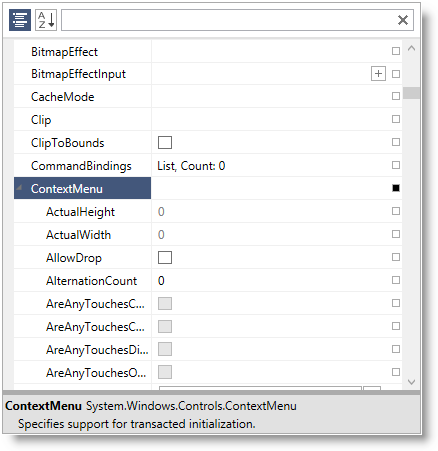
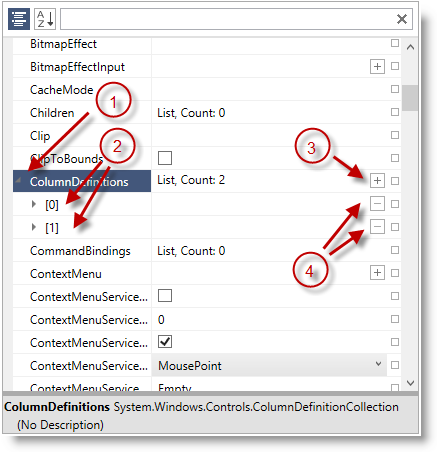
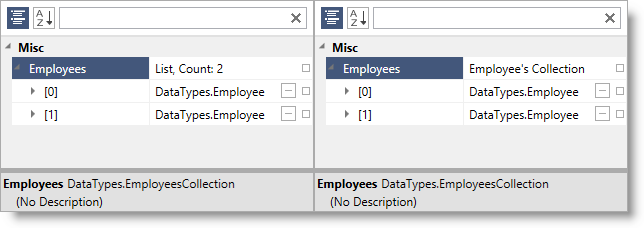
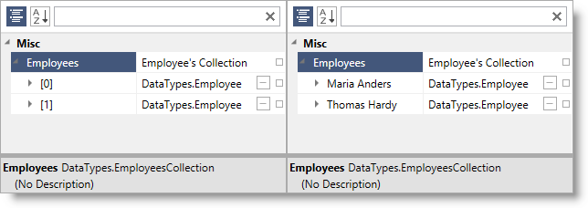

////

|metadata|
{
    "name": "xampropertygrid-work-expandable-properties",
    "tags": ["Drilldown","Editing"],
    "controlName": ["xamPropertyGrid"],
    "guid": "536a6799-c8ab-4404-a9be-4c0aec695ec4",  
    "buildFlags": [],
    "createdOn": "2014-08-28T10:52:56.2863729Z"
}
|metadata|
////

= Expandable Properties Support (xamPropertyGrid)

== Topic Overview

=== Purpose

This topic explains how the control identifies and displays expandable properties.

=== Required background

The following topics are prerequisites to understanding this topic:

[options="header", cols="a,a"]
|====
|Topic|Purpose

| link:xampropertygrid-features-overview.html[Features Overview (xamPropertyGrid)]
|This topic explains the features supported by the control from developer perspective.

| link:xampropertygrid-visual-elements.html[Visual Elements (xamPropertyGrid)]
|This topic provides an overview of the visual elements of the control.

|====

=== In this topic

This topic contains the following sections:

* <<_Ref424308539,Expandable Properties Introduction>>
* <<_Ref424308609,Types with Public Properties>>
* <<_Ref424308656,Collection Types>>
* <<_Ref424308689,Customizing Collection Types' Rendering>>
* <<_Ref424308746,Providing External Editors for Expandable Properties>>
* <<_Ref424308800,Related Content>>

[[_Ref424308539]]
== Expandable Properties Introduction

=== Summary

The link:{ApiPlatform}controls.editors.xampropertygrid{ApiVersion}~infragistics.controls.editors.xampropertygrid_members.html[ _xamPropertyGrid_  ] control supports the displaying of "expandable" properties. These properties contain child items/elements which can be revealed by clicking the expander glyph at the left edge of the expandable property item. A property is considered to be expandable if it satisfies certain criteria which are discussed below.

[[_Ref424308609]]
== Types with Public Properties

*Types With Public Properties*  - types which exposes one or more public properties (for example the `Style` property of a `Button` instance) or which have an `ExpandableObjectConverter` attribute. When expanded, the  _xamPropertyGrid_   displays an indented list of the type's properties.

If the type has a public parameter-less constructor and the property value is currently null, the  _xamPropertyGrid_   will display a button with a plus sign at the right edge of the property item which, when clicked, will create an instance of the type.

The following screenshot shows a type with public properties (ContextMenu) rendered in the  _xamPropertyGrid_  :

[[_Ref424308656]]
== Collection Types

*Collection Types*  - types which implement `ICollection`, `IList` or `IEnumerable`. When expanded, the  _xamPropertyGrid_   displays an indented list of the elements in the list.

If the list is an `ICollection<T>` where `T` has a public parameter-less constructor, and the list is modifiable, the  _xamPropertyGrid_   will display a button with a plus sign at the right edge of the list property which, when clicked, will add an entry of type `T` to the list.

If the list is modifiable, the  _xamPropertyGrid_   will also display a button with a minus sign at the right edge of each list element which, when clicked, will remove the respective element from the list.

The following screenshot shows a list type property (ColumnDefinitions) rendered in the  _xamPropertyGrid_  :

[start=1]
. Expand/collapse handle for an expandable property/collection
[start=2]
. Properties/elements of the expandable property/collection
[start=3]
. Plus-button for adding more elements to this collection
[start=4]
. Minus-buttons for removing particular element from this collection

[[_Ref424308689]]
== Customizing Collection Types' Rendering

=== Change collection description

By default the  _xamPropertyGrid_   control renders the collection type and the elements count in the value column. You can modify this value by performing the following steps:

* Create a class deriving from `System.ComponentModel.TypeConverter`
* Override the `ConvertTo` method to return the desired string value
* Decorate your collection property with the `TypeConverter` attribute and provide as argument the type of the class created in the first step

The following screenshot shows the default collection rendering on the left and a collection with customized rendering on the right:

The following code snippet shows how to achieve the above result:

*In Visual Basic:*

[source,vb]
----
Public Class CustomTypeConverter
  Inherits TypeConverter
  Public Overrides Function ConvertTo( _
    context As ITypeDescriptorContext, _
    culture As CultureInfo, _
    value As [Object], _
    destinationType As Type) As Object
    Return "Employee's Collection"
  End Function
End Class
…
<TypeConverter(GetType(CustomTypeConverter))> _
Public Property Customers() As List(Of Customer)
  Get
    Return m_Customers
  End Get
  Set
    m_Customers = Value
  End Set
End Property
Private m_Customers As List(Of Customer)
----

*In C#:*

[source,csharp]
----
public class CustomTypeConverter : TypeConverter
{
  public override object ConvertTo(
    ITypeDescriptorContext context,
    CultureInfo culture,
    Object value,
    Type destinationType)
  {
    return "Employee's Collection";
  }
}
…
[TypeConverter(typeof(CustomTypeConverter))]
public List<Customer> Customers
{
  get; set;
}
----

=== Change collection item's display name

By default the  _xamPropertyGrid_   control renders the collection's elements as indexes in square brackets ([0], [1], [2]…). You can customize this by performing the following steps:

* Have your collection implement the `System.ComponentModel.ICustomTypeDescriptor` interface.
* The key method to implement from this interface is the `GetProperties()` method. It should return a collection of objects which should be extending from the `System.ComponentModel.PropertyDescriptor` type.
* Provide a custom display name for each collection's element by overriding the `PropertyDescriptor`'s `DisplayName` string property.

.Note
[NOTE]
====
You also need to implement the abstract `Setvalue()`/`GetValue()` methods in order to have a logic for setting and obtaining the property value.
====

.Note
[NOTE]
====
You can customize collection item's value rendered by the  _xamPropertyGrid_   by simply overriding the `ToString()` method of your data objects.
====

The following screenshot shows the default collection element's rendering on the left and a collection with customized element's rendering on the right:

The following code snippet shows how to achieve the above result:

*In Visual Basic:*

[source,vb]
----
Public Class Employee
  Public Property FirstName() As String
    Get
      Return m_FirstName
    End Get
    Set
      m_FirstName = Value
    End Set
  End Property
  Private m_FirstName As String
  Public Property LastName() As String
    Get
      Return m_LastName
    End Get
    Set
      m_LastName = Value
    End Set
  End Property
  Private m_LastName As String
End Class
Public Class EmployeePropertyDescriptor
  Inherits PropertyDescriptor
  Private collection As EmployeeCollection
  Private index As Integer
  Public Sub New(col As EmployeeCollection, i As Integer)
    Me.collection = col
    Me.index = i
  End Sub
  Public Overrides ReadOnly Property DisplayName() As String
    Get
      Dim emp As Employee = Me.collection(index)
      Return emp.FirstName & " " & Convert.ToString(emp.LeftName)
    End Get
  End Property
End Class
Public Class EmployeeCollection
  Inherits List(Of Employee)
  Implements ICustomTypeDescriptor
  Public Function GetProperties() As PropertyDescriptorCollection
    Dim pds As New PropertyDescriptorCollection(Nothing)
    For i As Integer = 0 To Me.Count - 1
      Dim pd As New EmployeePropertyDescriptor(Me, i)
      pds.Add(pd)
    Next
    Return pds
  End Function
End Class
----

*In C#:*

[source,csharp]
----
public class Employee
{
  public string FirstName { get; set; }
  public string LastName { get; set; }
}
public class EmployeePropertyDescriptor : PropertyDescriptor
{
  private EmployeeCollection collection;
  private int index;
  public EmployeePropertyDescriptor(EmployeeCollection col, int i)
  {
    this.collection = col;
    this.index = i;
  }
  public override string DisplayName
  {
    get
    {
      Employee emp = this.collection[index];
      return emp.FirstName + " " + emp.LeftName;
    }
  }
}
public class EmployeeCollection : List<Employee>, ICustomTypeDescriptor
{
  public PropertyDescriptorCollection GetProperties()
  {
    PropertyDescriptorCollection pds = new PropertyDescriptorCollection(null);
    for (int i = 0; i < this.Count; i++)
    {
      EmployeePropertyDescriptor pd = new EmployeePropertyDescriptor(this, i);
      pds.Add(pd);
    }
    return pds;
  }
}
----

[[_Ref424308746]]
== Providing External Editors for Expandable Properties

=== Summary

You can provide external editors for both collection types and types with public properties. By providing such external editors the  _xamPropertyGrid_   will not render the indented list of properties/collection items. Instead the supplied external editor will be used to rendering the expandable property and/or collection's data.

When creating your external editor's data template keep in mind that the data template's data context will be set to the link:{ApiPlatform}controls.editors.xampropertygrid{ApiVersion}~infragistics.controls.editors.propertygridpropertyitem.html[PropertyGridPropertyItem] associated with the expandable property which means you can obtain the underlying property value by binding to the `PropertyGridPropertyItem`'s link:{ApiPlatform}controls.editors.xampropertygrid{ApiVersion}~infragistics.controls.editors.propertygridpropertyitem~value.html[Value] property.

For more information on how to provide external editors see the link:xampropertygrid-conf-editors.html[Configuring Editors Definitions] topic.

[[_Ref424308800]]
== Related Content

=== Topics

The following topics provide additional information related to this topic.

[options="header", cols="a,a"]
|====
|Topic|Purpose

| link:xampropertygrid-conf-editors.html[Configuring Editors Definitions (xamPropertyGrid)]
|This topic explains how to customize the editors used for editing the properties' values.

| link:xampropertygrid-property-item-generators.html[Property Item Generators (xamPropertyGrid)]
|This topic explains how the control discovers properties on the selected object(s), generates the list of property items and how the process can be configured and customized.

| link:xampropertygrid-resetting-property-value.html[Resetting Property Value (xamPropertyGrid)]
|This topic explains how to define default property value and how to customize the options menu.

| link:xampropertygrid-commands.html[Working with Commands (xamPropertyGrid)]
|This topic explains how to perform different operations with the control using commands.

|====

=== Samples

The following samples provide additional information related to this topic.

[options="header", cols="a,a"]
|====
|Sample|Purpose

| link:{SamplesURL}/property-grid/customizing-expandable[Customizing Expandable Properties]
|This sample demonstrates how to customize the collection's value column and collection elements' rendering.

| link:{SamplesURL}/property-grid/external-editors[Providing External Editors]
|This sample demonstrates how to create and set custom external editors for your complex properties.

|====