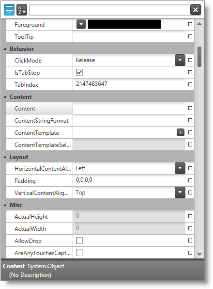

////

|metadata|
{
    "name": "xampropertygrid",
    "tags": [],
    "controlName": ["xamPropertyGrid"],
    "guid": "c6d53517-05bc-4686-92d0-5adcf727612c",  
    "buildFlags": [],
    "createdOn": "2014-07-11T11:57:44.1059022Z"
}
|metadata|
////

= xamPropertyGrid

== In This Group of Topics

=== Introduction

The link:{ApiPlatform}controls.editors.xampropertygrid{ApiVersion}~infragistics.controls.editors.xampropertygrid_members.html[ _xamPropertyGrid_  ] control provides the user with a friendly properties editing experience of a single object or multiple objects.

The following screenshot shows the  _xamPropertyGrid_   while showing/editing a lot of object’s properties grouped by categories:

=== Topics

[options="header", cols="a,a"]
|====
|Topic|Purpose

| link:xampropertygrid-overview.html[Overview (xamPropertyGrid)]
|This is a group of topics providing you with an overview of the features, visual elements and user interactions of the _xamPropertyGrid_ control.

| link:xampropertygrid-adding-to-your-page.html[Adding xamPropertyGrid to Your Page]
|This topic provides detailed instructions to help you get up and running as soon as possible with the _xamPropertyGrid_ .

| link:xampropertygrid-configuring.html[Configuring xamPropertyGrid]
|The topics in this section provide information about configuring the control.

| link:xampropertygrid-working.html[Working with xamPropertyGrid]
|The topics in this section provide deep knowledge on how to manage the control programmatically.

| link:xampropertygrid-api-reference.html[API Reference (xamPropertyGrid)]
|This topic provides reference information about the namespaces and classes related to the control.

|====