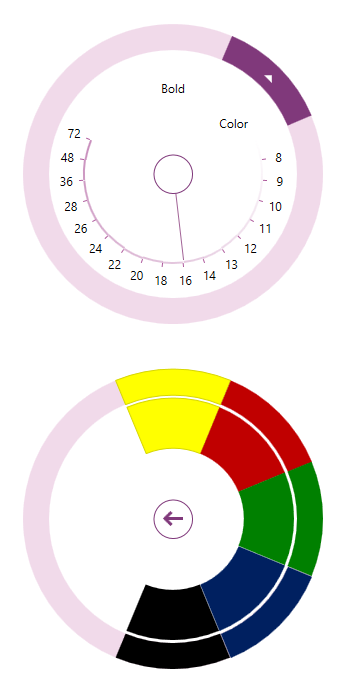

////

|metadata|
{
    "name": "xamradialmenu-adding-to-your-page",
    "tags": ["Getting Started"],
    "controlName": ["xamRadialMenu"],
    "guid": "af9c38ec-28cd-4780-af60-bbacb2b2b739",  
    "buildFlags": [],
    "createdOn": "2016-05-25T18:21:57.838306Z"
}
|metadata|
////

= Adding xamRadialMenu to Your Page

== Topic Overview

=== Purpose

This topic provides detailed instructions to help you get up and running as soon as possible with the link:{ApiPlatform}controls.menus.xamradialmenu{ApiVersion}~infragistics.controls.menus.xamradialmenu.html[ _xamRadialMenu_  ]™.

=== Required background

The following topics are prerequisites to understanding this topic:

[options="header", cols="a,a"]
|====
|Topic|Purpose

| link:xamradialmenu-features.html[xamRadialMenu Features]
|This topic explains the features supported by the control from developer perspective.

| link:xamradialmenu-visual-elements.html[xamRadialMenu Visual Elements]
|This topic provides an overview of the visual elements of the control.

|====

=== In this topic

This topic contains the following sections:

* <<_Ref378751700,Adding xamRadialMenu to Your Page>>
* <<_Ref378751704,Related Content>>

[[_Ref378751700]]
== Adding  _xamRadialMenu_  to Your Page

=== Introduction

The procedure bellow provides guidance on how to add the  _xamRadialMenu_   control and optional step on how to add different types of menu items.

=== Preview

The following screenshot is a preview of the final result including all optional steps:

=== Steps

The following steps demonstrate how to add xamRadialMenu to your page.

=== 1. Assembly references

Add the following assembly references in your project: 

*{ApiPlatform}{ApiVersion}* 

*{ApiPlatform}DataVisualization.{ApiVersion}*

*{ApiPlatform}Controls.Menus.XamRadialMenu.{ApiVersion}*

=== 2. Namespaces

Add the following namespaces:

Following is the code that implements this example.

*In XAML:*

[source,xaml]
----
xmlns:ig="http://schemas.infragistics.com/xaml"
----

Following is the code that implements this example.

*In C#:*

[source,csharp]
----
using Infragistics.Controls.Menus;
----

Following is the code that implements this example.

*In Visual Basic:*

[source,vb]
----
Imports Infragistics.Controls.Menus
----

=== 3. Create an instance of the xamRadialMenu

Create and place the  _xamRadialMenu_   on your page:

Following is the code that implements this example.

*In XAML:*

[source,xaml]
----
<ig:XamRadialMenu
 x:Name="rMenu" Width="300" Height="300">
<!-- Put menu items here -->
</ig:XamRadialMenu>
----

=== 4. Add a button item (optional)

Define a button item in the  _xamRadialMenu_  :

Following is the code that implements this example.

*In XAML:*

[source,xaml]
----
<ig:RadialMenuItem
 Header="Bold"
 Click="RadialMenuBold_Click" />
----

Following is the code that implements this example.

*In C#:*

[source,csharp]
----
public void RadialMenuBold_Click(object sender, EventArgs e)
{
    // code for handling the button item click event
}
----

Following is the code that implements this example.

*In Visual Basic:*

[source,vb]
----
Public Sub RadialMenuBold_Click(sender As Object, e As EventArgs)
    ' code for handling the button item click event
End Sub
----

=== 5. Add a color item (optional)

Define a color item with child color well items in the  _xamRadialMenu_  :

*In XAML:*

[source,xaml]
----
<ig:RadialMenuColorItem Header="Color">
    <ig:RadialMenuColorWell Color="#FFFF00" />
    <ig:RadialMenuColorWell Color="#C00000" />
    <ig:RadialMenuColorWell Color="#008000" />
    <ig:RadialMenuColorWell Color="#002060" />
    <ig:RadialMenuColorWell Color="#000000" />
</ig:RadialMenuColorItem>
----

=== 6. Add a numeric gauge item (optional)

Following is the code that implements this example.

*In XAML:*

[source,xaml]
----
<ig:RadialMenuNumericGauge
 WedgeSpan="5" Value="16"
    Ticks="8 9 10 11 12 13 14 16 18 20 22 24 26 28 36 48 72" />
----

[[_Ref378751704]]
== Related Content

=== Topics

The following topic provides additional information related to this topic.

[options="header", cols="a,a"]
|====
|Topic|Purpose

| link:xamradialmenu-configuration-overview.html[xamRadialMenu Configuration Overview]
|This topic explains how to configure the _xamRadialMenu_ control.

|====