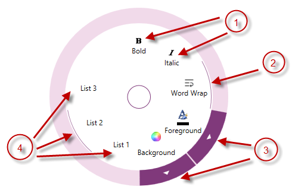

////

|metadata|
{
    "name": "xamradialmenu-configuring-button-items",
    "tags": ["How Do I","Layouts"],
    "controlName": ["xamRadialMenu"],
    "guid": "38f383c9-6255-4d66-b27c-8233e109bb85",  
    "buildFlags": [],
    "createdOn": "2016-05-25T18:21:57.8933112Z"
}
|metadata|
////

= Configuring Button Items (xamRadialMenu)

== Topic Overview

=== Purpose

This topic explains the link:{ApiPlatform}controls.menus.xamradialmenu.v{ProductVersion}~infragistics.controls.menus.xamradialmenu.html[ _xamRadialMenu_  ]™ button items.

=== Required background

The following topics are prerequisites to understanding this topic:

[options="header", cols="a,a"]
|====
|Topic|Purpose

| link:xamradialmenu-features.html[xamRadialMenu Features]
|This topic explains the features supported by the control from developer perspective.

| link:xamradialmenu-visual-elements.html[xamRadialMenu Visual Elements]
|This topic provides an overview of the visual elements of the control.

| link:xamradialmenu-items-sub-items-configuration-overview.html[Items/Sub-Items Configuration Overview]
|This topic explains in general the menu items and their common configuration properties.

|====

=== In this topic

This topic contains the following sections:

* <<_Ref378077373,Introduction>>
* <<_Ref378077405,Button Items Configuration Summary>>
* <<_Ref378077425,Related Content>>

[[_Ref378077373]]
== Introduction

=== Button items summary

The  _xamRadialMenu’s_   button items are ordinary items, represented by the link:{ApiPlatform}controls.menus.xamradialmenu.v{ProductVersion}~infragistics.controls.menus.radialmenuitem.html[RadialMenuItem] class which may be clicked to perform an action. The button items can include text and/or icons. Additionally, button items can have Sub-Items, and in this case the parent item will have an arrow button on the outer ring allowing the user to navigate the Sub-Items group.

You may configure button items as checkbox items, in which case an arc indicates their checked state is within the items area just inside the outer ring.

Button items can be configured as radio button items and there are two modes in which they can operate:

* Radio button group with at least one checked item
* Radio button group with no checked items

The following screenshot shows different button item types:

[start=1]
. Plain button items
[start=2]
. Checkbox button item in checked state
[start=3]
. Arrows showing that these color items have Sub-Items
[start=4]
. Radio buttons group with the second choice checked

[[_Ref378077405]]
== Button Items Configuration Summary

=== Button items configuration summary chart

The following table briefly explains the main configurable aspects of the button items control and maps them to properties that configure them.

[options="header", cols="a,a,a"]
|====
|Configurable aspect|Details|Properties

|Header
|Add, edit or delete text in the item
|
* link:{ApiPlatform}controls.menus.xamradialmenu.v{ProductVersion}~infragistics.controls.menus.radialmenuitem~header.html[Header] 

|Icon
|Add, edit or delete an icon in the item
|
* link:{ApiPlatform}controls.menus.xamradialmenu.v{ProductVersion}~infragistics.controls.menus.radialmenuitem~icon.html[Icon] 

|[[_Hlk356484826]] 

Adding unbound sub-items
|Add, edit or delete unbound sub-items
|
* link:{ApiPlatform}controls.menus.xamradialmenu.v{ProductVersion}~infragistics.controls.menus.radialmenuitem~items.html[Items] 

|Binding sub-items
|Bind a collection of Sub-Items
|
* link:{ApiPlatform}controls.menus.xamradialmenu.v{ProductVersion}~infragistics.controls.menus.radialmenuitem~itemssource.html[ItemsSource] 

|Check Box
|Configure the button item as a checkbox by setting the `CheckBehavior` property to `CheckBox` and using the `IsChecked` property to set or obtain its state
|
* link:{ApiPlatform}controls.menus.xamradialmenu.v{ProductVersion}~infragistics.controls.menus.radialmenuitem~checkbehavior.html[CheckBehavior] 

* link:{ApiPlatform}controls.menus.xamradialmenu.v{ProductVersion}~infragistics.controls.menus.radialmenuitem~ischecked.html[IsChecked] 

|Radio Button
|Configure the button item as a radio button by setting the `CheckBehavior` property to `RadioButton` (for a group with one checked item) or `RadioButtonAllowAllUp` (for a group which allows no checked items) and set a group name using the `GroupName` property to an equal value for all group members
|
* `CheckBehavior` 

* `IsChecked` 

* link:{ApiPlatform}controls.menus.xamradialmenu.v{ProductVersion}~infragistics.controls.menus.radialmenuitem~groupname.html[GroupName] 

|Events
|You may configure the Click event to attach event handlers and perform actions when the user clicks on a particular button item 

There are also events notifying you when a button has been checked or unchecked.
|
* link:{ApiPlatform}controls.menus.xamradialmenu.v{ProductVersion}~infragistics.controls.menus.radialmenuitem~click_ev.html[Click] 

* link:{ApiPlatform}controls.menus.xamradialmenu.v{ProductVersion}~infragistics.controls.menus.radialmenuitem~checked_ev.html[Checked] 

* link:{ApiPlatform}controls.menus.xamradialmenu.v{ProductVersion}~infragistics.controls.menus.radialmenuitem~unchecked_ev.html[Unchecked] 

|====

[[_Ref378077425]]
== Related Content

=== Topics

The following topics provide additional information related to this topic.

[options="header", cols="a,a"]
|====
|Topic|Purpose

| link:xamradialmenu-configuring-numeric-items.html[Configuring Numeric Items]
|This topic explains the _xamRadialMenu’s_ numeric items.

| link:xamradialmenu-configuring-color-items.html[Configuring Color Items]
|This topic explains the _xamRadialMenu’s_ color items.

| link:xamradialmenu-configuring-list-items.html[Configuring List Items]
|This topic explains the _xamRadialMenu’s_ list items.

|====

ifdef::sl,wpf[]

=== Samples

The following sample provides additional information related to this topic.

[options="header", cols="a,a"]
|====
|Sample|Purpose

| pick:[sl=" link:{SamplesURL}/radial-menu/#/button-items[Button Items]"] pick:[wpf=" link:{SamplesURL}/radial-menu/button-items[Button Items]"] 
|This sample demonstrates how to define and configure button items.

|====

endif::sl,wpf[]