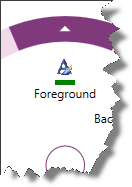
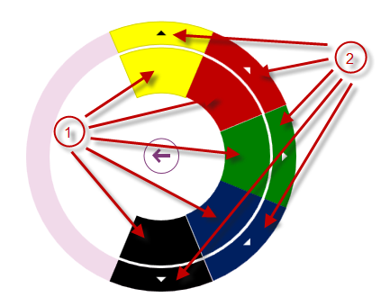
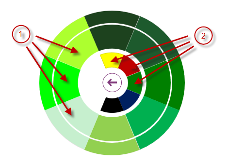

////

|metadata|
{
    "name": "xamradialmenu-configuring-color-items",
    "tags": ["How Do I","Layouts"],
    "controlName": ["xamRadialMenu"],
    "guid": "9cdb6bde-ae67-4cdb-bf68-563472adb3f2",  
    "buildFlags": [],
    "createdOn": "2016-05-25T18:21:57.9053096Z"
}
|metadata|
////

= Configuring Color Items (xamRadialMenu)

== Topic Overview

=== Purpose

This topic explains the link:{ApiPlatform}controls.menus.xamradialmenu{ApiVersion}~infragistics.controls.menus.xamradialmenu.html[ _xamRadialMenu_  ]™ color items.

=== Required background

The following topics are prerequisites to understanding this topic:

[options="header", cols="a,a"]
|====
|Topic|Purpose

| link:xamradialmenu-features.html[xamRadialMenu Features]
|This topic explains the features supported by the control from developer perspective.

| link:xamradialmenu-visual-elements.html[xamRadialMenu Visual Elements]
|This topic provides an overview of the visual elements of the control.

| link:xamradialmenu-items-sub-items-configuration-overview.html[Items/Sub-Items Configuration Overview]
|This topic explains in general the menu items and their common configuration properties.

| link:xamradialmenu-configuring-button-items.html[Configuring Button Items]
|This topic explains the _xamRadialMenu’s_ button items.

|====

=== In this topic

This topic contains the following sections:

* <<_Ref378152597,Color Items Configuration Summary>>
* <<_Ref378148085,Color Item>>
* <<_Ref378148094,Color Well>>
* <<_Ref377994940,Related Content>>

[[_Ref378152597]]
== Color Items Configuration Summary

=== Color items configuration summary chart

The  _xamRadialMenu_   supports color items which allow the user to observe and set color values. Further details are available after the table.

[options="header", cols="a,a,a"]
|====
|Color items|Description|Represented by type

|<<_Ref378148085,Color Item>>
|
* Displays a header text 

* Displays an icon 

* Displays the associated color 

|
* link:{ApiPlatform}controls.menus.xamradialmenu{ApiVersion}~infragistics.controls.menus.radialmenucoloritem_members.html[RadialMenuColorItem] 

|<<_Ref378148094,Color Well>>
|
* Displays the associated color in both the item area and outer ring 

|
* link:{ApiPlatform}controls.menus.xamradialmenu{ApiVersion}~infragistics.controls.menus.radialmenucolorwell_members.html[RadialMenuColorWell] 

|====

[[_Ref378148085]]
== Color Item

[[_Hlk368069110]]

=== Overview

Represented by the `RadialMenuColorItem` class, the  _xamRadialMenu’s_   color item extends from the link:{ApiPlatform}controls.menus.xamradialmenu{ApiVersion}~infragistics.controls.menus.radialmenuitem_members.html[RadialMenuItem] class. In addition to the header text and icon provided by the button items, the color item has an associated color rectangle.

The following screenshot shows a rectangle associated with the color green:

=== Property settings

The following table maps main configuration to the property settings that manage it.

[options="header", cols="a,a,a"]
|====
|In order to:|Use this property/event:|And:

|Set/obtain item’s associated color value
| link:{ApiPlatform}controls.menus.xamradialmenu{ApiVersion}~infragistics.controls.menus.radialmenucoloritembase~color.html[Color]
|Sets or reads its value

|Get notified when the associated color value changes
| link:{ApiPlatform}controls.menus.xamradialmenu{ApiVersion}~infragistics.controls.menus.radialmenucoloritembase~colorchanged_ev.html[ColorChanged]
|Attaches event handler to it

|====

[[_Ref378148094]]
== Color Well

=== Overview

The  _xamRadialMenu’s_   color well is represented by the `RadialMenuColorWell` class and displays the associated color in both the item area and the outer ring. When the user navigates to the Sub-Items of a color well, the parent color well and its siblings are displayed between the center button and the items area.

.Note
[NOTE]
====
Clicking on a color well updates the direct parent color well or color item setting such that their `Color` property is set to the color of the color well that was clicked.
====

The following screenshot shows color wells with Sub-Items rendered in different colors:

[start=1]
. Color wells in different colors (on the current level)
[start=2]
. Arrows indicating that there are sub-items, below these color wells

The following screenshot shows navigating to the Sub-Items of the parent green color well. The parent green color well and its siblings are shown between the center button and the items area:

[start=1]
. Color wells on the current level
[start=2]
. Parent color wells

=== Property settings

The following table maps main configurations to the property settings that manage it.

[options="header", cols="a,a,a"]
|====
|In order to:|Use this property/event:|And:

|Set/obtain item’s associated color value
| link:{ApiPlatform}controls.menus.xamradialmenu{ApiVersion}~infragistics.controls.menus.radialmenucoloritembase~color.html[Color]
|Sets or reads its value

|Get notified when the associated color value changes
| link:{ApiPlatform}controls.menus.xamradialmenu{ApiVersion}~infragistics.controls.menus.radialmenucoloritembase~colorchanged_ev.html[ColorChanged]
|Attaches event handler to it

|====

[[_Ref377994940]]
== Related Content

=== Topics

The following topics provide additional information related to this topic.

[options="header", cols="a,a"]
|====
|Topic|Purpose

| link:xamradialmenu-configuring-numeric-items.html[Configuring Numeric Items]
|This topic explains the _xamRadialMenu’s_ numeric items.

| link:xamradialmenu-configuring-list-items.html[Configuring List Items]
|This topic explains the _xamRadialMenu’s_ list items.

|====

ifdef::sl,wpf[]

=== Samples

The following sample provides additional information related to this topic.

[options="header", cols="a,a"]
|====
|Sample|Purpose

| pick:[sl=" link:{SamplesURL}/radial-menu/#/color-items[Color Items]"] pick:[wpf=" link:{SamplesURL}/radial-menu/color-items[Color Items]"] 
|This sample demonstrates how to define and use color items and color wells to allow color drilldown selection.

|====

endif::sl,wpf[]