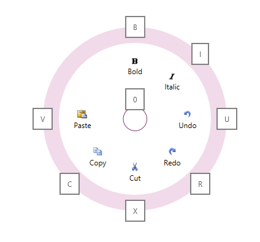

////

|metadata|
{
    "name": "xamradialmenu-configuring-key-tips",
    "tags": ["How Do I"],
    "controlName": ["xamRadialMenu"],
    "guid": "6fd34471-4e76-4f87-b931-f6c19c884aa2",  
    "buildFlags": [],
    "createdOn": "2016-05-25T18:21:57.923311Z"
}
|metadata|
////

= Configuring Key Tips (xamRadialMenu)

== Topic Overview

=== Purpose

This topic explains how to configure the link:{ApiPlatform}controls.menus.xamradialmenu.v{ProductVersion}~infragistics.controls.menus.xamradialmenu.html[ _xamRadialMenu_  ]™ items’ key tips.

=== Required background

The following topics are prerequisites to understanding this topic:

[options="header", cols="a,a"]
|====
|Topic|Purpose

| link:xamradialmenu-features.html[xamRadialMenu Features]
|This topic explains the features supported by the control from developer perspective.

| link:xamradialmenu-visual-elements.html[xamRadialMenu Visual Elements]
|This topic provides an overview of the visual elements of the control.

| link:xamradialmenu-configuring-tooltips.html[Configuring Tooltips]
|This topic explains how to configure the items’ tooltips.

|====

=== In this topic

This topic contains the following sections:

* <<_Ref378254351,Introduction>>
* <<_Ref378255599,Key Tips Configuration Summary>>
* <<_Ref378255604,Related Content>>

[[_Ref378254351]]
== Introduction

=== Key tips summary

Similar to tooltips, Key tips are visual element which show the user one or more characters available to the user for activating a particular  _xamRadialMenu_   item. Use the  pick:[wpf,win-rt="Alt"]  pick:[sl="F8"]  key to toggle the key tips’ Visible/Hidden state.

When visible, the key tips appear in the outer ring for each item along with a center adjacent key tip displaying the number "0" by default. The key tips for the items may be explicitly specified or can be Auto-Generated. Pressing the key tip of any item with Sub-Items displays the child items (as they would be when one clicked the outer ring button for that item) followed by a display of the child item’s key tips.

Pressing the escape key when key tips are visible will hide them. Also, pressing a navigation key or keyboard arrow key (e.g. up, down, left, right, home, end, tab) with key tips visible dismisses the key tips and enters the keyboard navigation mode.

.Note
[NOTE]
====
Although key tips are not shown for disabled items you may see one for a disabled item that has child item(s). This is necessary for navigating to the child items.
====

The following screenshot shows the  _xamRadialMenu_   displaying key tips:

[[_Ref378255599]]
== Key Tips Configuration Summary

=== Key tips configuration summary chart

The following table explains briefly the main configurable aspects of the  _xamRadialMenu_   control’s key tips.

[options="header", cols="a,a,a"]
|====
|Configurable aspect|Details|Properties

|[[_Hlk356484826]] 

Items’ key tips
|You can set key tip to a menu item to overwrite the default key tip set by the _xamRadialMenu_ .
| link:{ApiPlatform}controls.menus.xamradialmenu.v{ProductVersion}~infragistics.controls.menus.radialmenuitem~keytip.html[KeyTip]

|Center button’s key tip
|You can set key tip to the center button to overwrite the default key tip set by the _xamRadialMenu_ .
| link:{ApiPlatform}controls.menus.xamradialmenu.v{ProductVersion}~infragistics.controls.menus.xamradialmenu~centerbuttonkeytip.html[CenterButtonKeyTip]

|Key tip’s template
|You can set a template to be used for the xamRadialMenu key tips.
| link:{ApiPlatform}controls.menus.xamradialmenu.v{ProductVersion}~infragistics.controls.menus.xamradialmenu~keytiptemplate.html[KeyTipTemplate]

|====

[[_Ref378255604]]
== Related Content

=== Topics

The following topics provide additional information related to this topic.

[options="header", cols="a,a"]
|====
|Topic|Purpose

| link:xamradialmenu-configuration-overview.html[xamRadialMenu Configuration Overview]
|This topic explains how to configure the _xamRadialMenu_ control.

| link:xamradialmenu-configuring-center-button.html[Configuring the Center Button]
|This topic explains how to configure the Center Button.

|====

ifdef::sl,wpf[]

=== Samples

The following sample provides additional information related to this topic.

[options="header", cols="a,a"]
|====
|Sample|Purpose

| pick:[sl=" link:{SamplesURL}/radial-menu/#/button-items[Button Items]"] pick:[wpf=" link:{SamplesURL}/radial-menu/button-items[Button Items]"] 
|This sample demonstrates how to define and configure button items.

|====

endif::sl,wpf[]