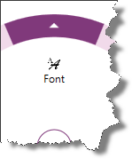
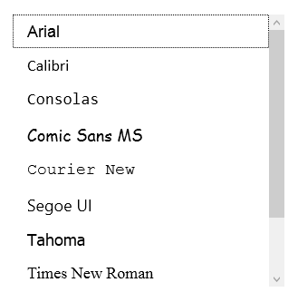

////

|metadata|
{
    "name": "xamradialmenu-configuring-list-items",
    "tags": ["How Do I","Layouts"],
    "controlName": ["xamRadialMenu"],
    "guid": "52edab6e-7dac-4248-942c-706b6791b90e",  
    "buildFlags": [],
    "createdOn": "2016-05-25T18:21:57.9113096Z"
}
|metadata|
////

= Configuring List Items (xamRadialMenu)

== Topic Overview

=== Purpose

This topic explains the link:{ApiPlatform}controls.menus.xamradialmenu.v{ProductVersion}~infragistics.controls.menus.xamradialmenu.html[ _xamRadialMenu_  ]™ list items.

=== Required background

The following topics are prerequisites to understanding this topic:

[options="header", cols="a,a"]
|====
|Topic|Purpose

| link:xamradialmenu-features.html[xamRadialMenu Features]
|This topic explains the features supported by the control from developer perspective.

| link:xamradialmenu-visual-elements.html[xamRadialMenu Visual Elements]
|This topic provides an overview of the visual elements of the control.

| link:xamradialmenu-items-sub-items-configuration-overview.html[Items/Sub-Items Configuration Overview]
|This topic explains in general the menu items and their common configuration properties.

| link:xamradialmenu-configuring-button-items.html[Configuring Button Items]
|This topic explains the _xamRadialMenu’s_ button items.

|====

=== In this topic

This topic contains the following sections:

* <<_Ref378083732,List Item>>
* <<_Ref377994940,Related Content>>

[[_Ref378083732]]
== List Item

[[_Hlk368069110]]

=== Overview

The  _xamRadialMenu’s_   list item is represented by the `RadialMenuList` class and extends from the link:{ApiPlatform}controls.menus.xamradialmenu.v{ProductVersion}~infragistics.controls.menus.radialmenuitem_members.html[RadialMenuItem] class. There is no difference in rendering the list item – it look like the button item with header text and icon. The only difference is how its sub-items are rendered in a vertical rectangular list instead of being rendered in circular arrangement. List items are added like any other radial menu sub-item (using the link:{ApiPlatform}controls.menus.xamradialmenu.v{ProductVersion}~infragistics.controls.menus.radialmenuitem~items.html[Items] collection or bound using the link:{ApiPlatform}controls.menus.xamradialmenu.v{ProductVersion}~infragistics.controls.menus.radialmenuitem~itemssource.html[ItemsSource] property).

The following screenshot shows a list item with header text, icon and the arrow for accessing the vertical list of sub-items:

The following screenshot shows the vertical list shown after the arrow in the outer ring of the list item was clicked by the user:

=== Property settings

The following table maps main configuration to the property settings that manage it.

[options="header", cols="a,a,a"]
|====
|In order to:|Use this property/collection/event:|And:

|Edit the list of unbound sub-items
| link:{ApiPlatform}controls.menus.xamradialmenu.v{ProductVersion}~infragistics.controls.menus.radialmenuitem~items.html[Items]
|Add or remove items

|Bind to a list of items
| link:{ApiPlatform}controls.menus.xamradialmenu.v{ProductVersion}~infragistics.controls.menus.radialmenuitem~itemssource.html[ItemsSource]
|Bind to the source list

|Set the display member of the data items
| link:{ApiPlatform}controls.menus.xamradialmenu.v{ProductVersion}~infragistics.controls.menus.radialmenulist~displaymemberpath.html[DisplayMemberPath]
|Provide the name of the member

|Set/obtain the selected item’s index
| link:{ApiPlatform}controls.menus.xamradialmenu.v{ProductVersion}~infragistics.controls.menus.radialmenulist~selectedindex.html[SelectedIndex]
|Set or obtain its value

|Set/obtain the selected item
| link:{ApiPlatform}controls.menus.xamradialmenu.v{ProductVersion}~infragistics.controls.menus.radialmenulist~selecteditem.html[SelectedItem]
|Set or obtain the selected item

|Get notified when the selection has changed
| link:{ApiPlatform}controls.menus.xamradialmenu.v{ProductVersion}~infragistics.controls.menus.radialmenulist~selectedvaluechanged_ev.html[SelectedValueChanged]
|Attach event handler to it

|Set/obtain the sub-items’ template
| link:{ApiPlatform}controls.menus.xamradialmenu.v{ProductVersion}~infragistics.controls.menus.radialmenulist~itemtemplate.html[ItemTemplate]
|Set or obtain the sub-items’ template

|====

[[_Ref377994940]]
== Related Content

=== Topics

The following topics provide additional information related to this topic.

[options="header", cols="a,a"]
|====
|Topic|Purpose

| link:xamradialmenu-configuring-numeric-items.html[Configuring Numeric Items]
|This topic explains the _xamRadialMenu’s_ numeric items.

| link:xamradialmenu-configuring-color-items.html[Configuring Color Items]
|This topic explains the _xamRadialMenu’s_ color items.

|====

ifdef::sl,wpf[]

=== Samples

The following samples provide additional information related to this topic.

[options="header", cols="a,a"]
|====
|Sample|Purpose

| pick:[sl=" link:{SamplesURL}/radial-menu/#/gauges-and-lists[Gauges and Lists]"] pick:[wpf=" link:{SamplesURL}/radial-menu/gauges-and-lists[Gauges and Lists]"] 
|This sample demonstrates how to define number items, gauge items and list items.

|====

endif::sl,wpf[]