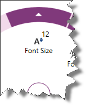
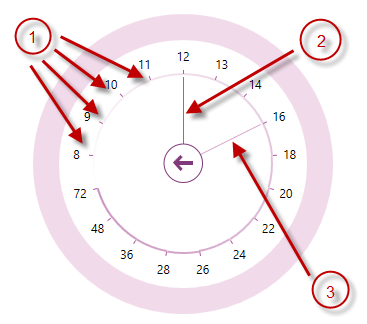

////

|metadata|
{
    "name": "xamradialmenu-configuring-numeric-items",
    "tags": ["How Do I","Layouts"],
    "controlName": ["xamRadialMenu"],
    "guid": "d750ee4f-2385-4850-bfa9-ffcb0a1923d3",  
    "buildFlags": [],
    "createdOn": "2016-05-25T18:21:57.8993085Z"
}
|metadata|
////

= Configuring Numeric Items (xamRadialMenu)

== Topic Overview

=== Purpose

This topic explains the link:{ApiPlatform}controls.menus.xamradialmenu{ApiVersion}~infragistics.controls.menus.xamradialmenu.html[ _xamRadialMenu_  ]™ numeric items.

=== Required background

The following topics are prerequisites to understanding this topic:

[options="header", cols="a,a"]
|====
|Topic|Purpose

| link:xamradialmenu-features.html[xamRadialMenu Features]
|This topic explains the features supported by the control from developer perspective.

| link:xamradialmenu-visual-elements.html[xamRadialMenu Visual Elements]
|This topic provides an overview of the visual elements of the control.

| link:xamradialmenu-items-sub-items-configuration-overview.html[Items/Sub-Items Configuration Overview]
|This topic explains in general the menu items and their common configuration properties.

| link:xamradialmenu-configuring-button-items.html[Configuring Button Items]
|This topic explains the _xamRadialMenu’s_ button items.

|====

=== In this topic

This topic contains the following sections:

* <<_Ref378083760,Numeric Items Configuration Summary>>
* <<_Ref378083732,Numeric Item>>
* <<_Ref378083740,Numeric Gauge>>
* <<_Ref378083777,Related Content>>

[[_Ref378083760]]
[[_Ref377994940]]
== Numeric Items Configuration Summary

=== Numeric items configuration summary chart

The  _xamRadialMenu_   supports numeric items which allow the user to observe and set numerical values. Further details are available after the table.

[options="header", cols="a,a,a"]
|====
|Numeric items|Description|Represented by type

|<<_Ref378083732,Numeric Item>>
|
* Displays a header text 

* Displays an icon 

* Displays the associated numeric value 

|
* link:{ApiPlatform}controls.menus.xamradialmenu{ApiVersion}~infragistics.controls.menus.radialmenunumericitem_members.html[RadialMenuNumericItem] 

|<<_Ref378083740,Numeric Gauge>>
|
* Displays a scale with the allowed values as ticks 

* Displays the current value 

* Displays the pending value 

|
* link:{ApiPlatform}controls.menus.xamradialmenu{ApiVersion}~infragistics.controls.menus.radialmenunumericgauge_members.html[RadialMenuNumericGauge] 

|====

[[_Ref378083732]]
== Numeric Item

[[_Hlk368069110]]

=== Overview

The `RadialMenuNumericItem` class represents the  _xamRadialMenu’s_   numeric item and extends from the link:{ApiPlatform}controls.menus.xamradialmenu{ApiVersion}~infragistics.controls.menus.radialmenuitem_members.html[RadialMenuItem] class. In addition to the header text and icon provided by the button items, the numeric item has an associated numeric value Within/Over the icon.

The following screenshot shows a numeric item with associated value (12) over the icon:

=== Property settings

The following table maps main configuration to the property settings that manage it.

[options="header", cols="a,a,a"]
|====
|In order to:|Use this property/event:|And:

|Set/obtain item’s associated numeric value
| link:{ApiPlatform}controls.menus.xamradialmenu{ApiVersion}~infragistics.controls.menus.radialmenunumericitem~value.html[Value]
|Set or read its value

|Get notified when the associated numeric value changes
| link:{ApiPlatform}controls.menus.xamradialmenu{ApiVersion}~infragistics.controls.menus.radialmenunumericitem~valuechanged_ev.html[ValueChanged]
|Attach event handler to it

|====

[[_Ref378083740]]
== Numeric Gauge

=== Overview

The `RadialMenuNumericGauge` class represents the  _xamRadialMenu’s_   numeric gauge. This item is showing a numeric gauge with values (ticks) for the user to choose from. There are also needles indicating the current value and the pending value – the value the mouse is hovering.

The following screenshot shows a numeric gauge:

[start=1]
. Ticks
[start=2]
. Current value needle
[start=3]
. Pending value needle

=== Property settings

The following table maps main configuration to the property settings that manage it.

[options="header", cols="a,a,a"]
|====
|In order to:|Use this property/event:|And:

|Set/obtain pending value
| link:{ApiPlatform}controls.menus.xamradialmenu{ApiVersion}~infragistics.controls.menus.radialmenunumericgauge~pendingvalue.html[PendingValue]
|Set it to a value of type double

|Get notified when the associated pending numeric value changes
| link:{ApiPlatform}controls.menus.xamradialmenu{ApiVersion}~infragistics.controls.menus.radialmenunumericgauge~pendingvaluechanged_ev.html[PendingValueChanged]
|Attach event handler to it

|Set/obtain ticks
| link:{ApiPlatform}controls.menus.xamradialmenu{ApiVersion}~infragistics.controls.menus.radialmenunumericgauge~ticks.html[Ticks]
|Set it to a collection with ticks values of type `DoubleCollection`

|Set/obtain current value
| link:{ApiPlatform}controls.menus.xamradialmenu{ApiVersion}~infragistics.controls.menus.radialmenunumericgauge~value.html[Value]
|Set it to a value of type double

|Get notified when the associated numeric value changes
| link:{ApiPlatform}controls.menus.xamradialmenu{ApiVersion}~infragistics.controls.menus.radialmenunumericgauge~valuechanged_ev.html[ValueChanged]
|Attach event handler to it

|====

[[_Ref378083777]]

== Related Content

=== Topics

The following topics provide additional information related to this topic.

[options="header", cols="a,a"]
|====
|Topic|Purpose

| link:xamradialmenu-configuring-color-items.html[Configuring Color Items]
|This topic explains the _xamRadialMenu’s_ color items.

| link:xamradialmenu-configuring-list-items.html[Configuring List Items]
|This topic explains the _xamRadialMenu’s_ list items.

|====

ifdef::sl,wpf[]

=== Samples

The following samples provide additional information related to this topic.

[options="header", cols="a,a"]
|====
|Sample|Purpose

| pick:[sl=" link:{SamplesURL}/radial-menu/#/gauges-and-lists[Gauges and Lists]"] pick:[wpf=" link:{SamplesURL}/radial-menu/gauges-and-lists[Gauges and Lists]"] 
|This sample demonstrates how to define number items, gauge items and list items.

|====

endif::sl,wpf[]