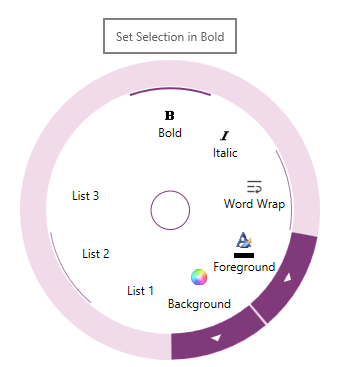

////

|metadata|
{
    "name": "xamradialmenu-configuring-tooltips",
    "tags": ["How Do I"],
    "controlName": ["xamRadialMenu"],
    "guid": "e3885410-c37c-4c43-8e27-87965a2b91ec",  
    "buildFlags": [],
    "createdOn": "2016-05-25T18:21:57.917313Z"
}
|metadata|
////

= Configuring Tooltips (xamRadialMenu)

== Topic Overview

=== Purpose

This topic explains how to configure the link:{ApiPlatform}controls.menus.xamradialmenu.v{ProductVersion}~infragistics.controls.menus.xamradialmenu.html[ _xamRadialMenu_  ]™ items’ tooltips.

=== Required background

The following topics are prerequisites to understanding this topic:

[options="header", cols="a,a"]
|====
|Topic|Purpose

| link:xamradialmenu-features.html[xamRadialMenu Features]
|This topic explains the features supported by the control from developer perspective.

| link:xamradialmenu-visual-elements.html[xamRadialMenu Visual Elements]
|This topic provides an overview of the visual elements of the control.

|====

=== In this topic

This topic contains the following sections:

* <<_Ref378254351,Introduction>>
* <<_Ref378255630,Tooltips Configuration Summary>>
* <<_Ref378255637,Related Content>>

[[_Ref378254351]]
== Introduction

=== Tooltips summary

_XamRadialMenu_   tooltip is a small visual element shown outside of the menu when a user hovers over a menu item. The tooltip usually contains helpful user information that you can specify using the `Tooltip` property. If tooltip’s message is not specified it is resolved based on the menu item type as shown in the table below:

[options="header", cols="a,a"]
|====
|Menu item type|Default tooltip content

|Button item, Numeric item, Color item, List item
.4|The content of the link:{ApiPlatform}controls.menus.xamradialmenu.v{ProductVersion}~infragistics.controls.menus.radialmenuitem~header.html[Header] property (assuming it is not an element).

|Gauge item
|The pending value

|Color well
|The calculated color name

|====

The following is a screenshot showing the  _xamRadialMenu_   tooltip:

[[_Ref378255630]]
== Tooltips Configuration Summary

=== Tooltips configuration summary chart

The following table briefly explains the main configurable aspects of the  _xamRadialMenu’s_   tooltips.

[options="header", cols="a,a,a"]
|====
|Configurable aspect|Details|Properties

|Tooltip
|Enable/Disable the item tooltip
| link:{ApiPlatform}controls.menus.xamradialmenu.v{ProductVersion}~infragistics.controls.menus.radialmenuitembase~istooltipenabled.html[IsToolTipEnabled]

|Item Tooltip’s content
|Set/Obtain the item tooltip content
|`Tooltip`

|Item Tooltip’s template
|A template you can set to be used for the _xamRadialMenu_ tooltip 

.Note 

[NOTE] 

==== 

The `DataContext` for this object will be a link:{ApiPlatform}controls.menus.xamradialmenu.v{ProductVersion}~infragistics.controls.menus.radialmenutooltipcontext.html[RadialMenuTooltipContext] instance providing the menu item. 

====
| link:{ApiPlatform}controls.menus.xamradialmenu.v{ProductVersion}~infragistics.controls.menus.radialmenuitembase~tooltiptemplate.html[TooltipTemplate]

|====

[[_Ref378255637]]
== Related Content

=== Topics

The following topics provide additional information related to this topic.

[options="header", cols="a,a"]
|====
|Topic|Purpose

| link:xamradialmenu-configuration-overview.html[xamRadialMenu Configuration Overview]
|This topic explains how to configure the _xamRadialMenu_ control.

| link:xamradialmenu-configuring-center-button.html[Configuring the Center Button]
|This topic explains how to configure the Center Button.

| link:xamradialmenu-configuring-key-tips.html[Configuring Key Tips]
|This topic explains how to configure the items’ key tips.

|====