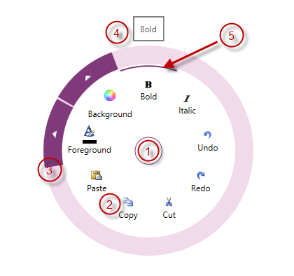
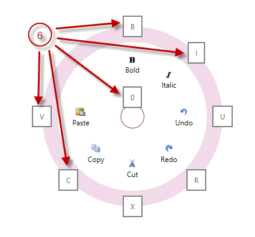

////

|metadata|
{
    "name": "xamradialmenu-visual-elements",
    "tags": ["Getting Started"],
    "controlName": ["xamRadialMenu"],
    "guid": "2e6f576b-8b05-4d5c-9ac7-4be18fdeddcd",  
    "buildFlags": [],
    "createdOn": "2016-05-25T18:21:57.8263068Z"
}
|metadata|
////

= xamRadialMenu Visual Elements

== Topic Overview

=== Purpose

This topic provides an overview of the visual elements of the link:{ApiPlatform}controls.menus.xamradialmenu{ApiVersion}~infragistics.controls.menus.xamradialmenu.html[ _xamRadialMenu_  ]™ control.

=== Required background

The following topic is a prerequisite to understanding this topic:

[options="header", cols="a,a"]
|====
|Topic|Purpose

| link:xamradialmenu-features.html[xamRadialMenu Features]
|This topic explains the features supported by the control from developer perspective.

|====

=== In this topic

This topic contains the following sections:

* <<_Ref377646161,Visual Elements of xamRadialMenu Control and Related Properties>>
* <<_Ref377646169,Related Content>>

[[_Ref377646161]]
== Visual Elements of  _xamRadialMenu_  Control and Related Properties

=== Visual elements summary

The following screenshot depicts the visual elements of the  _xamRadialMenu_   control. Configurable elements are listed after the image.

*Configurable Visual Elements:*

[start=1]
. Center Button – either opens and closes the xamRadialMenu, or allows access to menu items on the previous level.
[start=2]
. Items Area – displays the current level menu items in this area.
[start=3]
. Outer Ring – the outer most part of the xamRadialMenu, may contain arrows for accessing sub-items
[start=4]
. Tooltip – indicates the currently hovered menu item.
[start=5]
. Selection Arc – highlights the currently selected menu item and its checked state.
[start=6]
. Key Tips – shows the keyboard shortcut for activating each menu item.

=== Visual elements and related properties

The following table maps the visual elements of the  _xamRadialMenu_   control and the properties that configure them.

[options="header", cols="a,a"]
|====
|Visual element|Main configurable aspects

|Center button
| link:{ApiPlatform}controls.menus.xamradialmenu{ApiVersion}~infragistics.controls.menus.xamradialmenu~centerbuttonbacktemplate.html[CenterButtonBackTemplate] 

link:{ApiPlatform}controls.menus.xamradialmenu{ApiVersion}~infragistics.controls.menus.xamradialmenu~centerbuttoncontent.html[CenterButtonContent] 

link:{ApiPlatform}controls.menus.xamradialmenu{ApiVersion}~infragistics.controls.menus.xamradialmenu~centerbuttonfill.html[CenterButtonFill] 

link:{ApiPlatform}controls.menus.xamradialmenu{ApiVersion}~infragistics.controls.menus.xamradialmenu~centerbuttonkeytip.html[CenterButtonKeyTip] 

link:{ApiPlatform}controls.menus.xamradialmenu{ApiVersion}~infragistics.controls.menus.xamradialmenu~centerbuttonstroke.html[CenterButtonStroke]

|Items area
| link:{ApiPlatform}controls.menus.xamradialmenu{ApiVersion}~infragistics.controls.menus.xamradialmenu~items.html[Items] 

link:{ApiPlatform}controls.menus.xamradialmenu{ApiVersion}~infragistics.controls.menus.xamradialmenu~itemssource.html[ItemsSource] 

link:{ApiPlatform}controls.menus.xamradialmenu{ApiVersion}~infragistics.controls.menus.xamradialmenu~minwedgecount.html[MinWedgeCount] 

link:{ApiPlatform}controls.menus.xamradialmenu{ApiVersion}~infragistics.controls.menus.xamradialmenu~rotationindegrees.html[RotationInDegrees] 

link:{ApiPlatform}controls.menus.xamradialmenu{ApiVersion}~infragistics.controls.menus.radialmenuitembase~wedgeindex.html[WedgeIndex] 

link:{ApiPlatform}controls.menus.xamradialmenu{ApiVersion}~infragistics.controls.menus.radialmenuitembase~wedgespan.html[WedgeSpan]

|Outer ring
| link:{ApiPlatform}controls.menus.xamradialmenu{ApiVersion}~infragistics.controls.menus.xamradialmenu~outerringfill.html[OuterRingFill] 

link:{ApiPlatform}controls.menus.xamradialmenu{ApiVersion}~infragistics.controls.menus.xamradialmenu~outerringstroke.html[OuterRingStroke] 

link:{ApiPlatform}controls.menus.xamradialmenu{ApiVersion}~infragistics.controls.menus.xamradialmenu~outerringthickness.html[OuterRingThickness] link:{ApiPlatform}controls.menus.xamradialmenu{ApiVersion}~infragistics.controls.menus.xamradialmenu~outerringstrokethickness.html[OuterRingStrokeThickness]

|Tooltips
| link:{ApiPlatform}controls.menus.xamradialmenu{ApiVersion}~infragistics.controls.menus.radialmenuitembase~istooltipenabled.html[IsToolTipEnabled] 

`ToolTip` 

link:{ApiPlatform}controls.menus.xamradialmenu{ApiVersion}~infragistics.controls.menus.radialmenuitembase~tooltiptemplate.html[ToolTipTemplate]

|Selection arc
| link:{ApiPlatform}controls.menus.xamradialmenu{ApiVersion}~infragistics.controls.menus.radialmenuitem~ischecked.html[IsChecked]

|Key tips
| link:{ApiPlatform}controls.menus.xamradialmenu{ApiVersion}~infragistics.controls.menus.xamradialmenu~centerbuttonkeytip.html[CenterButtonKeyTip] 

link:{ApiPlatform}controls.menus.xamradialmenu{ApiVersion}~infragistics.controls.menus.radialmenuitem~keytip.html[KeyTip] 

link:{ApiPlatform}controls.menus.xamradialmenu{ApiVersion}~infragistics.controls.menus.xamradialmenu~keytiptemplate.html[KeyTipTemplate]

|====

[[_Ref377646169]]
== Related Content

=== Topics

The following topic provides additional information related to this topic.

[options="header", cols="a,a"]
|====
|Topic|Purpose

| link:xamradialmenu-user-interaction.html[User Interaction and Usability]
|This topic explains what actions can be performed by the user.

|====