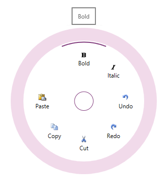

////

|metadata|
{
    "name": "xamradialmenu",
    "tags": [],
    "controlName": ["xamRadialMenu"],
    "guid": "3b631bf5-4648-4fb9-bf13-46ae38f43c7b",  
    "buildFlags": [],
    "createdOn": "2016-05-25T18:21:57.8083001Z"
}
|metadata|
////

= xamRadialMenu

== In This Group of Topics

=== Introduction

This section contains topics covering the link:{ApiPlatform}controls.menus.xamradialmenu{ApiVersion}~infragistics.controls.menus.xamradialmenu.html[ _xamRadialMenu_  ]™ control for {ProductName}.

The  _xamRadialMenu_   control is essentially a context menu presenting its items in a circular arrangement around a center button. The circular arrangement of the items speeds up items selection, because each item is equally positioned in relation to the center. The  _xamRadialMenu_   supports different item types for choosing numerical values, color values or performs actions. Sub-Items are also supported.

=== Topics

[options="header", cols="a,a"]
|====
|Topic|Purpose

| link:xamradialmenu-overview.html[xamRadialMenu Overview]
|The topics in this group explain the _xamRadialMenu_ control's features, visual elements and user actions.

| pick:[sl,wpf=" link:xamradialmenu-adding-to-your-page.html[Adding xamRadialMenu to Your Page]"] pick:[win-rt=" link:xamradialmenu-adding-to-your-page-win-rt.html[Adding xamRadialMenu to Your Page]"] 
|This topic provides detailed instructions to help you get up and running as soon as possible with the _xamRadialMenu_ .

| link:xamradialmenu-configuring.html[Configuring xamRadialMenu]
|The topics in this section provide additional information about _xamRadialMenu_ configuring.

| link:xamradialmenu-api-overview.html[API Overview]
|This topic lists the namespaces and classes that you will be working with while programming with _xamRadialMenu_ . The namespaces and classes listed in this topic link conveniently into the link:api-reference-guide.html[API Reference Guide] section of the {ProductName} help.

|====