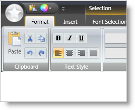
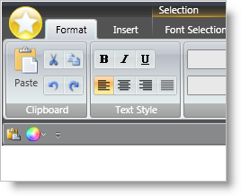
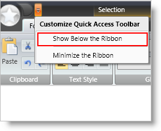
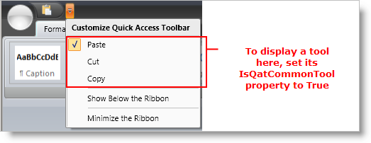
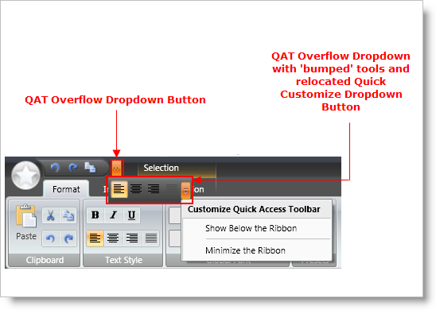

////

|metadata|
{
    "name": "xamribbon-about-quickaccesstoolbar",
    "controlName": ["xamRibbon"],
    "tags": ["Getting Started","How Do I"],
    "guid": "{E3ADB1B9-3352-483D-8B20-6239D9D82550}",  
    "buildFlags": [],
    "createdOn": "2012-01-30T19:39:54.0841699Z"
}
|metadata|
////

= About QuickAccessToolbar

== Overview

The Quick Access Toolbar (QAT) is an area within the xamRibbon control that contains tools which are always available to the user regardless of which tab is selected in the Ribbon. In addition, it is the only area in xamRibbon that can be customized by the end user.

The QAT can appear above or below the Ribbon:

There are several ways to change the location of the QAT:

* programmatically (via code-behind or XAML) by setting XamRibbon's QuickAccessToolbarLocation property
* programmatically (via code-behind or XAML) using XamRibbon's ToggleQatLocation RoutedCommand
* via the UI and the QAT's QuickCustomizeMenu

== Accessing the QAT Programmatically

The QAT can be accessed programmatically (via code-behind or XAML) by using xamRibbon's QuickAccessToolbar property.

*In XAML:*

----
<igRibbon:XamRibbon.QuickAccessToolbar>
        <igRibbon:QuickAccessToolbar>
                <igRibbon:QatPlaceholderTool TargetId="tbtool1"/>
                <igRibbon:QatPlaceholderTool TargetId="Tab1_Group1" TargetType="RibbonGroup"/>
        </igRibbon:QuickAccessToolbar>
</igRibbon:XamRibbon.QuickAccessToolbar>
----

.Note
[NOTE]
====
there is no need to create an instance of the QuickAccessToolbar and assign it to this property – an instance is automatically created for you by xamRibbon.
====

== Adding Tools to the QAT

To fulfill its role as an 'always available' area that provides quick access to tools defined elsewhere in the Ribbon, the QAT is designed to 'temporarily' contain and display cloned copies of tools that are actually defined somewhere else in the Ribbon. The "somewhere else" can be:

* In a RibbonGroup (either directly in a RibbonGroup or within a ToolVerticalWrapPanel or ToolHorizontalWrapPanel contained in a RibbonGroup). This is the most common location for a tool in the Ribbon.
* On a Menu tool somewhere in the Ribbon
* On the Application Menu's Footer toolbar
* In the XamRibbon’s ToolsNotInRibbon collection

Tools defined in these locations can be added (i.e. cloned and copied) to the QAT in several ways, but regardless of which method is used, they ultimately end up in the QAT, housed inside a special tool called the QatPlaceholderTool. The ways in which a tool can be added to the QAT are:

* Right-click on a tool somewhere in the Ribbon (valid locations defined above) and select 'Add To Quick AccessToolbar'. What happens behind the scenes is:

** the tool is cloned (properties and event handlers)
** important state related properties are bound to the original tool instance
** a QatPlaceholderTool is created and its TargetId property is set to the Id of the tool being added
** the QatPlaceholderTool is added to the QAT

* Create a QatPlaceholderTool (programmatically in XAML or code) and set its TargetId property to the Id of the tool to be added, then add the QatPlaceholderTool to the QAT Items collection.

*In XAML:*

----
<igRibbon:XamRibbon.QuickAccessToolbar>
        <igRibbon:QuickAccessToolbar>
                <igRibbon:QatPlaceholderTool TargetId="tbtool1"/>
        </igRibbon:QuickAccessToolbar>
</igRibbon:XamRibbon.QuickAccessToolbar>
----

* Drop down the QAT's QuickCustomizeMenu and select a tool in the 'Customize Quick Access Toolbar' section of the menu. Checking/unchecking any one of these tools will add/remove the tool from the QAT.

.Note
[NOTE]
====
to add a tool to this list on the QAT's QuickCustomizeMenu, set the tool's IsQatCommonTool property to True.
====

== Adding Ribbon Groups to the Quick Access Toolbar

RibbonGroups can also be added to the QAT. There are two ways to add a RibbonGroup to the QAT:

* Right-click on a RibbonGroup and select 'Add to Quick Access Toolbar'. What happens behind the scenes is:

** the Ribbon Group and all the tools contained in the Ribbon Group are cloned (including all tool properties and event handlers)
** important state related properties are bound to the original tool instances in the original Ribbon Group instance
** a QatPlaceholderTool is created and its TargetId property is set to the Id of the RibbonGroup being added, and the TargetType property is set to "RibbonGroup"
** the QatPlaceholderTool is added to the QAT

* Create a QatPlaceholderTool (programmatically in XAML or code) and set its TargetId property to the Id of the RibbonGrop to be added. Set its TargetType property to "RibbonGroup". Add the QatPlaceholderTool to the QAT Items collection.

*In XAML:*

----
<igRibbon:XamRibbon.QuickAccessToolbar>
        <igRibbon:QuickAccessToolbar>
                <igRibbon:QatPlaceholderTool TargetId="Tab1_Group1" TargetType="RibbonGroup"/>
        </igRibbon:QuickAccessToolbar>
</igRibbon:XamRibbon.QuickAccessToolbar>
----

== Quick Access Toolbar Resizing

As the xamRibbon control is resized smaller in the horizontal dimension and the space available to the QAT falls below the space required by the QAT, tools will automatically be ‘bumped’ from the QAT onto the QAT overflow drop-down list.

There is no coding required to enable this functionality nor is there a way to change this behavior.

== Behavior of Tools on the Quick Access Toolbar

Since tools placed on the QAT are clones of the original tool instance with their important state-related properties bound to the original instance, they behave (in most respects) like the original tool and remain 'in sync' with the original tool.

There are exceptions though -- not all state related properties in the QAT copy of a tool are bound to the corresponding property on the original tool instance. There are some cases where this isn't appropriate.

Examples of state-related properties that are automatically bound and kept 'in sync':

* The IsChecked property of a Toggle Button tool -- when one of the buttons is checked, the other button is checked as well.
* The Value property of a Text Editor tool -- as text is typed in one instance of the tool, the other instance displays the modified text

Examples of state properties that are not automatically bound and kept 'in sync':

* The IsPressed property of a Button tool
* The IsInEditMode property of a Text Editor tool

As a result of the synchronizing of state properties described above, note that events relating to state that are fired by tools that are on the QAT will fire twice -- one for the QAT instance and once for the original instance. This is because the state property is actually changing on both instances based on the automatic binding described above. To help you distinguish between the two events and the instance it was fired from, two static methods are provided on XamRibbon:

* public static GetOriginalTool(FrameworkElement tool) -- Returns the original tool instance a 'tool' was cloned from or 'tool' if it is the original tool instance.
* public static GetToolInEditMode(ValueEditor valueEditor) -- Returns the logical instance of the specified tool that is currently in edit mode, otherwise returns null (Nothing).

== Related Topics

link:xamribbon-add-a-tool-or-ribbongroup-to-the-quick-access-toolbar.html[Add a Tool or RibbonGroup to the Quick Access Toolbar]

link:xamribbon-adding-and-removing-common-tools.html[Adding and Removing Common Tools]