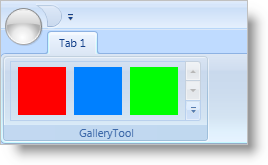

////

|metadata|
{
    "name": "xamribbon-add-a-galleryitem-to-a-gallerytool",
    "controlName": ["xamRibbon"],
    "tags": ["Getting Started","How Do I","Selection"],
    "guid": "{79F5F980-FF81-4E2D-8F7C-65D73A863D19}",  
    "buildFlags": [],
    "createdOn": "2012-01-30T19:39:54.1021735Z"
}
|metadata|
////

= Add a GalleryItem to a GalleryTool

After you add a link:{ApiPlatform}ribbon{ApiVersion}~infragistics.windows.ribbon.gallerytool.html[GalleryTool] to xamRibbon™, you will have to add link:{ApiPlatform}ribbon{ApiVersion}~infragistics.windows.ribbon.galleryitem.html[GalleryItems] to the GalleryTool so your end users can select an item within the GalleryTool.

The GalleryItem object is easy to use since it only has a couple of properties that you need to set. Each GalleryItem that you add to a GalleryTool must have a unique key. You can use the key to identify the selected GalleryItem in the code-behind or to add GalleryItems into a GalleryItemGroup. In addition to the link:{ApiPlatform}ribbon{ApiVersion}~infragistics.windows.ribbon.galleryitem~key.html[Key] property, you can also set simple properties like the link:{ApiPlatform}ribbon{ApiVersion}~infragistics.windows.ribbon.galleryitem~text.html[Text] property and the link:{ApiPlatform}ribbon{ApiVersion}~infragistics.windows.ribbon.galleryitem~image.html[Image] property to give the GalleryItem a unique appearance. You can also specify link:{ApiPlatform}ribbon{ApiVersion}~infragistics.windows.ribbon.galleryitemsettings.html[GalleryItemSettings] at the GalleryItem level if you want to override the GalleryItemSettings specified at the GalleryTool level.

The following example code demonstrates how to add a GalleryItem to a GalleryTool. You will have to replace all images referenced in the example code with your own images.

*In XAML:*

----
...
<igRibbon:GalleryTool Name="galleryTool1" ItemBehavior="StateButton">
        <igRibbon:GalleryTool.Items>
                <igRibbon:GalleryItem 
                        Key="RedItem" 
                        Text="Red"
                        Image="GalleryItemImages/Red.png" />
                <!--TODO: Add more GalleryItems here-->
        </igRibbon:GalleryTool.Items>
</igRibbon:GalleryTool>
...
----

*In Visual Basic:*

----
Imports Infragistics.Windows.Ribbon
...
Dim item as New GalleryItem()
item.Key = "RedItem"
item.Text = "Red"
'TODO: Replace the Uri so that it points to one of your images
item.Image = new BitMapImage(new Uri("pack://application:,,,/GalleryItemImages/Red.png"))
Me.galleryTool1.Items.Add(item)
...
----

*In C#:*

----
using Infragistics.Windows.Ribbon;
...
GalleryItem item = new GalleryItem();
item.Key = "RedItem";
item.Text = "Red";
//TODO: Replace the Uri so that it points to one of your images
item.Image = new BitmapImage(new Uri("pack://application:,,,/GalleryItemImages/Red.png"));
this.galleryTool1.Items.Add(item);
...
----

== Related Topics

link:xamribbon-add-a-gallerytool-to-a-ribbongroup.html[Add a GalleryTool to a RibbonGroup]

link:xamribbon-create-groups-of-galleryitems.html[Create Groups of GalleryItems]

link:xamribbon-creating-a-live-preview.html[Creating a Live Preview]