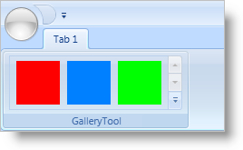

////

|metadata|
{
    "name": "xamribbon-add-a-gallerytool-to-a-ribbongroup",
    "controlName": ["xamRibbon"],
    "tags": ["Data Presentation","Getting Started","How Do I","Layouts","Navigation","Selection"],
    "guid": "{FE33C392-AA3F-4D4E-AE0F-83E8E3E02059}",  
    "buildFlags": [],
    "createdOn": "2012-01-30T19:39:54.1051741Z"
}
|metadata|
////

= Add a GalleryTool to a RibbonGroup

The link:{ApiPlatform}ribbon.v{ProductVersion}~infragistics.windows.ribbon.gallerytool.html[GalleryTool] is a specialized drop-down list that can display items in a visually appealing manner to the end user. Instead of a simple list of items with a text description, the GalleryTool can display an image along with text to illustrate the application specific task(s) that the item will execute. In addition to the visual appeal of the GalleryTool, the GalleryTool can display a preview of the items that you add to its Items collection. This will allow your end users to identify the options that the GalleryTool offers simply by looking at the preview. If your end users do not see the option they want in the preview area, they can click the drop-down arrow to show a list of all available options or they can scroll the preview rows by clicking the scroll arrow thumbs right above the drop-down arrow.

You cannot add the GalleryTool directly to a link:{ApiPlatform}ribbon.v{ProductVersion}~infragistics.windows.ribbon.ribbongroup.html[RibbonGroup]; you must add it to a link:{ApiPlatform}ribbon.v{ProductVersion}~infragistics.windows.ribbon.menutool.html[MenuTool]. However, you can only add a single instance of a GalleryTool to a MenuTool's Items collection. If you want to display a preview of the GalleryItems, you can set the MenuTool's link:{ApiPlatform}ribbon.v{ProductVersion}~infragistics.windows.ribbon.menutool~shoulddisplaygallerypreview.html[ShouldDisplayGalleryPreview] property to True.

The GalleryTool exposes an link:{ApiPlatform}ribbon.v{ProductVersion}~infragistics.windows.ribbon.gallerytool~itemsettings.html[ItemSettings] property that you can set to an instance of a link:{ApiPlatform}ribbon.v{ProductVersion}~infragistics.windows.ribbon.galleryitemsettings.html[GalleryItemSettings] object. The settings that you specify at the GalleryTool level will control the behavior of all the GalleryItems in the GalleryTool. You can override any setting that you set at the GalleryTool level by adding a GalleryItemSettings object to an individual link:{ApiPlatform}ribbon.v{ProductVersion}~infragistics.windows.ribbon.galleryitem.html[GalleryItem].

The following example code demonstrates how to add a GalleryTool to a RibbonGroup.

*In XAML:*

----
...
<igRibbon:MenuTool Name="menuTool1" ShouldDisplayGalleryPreview="True">
        <igRibbon:GalleryTool Id="galleryTool1" ItemBehavior="StateButton">
        <!--TODO: Add GalleryItems to the GalleryTool -->
        </igRibbon:GalleryTool>
</igRibbon:MenuTool>
...
----

*In Visual Basic:*

----
Imports Infragistics.Windows.Ribbon
...
Dim galleryTool1 as New GalleryTool()
galleryTool1.Id = "galleryTool1"
galleryTool1.ItemBehavior = GalleryToolItemBehavior.StateButton
Me.menuTool1.Items.Add(galleryTool1)
'TODO: Add GalleryItems to the GalleryTool
…
----

*In C#:*

----
using Infragistics.Windows.Ribbon;
...
GalleryTool galleryTool1 = new GalleryTool();
galleryTool1.Id = "galleryTool1";
galleryTool1.ItemBehavior = GalleryToolItemBehavior.StateButton;
this.menuTool1.Items.Add(galleryTool1);
//TODO: Add GalleryItems to the GalleryTool
...
----

== Related Topics

link:xamribbon-add-a-gallerytool-to-a-ribbongroup.html[Add a GalleryTool to a RibbonGroup]

link:xamribbon-create-groups-of-galleryitems.html[Create Groups of GalleryItems]

link:xamribbon-creating-a-live-preview.html[Creating a Live Preview]