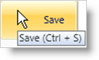

////

|metadata|
{
    "name": "xamribbon-add-a-simple-tooltip-to-a-ribbon-tool",
    "controlName": ["xamRibbon"],
    "tags": ["Getting Started","How Do I","Styling"],
    "guid": "{CD900D07-9376-4A2F-901C-E0E070E7197B}",  
    "buildFlags": [],
    "createdOn": "2012-01-30T19:39:54.1101751Z"
}
|metadata|
////

= Add a Simple ToolTip to a Ribbon Tool

You can use the Microsoft® Windows® Presentation Foundation ToolTip control to display a simple ToolTip for your end users. This type of ToolTip is similar to the ToolTip found on the Save button in Microsoft Word™. However, to keep the ToolTip control's style consistent with the xamRibbon™ control's theme, you should set the ToolTip control's Style property to the static link:{ApiPlatform}ribbon{ApiVersion}~infragistics.windows.ribbon.xamribbon~tooltipstylekey.html[ToolTipStyleKey] property exposed by xamRibbon.

The following example code demonstrates how to add a simple ToolTip to a xamRibbon tool.

*In XAML:*

----
...
<igRibbon:ButtonTool Caption="Save" Name="btnToolSave">
    <igRibbon:ButtonTool.ToolTip>
        <ToolTip 
            Content="Save (Ctrl + S)" 
            Style="{DynamicResource {x:Static igRibbon:XamRibbon.ToolTipStyleKey}}" />
    </igRibbon:ButtonTool.ToolTip>
</igRibbon:ButtonTool>
...
----

*In Visual Basic:*

----
Imports Infragistics.Windows.Ribbon
...
Dim saveBtnToolTip As New ToolTip With {.Content = "Save (Ctrl + S)"}
saveBtnToolTip.SetResourceReference(StyleProperty, XamRibbon.ToolTipStyleKey)
Me.btnToolSave.ToolTip = saveBtnToolTip
...
----

*In C#:*

----
using Infragistics.Windows.Ribbon;
...
ToolTip saveBtnToolTip = new ToolTip { Content = "Save (Ctrl + S)" };
saveBtnToolTip.SetResourceReference(StyleProperty, XamRibbon.ToolTipStyleKey);
this.btnToolSave.ToolTip = saveBtnToolTip;
...
----

== Related Topics

link:xamribbon-about-xamribbonscreentip.html[About xamRibbonScreenTip]

link:xamribbon-add-a-xamribbonscreentip-to-a-ribbon-tool.html[Add a xamRibbonScreenTip to a Ribbon Tool]