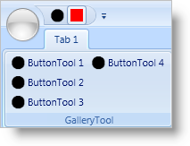

////

|metadata|
{
    "name": "xamribbon-add-a-tool-or-ribbongroup-to-the-quick-access-toolbar",
    "controlName": ["xamRibbon"],
    "tags": ["Data Presentation","Grouping","How Do I","Layouts","Navigation","Selection"],
    "guid": "{41909644-14A8-423C-B427-FBFBDAEF37A5}",  
    "buildFlags": [],
    "createdOn": "2012-01-30T19:39:54.1181767Z"
}
|metadata|
////

= Add a Tool or RibbonGroup to the Quick Access Toolbar

The Quick Access Toolbar (QAT) is a toolbar that your end users can customize at run time based on their preferences. Adding tools to the QAT is an intuitive, context-sensitive menu driven process that your end users will find simple to use. Along with user customization, you may also want to present a default set of tools in the QAT when your application runs for the first time. You can implement this requirement either declaratively in Extensible Application Markup Language (XAML) or procedurally in the code-behind.

Adding Ribbon tools to the QAT may seem strange at first, especially if you're familiar with adding tools to a Ribbon group or the application menu. You cannot add Ribbon tools directly to the QAT's Items collection. The only type of object you can add to the QAT's Items collection is a link:{ApiPlatform}ribbon.v{ProductVersion}~infragistics.windows.ribbon.qatplaceholdertool.html[QatPlaceholderTool]. As the name of the tool implies, the QatPlaceholderTool is simply a placeholder for other Ribbon tools or groups. Once you set the link:{ApiPlatform}ribbon.v{ProductVersion}~infragistics.windows.ribbon.qatplaceholdertool~targetid.html[TargetId] property of the QatPlaceholderTool to an existing Ribbon tool ID, a clone of the Ribbon tool will appear in the QAT. If you want to add a Ribbon group to the QAT, you have to set the link:{ApiPlatform}ribbon.v{ProductVersion}~infragistics.windows.ribbon.qatplaceholdertool~targettype.html[TargetType] property to 'RibbonGroup' in addition to the TargetId property of the QatPlaceholderTool. You may have noticed that you did not have to set the TargetType property explicitly when adding Ribbon tools to the QAT. This is because the TargetType property will use a default value of 'Tool' if you do not set it.

The following example code demonstrates how to add a tool and a Ribbon group to the QAT. The example code assumes you have an instance of a link:{ApiPlatform}ribbon.v{ProductVersion}~infragistics.windows.ribbon.ribbongroup.html[RibbonGroup] with its Id property set to 'Tab1_Group1' and an instance of a link:{ApiPlatform}ribbon.v{ProductVersion}~infragistics.windows.ribbon.buttontool.html[ButtonTool] with its Id property set to 'btnToolBold'.

*In XAML:*

----
...
<igRibbon:QuickAccessToolbar>
    <igRibbon:QatPlaceholderTool TargetId="btnToolBold" />
    <igRibbon:QatPlaceholderTool TargetId="Tab1_Group1" TargetType="RibbonGroup" />
</igRibbon:QuickAccessToolbar>
...
----

*In Visual Basic:*

----
Imports Infragistics.Windows.Ribbon
...
Dim btnBoldPH As New QatPlaceholderTool("btnBold") 
'If you need to add a RibbonGroup to the QAT, you have to set the TargetType to RibbonGroup
Dim tab1_group1PH As New QatPlaceholderTool("Tab1_Group1", QatPlaceholderToolType.RibbonGroup) 
'Replace xamRibbon1 with instance variable of your xamRibbon
Me.xamRibbon1.QuickAccessToolbar.Items.Add(btnBoldPH) 
Me.xamRibbon1.QuickAccessToolbar.Items.Add(tab1_group1PH)
...
----

*In C#:*

----
using Infragistics.Windows.Ribbon;
...
QatPlaceholderTool btnBoldPH = new QatPlaceholderTool("btnBold");
//If you need to add a RibbonGroup to the QAT, you have to set the TargetType to RibbonGroup
QatPlaceholderTool tab1_group1PH = new QatPlaceholderTool("Tab1_Group1", QatPlaceholderToolType.RibbonGroup);
//Replace xamRibbon1 with the instance variable of your xamRibbon
this.xamRibbon1.QuickAccessToolbar.Items.Add(btnBoldPH);
this.xamRibbon1.QuickAccessToolbar.Items.Add(tab1_group1PH);
...
----

== Related Topics

link:xamribbon-about-quickaccesstoolbar.html[About QuickAccessToolbar]

link:xamribbon-adding-and-removing-common-tools.html[Adding and Removing Common Tools]