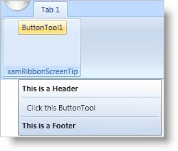

////

|metadata|
{
    "name": "xamribbon-add-a-xamribbonscreentip-to-a-ribbon-tool",
    "controlName": ["xamRibbon"],
    "tags": ["Data Presentation","How Do I"],
    "guid": "{A74AF8E9-AE58-4750-A6C5-2299945BDA1F}",  
    "buildFlags": [],
    "createdOn": "2012-01-30T19:39:54.1231777Z"
}
|metadata|
////

= Add a xamRibbonScreenTip to a Ribbon Tool

You can add a xamRibbon™ Screen Tip to any Ribbon tool by setting its ToolTip property to an instance of a link:{ApiPlatform}ribbon{ApiVersion}~infragistics.windows.ribbon.xamribbonscreentip.html[xamRibbonScreenTip]. You can set the link:{ApiPlatform}ribbon{ApiVersion}~infragistics.windows.ribbon.xamribbonscreentip.html[Content] property of a xamRibbon Screen Tip to a helpful message that is displayed to your end users when they hover over a Ribbon tool. You can also set the link:{ApiPlatform}v{ProductVersion}~infragistics.windows.controls.xamscreentip~header.html[Header] property and/or the link:{ApiPlatform}v{ProductVersion}~infragistics.windows.controls.xamscreentip~footer.html[Footer] property in order to display something in the top and/or bottom of the xamRibbon Screen Tip, respectively. Any text in the header or footer will be displayed as bold text automatically to differentiate it from the content of the xamRibbon Screen Tip. If you want to differentiate the content of the xamRibbonScreenTip further from the header and/or footer, you can display separators (thin horizontal lines) under the header and/or above the footer.

The following example code demonstrates how to add a xamRibbon Screen Tip to a link:{ApiPlatform}ribbon{ApiVersion}~infragistics.windows.ribbon.buttontool.html[ButtonTool]. The example code assumes that the ButtonTool is named 'ButtonTool1'.

*In XAML:*

----
...
<igRibbon:ButtonTool Id="ButtonTool1" Caption="ButtonTool1">
        <igRibbon:ButtonTool.ToolTip>
                <igRibbon:XamRibbonScreenTip 
                        Header="This is a Header" 
                        Footer="This is a Footer" 
                        Content="Click the ButtonTool" 
                        FooterSeparatorVisibility="Visible" 
                        HeaderSeparatorVisibility="Visible" />
                </igRibbon:ButtonTool.ToolTip>
</igRibbon:ButtonTool>
...
----

*In Visual Basic:*

----
Imports Infragistics.Windows.Ribbon
...
Dim tip as New XamRibbonScreenTip()
tip.Header = "This is a Header"
tip.Footer = "This is a Footer"
tip.Content = "Click the ButtonTool"
tip.FooterSeparatorVisibility = Visibility.Visible
tip.HeaderSeparatorVisibility = Visibility.Visible
'Replace ButtonTool1 with the Name of a ButtonTool control in your application
Me.ButtonTool1.ToolTip = tip
...
----

*In C#:*

----
using Infragistics.Windows.Ribbon;
...
XamRibbonScreenTip tip = new XamRibbonScreenTip();
tip.Header = "This is a Header";
tip.Footer = "This is a Footer";
tip.Content = "Click the ButtonTool";
tip.FooterSeparatorVisibility = Visibility.Visible;
tip.HeaderSeparatorVisibility = Visibility.Visible;
//Replace ButtonTool1 with the name of a ButtonTool control in your application
this.ButtonTool1.ToolTip = tip;
...
----

== Related Topics

link:xamribbon-about-xamribbonscreentip.html[About xamRibbonScreenTip]

link:xamribbon-add-a-simple-tooltip-to-a-ribbon-tool.html[Add a Simple ToolTip to a Ribbon Tool]