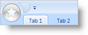

////

|metadata|
{
    "name": "xamribbon-add-an-image-to-the-application-menu",
    "controlName": ["xamRibbon"],
    "tags": ["Getting Started","How Do I","Styling"],
    "guid": "{0D687A5D-B180-4897-BBEE-03157C80C718}",  
    "buildFlags": [],
    "createdOn": "2012-01-30T19:39:54.1261783Z"
}
|metadata|
////

= Add an Image to the Application Menu

When you create a basic xamRibbon using Extensible Application Markup Language (XAML), the Application Menu is one of the few xamRibbon™ components that is always visible by default. You may wish to enhance this area of xamRibbon by displaying an image inside the Application Menu button. Typically, this image would be a company logo or application icon.

The following example code demonstrates how to add an image to the application menu.

.Note
[NOTE]
====
The CompanyLogo.gif image is not included in this topic. You will have to replace the CompanyLogo.gif with a URI to your own image file.
====

*In XAML:*

----
...
<igRibbon:XamRibbon Name="xamRibbon1">
        <igRibbon:XamRibbon.ApplicationMenu>
                <!--The CompanyLogo.gif is not included in this topic. 
                Replace "CompanyLogo.gif" with a URI to your own image file.-->
                <igRibbon:ApplicationMenu Image="CompanyLogo.png"/>
        </igRibbon:XamRibbon.ApplicationMenu>
</igRibbon:XamRibbon>
...
----

*In Visual Basic:*

----
...
Me.xamRibbon1.ApplicationMenu.Image = New BitmapImage(New Uri("pack://application:,,,/CompanyLogo.png"))
...
----

*In C#:*

----
...
this.xamRibbon1.ApplicationMenu.Image = new BitmapImage(new Uri("pack://application:,,,/CompanyLogo.png"));
...
----

== Related Topics

link:xamribbon-add-tools-to-the-application-menu.html[Add Tools to the Application Menu]

link:xamribbon-add-tools-to-the-footer-toolbar.html[Add Tools to the Footer Toolbar]

link:xamribbon-display-a-most-recently-used-items-list.html[Display a Most Recently Used Items List]