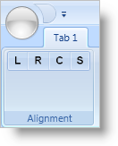

////

|metadata|
{
    "name": "xamribbon-add-tools-to-a-buttongroup",
    "controlName": ["xamRibbon"],
    "tags": ["How Do I"],
    "guid": "{A91F8F64-A377-4A34-AD3C-3D8FC239D646}",  
    "buildFlags": [],
    "createdOn": "2012-01-30T19:39:54.1291789Z"
}
|metadata|
////

= Add Tools to a ButtonGroup

You can group tools into subsets of functionally-related tools within a link:{ApiPlatform}ribbon{ApiVersion}~infragistics.windows.ribbon.ribbongroup.html[RibbonGroup] by adding the tools to a link:{ApiPlatform}ribbon{ApiVersion}~infragistics.windows.ribbon.buttongroup.html[ButtonGroup] panel. The ButtonGroup panel uses the following rules to arrange tools:

* The ButtonGroup panel will arrange all its tools into a single row.
* The ButtonGroup panel will set the SizingMode property of all its tools to link:{ApiPlatform}ribbon{ApiVersion}~infragistics.windows.ribbon.ribbontoolsizingmode.html[ImageOnly].
* The ButtonGroup panel will keep all its tools together and in the same order that you add them to the panel when the RibbonGroup is resized.

If you want to create a group of text alignment tools, like those commonly found in word processing applications, you can add four link:{ApiPlatform}ribbon{ApiVersion}~infragistics.windows.ribbon.buttontool.html[ButtonTools], one per alignment setting, to a RibbonGroup. However, if the end user resizes the application and causes the RibbonGroup to rearrange its tools, the RibbonGroup may separate the ButtonTools and place them into different rows. If you do not want the RibbonGroup to separate the ButtonTools, you can add a ButtonGroup panel to the RibbonGroup, and then add the ButtonTools to the ButtonGroup panel.

.Note
[NOTE]
====
The images in the sample code are not included in this topic. Replace the images with a URI to your own image files.
====

The code below demonstrates how to add tools to a ButtonGroup layout panel.

*In XAML:*

----
...
<igRibbon:RibbonGroup Name="grpAlignment" Caption="Alignment">
        <igRibbon:ButtonGroup>
                <!--TODO: Set the SmallImage property to a URI for your own image file.-->
                <igRibbon:ButtonTool Id="btnLeft" SmallImage="left.png" />
                <igRibbon:ButtonTool Id="btnRight" SmallImage="right.png" />
                <igRibbon:ButtonTool Id="btnCenter" SmallImage="center.png"  />
                <igRibbon:ButtonTool Id="btnStretch" SmallImage="stretch.png"  />
        </igRibbon:ButtonGroup>
</igRibbon:RibbonGroup>
...
----

*In Visual Basic:*

----
Imports Infragistics.Windows.Ribbon
...
Dim buttonGroup1 As New ButtonGroup() 
Me.grpAlignment.Items.Add(buttonGroup1) 
Dim btnLeft As New ButtonTool() 
btnLeft.Id = "btnLeft" 
btnLeft.SmallImage = New BitmapImage(New Uri("pack://application:,,,/left.png")) 
buttonGroup1.Children.Add(btnLeft) 
Dim btnRight As New ButtonTool() 
btnRight.Id = "btnRight" 
btnRight.SmallImage = New BitmapImage(New Uri("pack://application:,,,/right.png")) 
buttonGroup1.Children.Add(btnRight) 
Dim btnCenter As New ButtonTool() 
btnCenter.Id = "btnCenter" 
btnCenter.SmallImage = New BitmapImage(New Uri("pack://application:,,,/center.png")) 
buttonGroup1.Children.Add(btnCenter) 
Dim btnStretch As New ButtonTool() 
btnStretch.Id = "btnStretch" 
btnStretch.SmallImage = New BitmapImage(New Uri("pack://application:,,,/stretch.png")) 
buttonGroup1.Children.Add(btnStretch) 
...
----

*In C#:*

----
using Infragistics.Windows.Ribbon;
...
ButtonGroup buttonGroup1 = new ButtonGroup();
this.grpAlignment.Items.Add(buttonGroup1);
ButtonTool btnLeft = new ButtonTool();
btnLeft.Id = "btnLeft";
btnLeft.SmallImage = new BitmapImage(new Uri("pack://application:,,,/left.png"));
buttonGroup1.Children.Add(btnLeft);
ButtonTool btnRight = new ButtonTool();
btnRight.Id = "btnRight";
btnRight.SmallImage = new BitmapImage(new Uri("pack://application:,,,/right.png"));
buttonGroup1.Children.Add(btnRight);
ButtonTool btnCenter = new ButtonTool();
btnCenter.Id = "btnCenter";
btnCenter.SmallImage = new BitmapImage(new Uri("pack://application:,,,/center.png"));
buttonGroup1.Children.Add(btnCenter);
ButtonTool btnStretch = new ButtonTool();
btnStretch.Id = "btnStretch";
btnStretch.SmallImage = new BitmapImage(new Uri("pack://application:,,,/stretch.png"));
buttonGroup1.Children.Add(btnStretch);
...
----

== Related Topics

link:xamribbon-add-a-toolhorizontalwrappanel-to-a-ribbongroup.html[Add a ToolHorizontalWrapPanel to a RibbonGroup]

link:xamribbon-specify-a-sortorder-for-tools-in-a-toolhorizontalwrappanel.html[Specify a SortOrder for Tools in a ToolHorizontalWrapPanel]