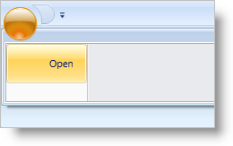

////

|metadata|
{
    "name": "xamribbon-add-tools-to-the-application-menu",
    "controlName": ["xamRibbon"],
    "tags": ["Data Presentation","Getting Started","How Do I","Layouts","Navigation","Selection"],
    "guid": "{3F8DC03E-EED5-4BB0-99F3-015237A50C38}",  
    "buildFlags": [],
    "createdOn": "2012-01-30T19:39:54.1341799Z"
}
|metadata|
////

= Add Tools to the Application Menu

Without tools to interact with, the Application Menu would lack a sense of purpose to your end user. In fact, if you do not include any tools in the Application Menu's Items collection, the Application Menu won't even display, even if you have tools in the Footer toolbar and link:{ApiPlatform}ribbon{ApiVersion}~infragistics.windows.ribbon.applicationmenu~recentitems.html[RecentItems] collection. Just like any ItemsControl derived control in Microsoft® Windows® Presentation Foundation, you can add objects directly to the Application Menu without the need for an explicit Items collection declaration.

Customarily, you would place the Button, Menu, Label, or Separator tools on the Application Menu. You can add other tools to the Application Menu as well; however, other tools may not relate well to an application-level menu.

The following example code demonstrates how to add a link:{ApiPlatform}ribbon{ApiVersion}~infragistics.windows.ribbon.buttontool.html[ButtonTool] to the Application Menu.

*In XAML:*

----
...
<igRibbon:XamRibbon Name="xamRibbon1">
    <igRibbon:XamRibbon.ApplicationMenu>
        <igRibbon:ApplicationMenu>
            <igRibbon:ApplicationMenu.Items>
                <igRibbon:ButtonTool Caption="Open" Id="btnOpen" />
            </igRibbon:ApplicationMenu.Items>
        </igRibbon:ApplicationMenu>
    </igRibbon:XamRibbon.ApplicationMenu>
</igRibbon:XamRibbon>
...
----

*In Visual Basic:*

----
'You can place the following code in the Window's Loaded event handler 
Dim bt As New ButtonTool()
bt.Caption = "Open"
bt.Id = "btnOpen"
Me.xamRibbon1.ApplicationMenu.Items.Add(bt)
----

*In C#:*

----
//You can place the following code in the Window's Loaded event handler
ButtonTool bt = new ButtonTool();
bt.Caption = "Open";
bt.Id = "btnOpen";
this.xamRibbon1.ApplicationMenu.Items.Add(bt);
----

== Related Topics

link:xamribbon-add-an-image-to-the-application-menu.html[Add an Image to the Application Menu]

link:xamribbon-add-tools-to-the-footer-toolbar.html[Add Tools to the Footer Toolbar]

link:xamribbon-display-a-most-recently-used-items-list.html[Display a Most Recently Used Items List]