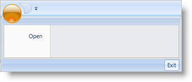

////

|metadata|
{
    "name": "xamribbon-add-tools-to-the-footer-toolbar",
    "controlName": ["xamRibbon"],
    "tags": ["Data Presentation","Getting Started","How Do I","Navigation"],
    "guid": "{285F87E3-553A-4FE7-8904-3D5A04995526}",  
    "buildFlags": [],
    "createdOn": "2012-01-30T19:39:54.1371805Z"
}
|metadata|
////

= Add Tools to the Footer Toolbar

The Footer toolbar is located at the bottom of the Application Menu and is designed to contain tools of higher importance, such as the application's Close or Options buttons. Despite having tools in the Footer toolbar, if you do not have tools in the Items collection, the Application Menu will not display.

The following example code demonstrates how to add a ButtonTool to the link:{ApiPlatform}ribbon{ApiVersion}~infragistics.windows.ribbon.applicationmenufootertoolbar.html[ApplicationMenuFooterToolbar].

*In XAML:*

----
...
<igRibbon:XamRibbon Name="xamRibbon1">
    <igRibbon:XamRibbon.ApplicationMenu>
        <igRibbon:ApplicationMenu>
        <!--There has to be at least one tool in the Application Menu’s Items collection-->
            <igRibbon:ApplicationMenu.Items>
                <igRibbon:ButtonTool Caption="Open" Id="btnOpen" />
            </igRibbon:ApplicationMenu.Items>
            <igRibbon:ApplicationMenu.FooterToolbar>
                <igRibbon:ApplicationMenuFooterToolbar>
                    <igRibbon:ButtonTool Caption="Exit" Id="btnExit" />
                </igRibbon:ApplicationMenuFooterToolbar>
            </igRibbon:ApplicationMenu.FooterToolbar>
        </igRibbon:ApplicationMenu>
    </igRibbon:XamRibbon.ApplicationMenu>
</igRibbon:XamRibbon>
...
----

*In Visual Basic:*

----
Imports Infragistics.Windows.Ribbon
...
'You can place the following code in the Window's Loaded event handler
Dim bt As New ButtonTool()
bt.Caption = "Open"
bt.Id = "btnOpen"
'There has to be at least one tool in the Application Menu’s Items collection 
Me.xamRibbon1.ApplicationMenu.Items.Add(bt)
'You must set the ApplicationMenu's FooterToolbar to an instance of an ApplicationMenuFooterToolbar since it is not initialized automatically. 
Me.xamRibbon1.ApplicationMenu.FooterToolbar = New ApplicationMenuFooterToolbar()
Dim footerbt As New ButtonTool() 
footerbt.Caption = "Exit"
footerbt.Id = "btnExit"
Me.xamRibbon1.ApplicationMenu.FooterToolbar.Items.Add(footerbt)
----

*In C#:*

----
using Infragistics.Windows.Ribbon;
...
//You can place the following code in the Window's Loaded event handler
ButtonTool bt = new ButtonTool();
bt.Caption = "Open";
bt.Id = "btnOpen";
//There has to be at least one tool in the Application Menu’s Items collection
this.xamRibbon1.ApplicationMenu.Items.Add(bt);
//You must set the ApplicationMenu's FooterToolbar to an instance of an ApplicationMenuFooterToolbar since it is not initialized automatically.
this.xamRibbon1.ApplicationMenu.FooterToolbar = new ApplicationMenuFooterToolbar();
ButtonTool footerbt = new ButtonTool();
footerbt.Caption = "Exit";
footerbt.Id = "btnExit";
this.xamRibbon1.ApplicationMenu.FooterToolbar.Items.Add(footerbt);
----

== Related Topics

link:xamribbon-add-an-image-to-the-application-menu.html[Add an Image to the Application Menu]

link:xamribbon-add-tools-to-the-application-menu.html[Add Tools to the Application Menu]

link:xamribbon-display-a-most-recently-used-items-list.html[Display a Most Recently Used Items List]