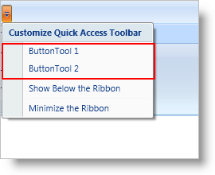

////

|metadata|
{
    "name": "xamribbon-adding-and-removing-common-tools",
    "controlName": ["xamRibbon"],
    "tags": ["Data Presentation","Editing","Getting Started","How Do I","Selection"],
    "guid": "{4BD21264-6734-4883-BB0A-E9C69D0C5DA5}",  
    "buildFlags": [],
    "createdOn": "2012-01-30T19:39:54.1401811Z"
}
|metadata|
////

= Adding and Removing Common Tools

The Quick Access Toolbar (QAT) is a customizable toolbar where end users can add frequently used tools at run time. Normally, your end user will have to locate the tool in a link:{ApiPlatform}ribbon.v{ProductVersion}~infragistics.windows.ribbon.ribbongroup.html[RibbonGroup] or in the application menu before they can add it to the QAT. However, you can alleviate the search process by adding tools of higher importance to the QAT's Quick Customize Menu. The Quick Customize Menu is the QAT's drop-down menu that displays QAT location options as well as a list of commonly used tools, also referred to as common tools. The end user can simply click a tool in the common tools section of the Quick Customize Menu to add or remove a tool from the QAT.

Your end user will not be able to add tools to the common tools list in the Quick Customize Menu; instead, you are responsible for defining a list of common tools that your end users can add to the QAT. Creating a list of common tools in the Quick Customize Menu is a simple process that involves a single property on a Ribbon tool. In order to display a Ribbon tool in the common tools list, set the Ribbon tool's IsQatCommonTool property to True. You can also remove a common tool from the list by setting the IsQatCommonTool property to False. The one caveat is that you can only add Ribbon tools that support user interaction to the common tools list and ultimately the QAT.

== Related Topics

link:xamribbon-about-quickaccesstoolbar.html[About QuickAccessToolbar]

link:xamribbon-add-a-tool-or-ribbongroup-to-the-quick-access-toolbar.html[Add a Tool or RibbonGroup to the Quick Access Toolbar]