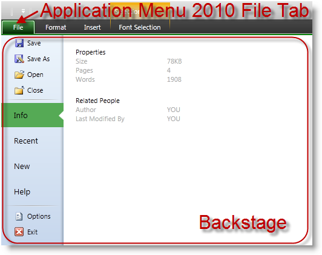
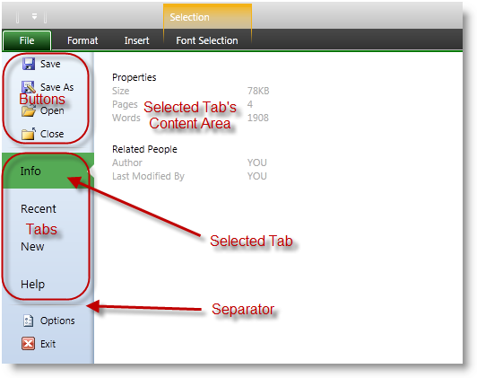

////

|metadata|
{
    "name": "xamribbon-applicationmenu2010-overview",
    "controlName": ["xamRibbon"],
    "tags": ["Application Scenarios","Getting Started"],
    "guid": "cb92a71b-9660-4189-95a2-d8ea916e57fc",  
    "buildFlags": [],
    "createdOn": "2013-03-04T07:13:00.3274069Z"
}
|metadata|
////

= ApplicationMenu2010 Overview (xamRibbon)

== Topic Overview

=== Purpose

This topic explains the Application Menu 2010 and its behaviors in general.

=== Required background

The following topics are prerequisites to understanding this topic:

[options="header", cols="a,a"]
|====
|Topic|Purpose

| link:xamribbon-about-xamribbon.html[About xamRibbon]
|Overview of the xamRibbon control

| link:xamribbon-adding-xamribbon-to-your-application-.html[Adding xamRibbon to Your Application]
|This topic provides step-by-step instruction how to add the control to your application and how to define tabs and groups

|====

=== In this topic

This topic contains the following sections:

* <<_Ref348518601, Introduction >>
* <<_Ref348518613, Application Menu 2010 Summary >>
* <<_Ref348518622, Backstage Content >>
* <<_Ref348518634, Closing the Backstage >>
* <<_Ref348518647, Related Content >>

[[_Ref348518601]]
== Introduction

[[_Ref348518613]]

=== Application Menu 2010 Summary

When enabled, the Application Menu 2010 feature renders a File Tab before all other tabs in the  _xamRibbon_   control. Pressing this tab will open a backstage, which will cover the  _xamRibbon_   groups and extends to the size of the window containing the  _xamRibbon_  .

The screenshot below shows the location of the Application Menu 2010 File Tab within the  _xamRibbon_   control and an opened backstage:

Nevertheless, positioned over the  _xamRibbon_   the backstage tabs are visible, and the user can interact with them. Clicking on a tab will hide the backstage and show the particular tab of the  _xamRibbon_  . The backstage remains visible even if the user resizes or moves the window.

If you set the link:{ApiPlatform}ribbon{ApiVersion}~infragistics.windows.ribbon.xamribbon~theme.html[Theme] property of a  _xamRibbon_   control that is inside a link:{ApiPlatform}ribbon{ApiVersion}~infragistics.windows.ribbon.xamribbonwindow_members.html[XamRibbonWindow] to “Office 2013” then the backstage, which is defined via the link:{ApiPlatform}ribbon{ApiVersion}~infragistics.windows.ribbon.applicationmenu2010_members.html[ApplicationMenu2010] property, will mimic the MS Office 2013 look by hiding the whole  _xamRibbon_   control, showing the buttons area on the left with a sliding animation and showing the content on the right using an opacity animation. You can use the back button on the top left to close the backstage.

image::images/xamRibbon_Backstage2013.png[]

[[_Ref348518622]]

=== Backstage Content

The left side of the backstage contains a column of buttons, tabs and separators. There is always one selected tab, and you can specify which one will be the initially selected tab. The selected tab’s content displays in the right side of the opened backstage area.

The screenshot below shows the content parts of an opened backstage:

.Note
[NOTE]
====
The Application Menu 2010 supports an accent color used for:

* Drawing a gradient over the Application Menu 2010 File Tab
* Drawing the topmost part of the backstage (just beneath the  _xamRibbon’s_   tabs)
* Highlighting the selected tab in the left part of the backstage
* Highlighting the hovered button or tab

====

[[_Ref348518634]]

=== Closing the Backstage

When shown the backstage remains visible until:

* The user pressed the Escape key
* The user clicks on the Application Menu 2010 File Tab
* The user clicks on a tab in the xamRibbon
* The user clicks on a button in the left side of the backstage

The backstage can also be hidden programmatically using the following ways:

* Invokes the link:{ApiPlatform}ribbon{ApiVersion}~infragistics.windows.ribbon.ribboncommands~closeapplicationmenu.html[CloseApplicationMenu2010] command
* Sets the attached property link:{ApiPlatform}ribbon{ApiVersion}~infragistics.windows.ribbon.applicationmenu2010item~setclosewhenclicked.html[ApplicationMenu2010Item.CloseWhenClicked] to true on a `MenuItem`, `ButtonBase` or a `Hyperlink`
* Sets the property link:{ApiPlatform}ribbon{ApiVersion}~infragistics.windows.ribbon.applicationmenu2010~isopen.html[ApplicationMenu2010.IsOpen] to false

[[_Ref348518647]]
== Related Content

=== Topics

The following topics provide additional information related to this topic.

[options="header", cols="a,a"]
|====
|Topic|Purpose

| link:xamribbon-defininganapplicationmenu2010.html[Defining an Application Menu 2010]
|This topic provides step-by-step instructions on how to define an Application Menu 2010.

| link:xamribbon-applicationmenu2010keytips.html[Application Menu 2010 KeyTips]
|This topic explains the Application Menu 2010’s KeyTips feature.

|====

=== Samples

The following samples provide additional information related to this topic.

[options="header", cols="a,a"]
|====
|Sample|Purpose

| link:{SamplesURL}/ribbon/application-menu-2010[Application Menu 2010]
|This sample demonstrates how to define a _xamRibbon’s_ Application Menu 2010.

|====