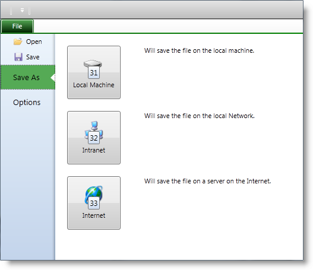

////

|metadata|
{
    "name": "xamribbon-applicationmenu2010keytips",
    "controlName": ["xamRibbon"],
    "tags": ["How Do I"],
    "guid": "1b8faf27-820b-4658-951b-cbb6329a021c",  
    "buildFlags": [],
    "createdOn": "2013-03-04T07:14:38.5184069Z"
}
|metadata|
////

= Application Menu 2010 KeyTips (xamRibbon)

== Topic Overview

=== Purpose

This topic explains the Application Menu 2010’s KeyTips feature.

=== Required background

The following topics are prerequisites to understanding this topic:

[options="header", cols="a,a"]
|====
|Topic|Purpose

| link:xamribbon-about-xamribbon.html[About xamRibbon]
|Overview of the xamRibbon control

| link:xamribbon-adding-xamribbon-to-your-application-.html[Adding xamRibbon to Your Application]
|This topic provides step-by-step instruction how to add the control to your application and how to define tabs and groups

| link:xamribbon-applicationmenu2010-overview.html[Application Menu 2010 Overview]
|This topic explains the Application Menu 2010 and its behaviors in general.

|====

=== In this topic

This topic contains the following sections:

* <<_Ref348630437, Introduction >>
* <<_Ref348630443, KeyTips summary >>
* <<_Ref348630449, KeyTips on the left side of the backstage >>
* <<_Ref348630457, KeyTips on the right side of the backstage >>
* <<_Ref345935957, Code Examples >>
* <<_Ref348629806, Code Example: Assign KeyTip to an ApplicationMenu2010Item >>
* <<_Ref348629811, Code Example: Assign KeyTip to a Button >>
* <<_Ref348630482, Related Content >>

[[_Ref348630437]]
== Introduction

[[_Ref348630443]]

=== KeyTips summary

KeyTips are visual cues that help users navigating through the information and controls placed in the  _xamRibbon_   and the Application Menu 2010. Although the  _xamRibbon_   control automatically assigns some of the KeyTips, they are customizable. However, there are other controls that do not support automatic KeyTips, you may configure these. The KeyTips are shown by pressing the ALT key and at this point the user have to press the key (or the keys one after another) shown on the KeyTip to activate a particular feature. The KeyTips are grouped based on the containers in which the controls are grouped. Pressing the key for a KeyTip assigned to a group, hides all of the KeyTips at the current group control and displays all of the KeyTips for the next group. Pressing the Escape key hides the current group KeyTips and shows the KeyTips from the parent group.

The screenshots below shows an Application Menu 2010 with KeyTips visible for the left side of the backstage:

The screenshot below shows an Application Menu 2010 after pressing the KeyTip “3” on the previous screenshot:

[[_Ref348630449]]

=== KeyTips on the left side of the backstage

The  _xamRibbon_   control automatically adds KeyTips on the left side of the backstage. You can overwrite their default values by setting the link:{ApiPlatform}ribbon{ApiVersion}~infragistics.windows.ribbon.applicationmenu2010item~keytip.html[KeyTip] property of the link:{ApiPlatform}ribbon{ApiVersion}~infragistics.windows.ribbon.applicationmenu2010item.html[ApplicationMenu2010Item] class.

<<_Ref348629806,Code Example: Assign KeyTip to an ApplicationMenu2010Item>>

[[_Ref348630457]]

=== KeyTips on the right side of the backstage

The  _xamRibbon_   control does not automatically assign KeyTips on the right side of the backstage. To assign a KeyTip use the attached property link:{ApiPlatform}ribbon{ApiVersion}~infragistics.windows.ribbon.applicationmenu2010item~setkeytipprovider.html[KeyTipProvider] of the `ApplicationMenu2010Item` class, which is of an link:{ApiPlatform}ribbon{ApiVersion}~infragistics.windows.ribbon.elementkeytipprovider.html[ElementKeyTipProvider] type. You may set the link:{ApiPlatform}ribbon{ApiVersion}~infragistics.windows.ribbon.elementkeytipprovider~keytip.html[KeyTip] property of the `ElementKeyTipProvider` class to a value of your choice, or the  _xamRibbon_   will automatically generate a non-used KeyTip for you.

<<_Ref348629811,Code Example: Assign KeyTip to a Button>>

Access the KeyTips on the right side of the backstage based of the containers in which the controls are nested.

The screenshot below shows an Application Menu 2010, with KeyTips shown after selecting the second tab:

In this case, the controls on the right side of the backstage are grouped in 2 Border containers. Both Border containers have assigned KeyTips, and the KeyTips are shown – “41” and “42”.

The screenshot below shows that the left Border was selected (using the KeyTip with value “41”) and now all control nested in the left Border are with visible KeyTips:

[[_Ref345935957]]
== Code Examples

=== Code examples summary

The following table lists the code examples included in this topic.

[options="header", cols="a,a"]
|====
|Example|Description

|<<_Ref348629806,Code Example: Assign a KeyTip to an ApplicationMenu2010Item>>
|This example shows how to assign KeyTip to an ApplicationMenu2010Item object.

|<<_Ref348629811,Code Example: Assign a KeyTip to a Button>>
|This example shows how to assign KeyTip to a Button object.

|====

[[_Ref348628296]]

[[_Ref348629806]]
== Code Example: Assign KeyTip to an ApplicationMenu2010Item

=== Description

This example illustrates assigning a KeyTip to an `ApplicationMenu2010Item` object with a value of, “1.”

=== Code

*In XAML:*

[source,xaml]
----
<igRibbon:ApplicationMenu2010Item KeyTip="1">
    <igRibbon:ApplicationMenu2010Item.Header>
        <TextBlock Text="Open" />
    </igRibbon:ApplicationMenu2010Item.Header>
</igRibbon:ApplicationMenu2010Item>
----

[[_Ref348629811]]
== Code Example: Assign KeyTip to a Button

=== Description

This example illustrates assigning a KeyTip to a Button object with a value of, “B1.” That is to say that the user needs to press “B” and “1” sequentially to activate the button.

=== Code

*In XAML:*

[source,xaml]
----
<Button Content="Press Me">
    <igRibbon:ApplicationMenu2010Item.KeyTipProvider>
        <igRibbon:ElementKeyTipProvider KeyTip="B1" />
    </igRibbon:ApplicationMenu2010Item.KeyTipProvider>
</Button>
----

[[_Ref348630482]]
== Related Content

=== Topics

The following topics provide additional information related to this topic.

[options="header", cols="a,a"]
|====
|Topic|Purpose

| link:xamribbon-applicationmenu2010-overview.html[Application Menu 2010 Overview]
|This topic explains the Application Menu 2010 and its behaviors in general.

| link:xamribbon-defininganapplicationmenu2010.html[Defining an Application Menu 2010]
|This topic provides step-by-step instructions on how to define an Application Menu 2010.

|====

=== Samples

The following samples provide additional information related to this topic.

[options="header", cols="a,a"]
|====
|Sample|Purpose

| link:{SamplesURL}/ribbon/application-menu-2010[Application Menu 2010]
|This sample demonstrates how to define a _xamRibbon’s_ Application Menu 2010.

| link:{SamplesURL}/ribbon/application-menu-2010-keytips[Application Menu 2010 KeyTips]
|This sample demonstrates how to define and use the _xamRibbon’s_ control KeyTips.

|====