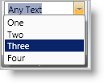
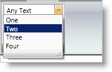

////

|metadata|
{
    "name": "xamribbon-combo-editor",
    "controlName": ["xamRibbon"],
    "tags": ["Data Presentation","Getting Started","How Do I","Navigation","Selection"],
    "guid": "{3B596FBF-0B54-46F7-BDF6-D2FFDFE0E772}",  
    "buildFlags": [],
    "createdOn": "2012-01-30T19:39:54.1531837Z"
}
|metadata|
////

= Combo Editor

== Overview

The Combo Editor tool is an editor tool that displays a drop-down list containing items from which the end user can select a single item. Your end user can also enter any arbitrary text inside Combo Editor's edit portion. You can enable this behavior by setting the IsEditable property. The Combo Editor tool is similar to the .NET Framework ComboBox control; however, the Combo Editor tool derives from xamComboEditor editor, which ultimately derives from ValueEditor, and therefore shares the object model and functionality exposed by the ValueEditor class.

The way you populate ComboEditorTool's drop-down list is by setting its ItemsProvider property to an instance of a ComboBoxItemsProvider object. The ComboBoxItemsProvider object exposes Items and ItemSource properties which behave just like the properties of ItemsControl with the same name. You only need to use one of these properties, not both, to populate a ComboBoxItemsProvider object with items. These items will be displayed by ComboEditorTool's drop-down list.

.Note
[NOTE]
====
The main advantage of the ComboBoxItemsProvider object concept is that a single ComboBoxItemsProvider can be shared by multiple ComboEditorTool and XamComboEditor instances. This greatly reduces overhead in situations where multiple instances of these editors will be making use of the same items, such as in a xamDataGrid field where multiple cells from the same field are using xamComboEditors to display their contents. In such a case, a single ComboBoxItemsProvider would be shared by all the xamComboEditor instances associated with the cells of the field.
====

== General Steps for using ComboEditorTool:

[start=1]
. Create a ComboBoxItemsProvider object.
[start=2]
. Populate ComboBoxItemsProvider with items to be displayed in the drop down. You can either set ItemsSource property to a data source or populate its Items collection. You can add any custom objects to the Items collection. The ComboEditorTool object model also exposes ComboBoxDataItem object, where each instance can contain display text, a data value, and an optional image. You can use ComboBoxDataItem objects to populate the Items property of the ComboBoxItemsProvider to easily map data to display text and optionally display images in the items.
[start=3]
. Set the ComboBoxItemsProvider's ValuePath and DisplayMemberPath properties as desired. ValuePath and DisplayMemberPath are typically set to names of properties of the objects that the items provider is populated with that will contain the data value and display text respectively.
[start=4]
. Create a ComboEditorTool instance. Set ComboEditorTool's ItemsProvider to the above created ComboBoxItemsProvider.

== Properties

As mentioned previously, ComboEditorTool derives from xamComboEditor, which ultimately derives from the ValueEditor class. Therefore ComboEditorTool shares the same consistent object model and set of functionalities that other Value Editors expose.

* IsEditable - Set this property to True to make the text portion editable. This will allow the user to enter any arbitrary value inside the edit portion of the tool.
* ItemsProvider - This property specifies the items to display in the drop down. Set it to an instance of ComboBoxItemsProvider which is the object that actually contains and manages items.
* What's the current value of the editor tool?

** SelectedItem - Gets or sets the item in the list that's currently selected.
** SelectedIndex - The index of the item that's currently selected.
** Value - The value of the property or path as specified by the ValuePath property of the associated ComboBoxItemsProvider into the SelectedItem. If Value is not set, then the SelectedItem will be returned from this property.
** Example: If the ValuePath is set to "Name" and the SelectedItem is a Customer object, then the Value property will return the value of the Name property of the Customer object. The SelectedItem property will return the Customer object itself.
** Text – The text that's displayed inside the edit portion.

* DropDownButtonDisplayMode - You can control when the editor tool displays the drop-down button. Options are Always, MouseOver, Focused, and OnlyInEditMode.
* EditAreaWidth - As with other tools, you can specify a label for the ComboEditorTool via the XamRibbon object model. This label will be displayed next to the edit portion of the editor tool. The EditAreaWidth property controls the width of the edit portion. The label will have fixed, auto-calculated widths.
* SelectionStart, SelectionLength, and SelectedText - These properties indicate the current text selection inside the edit portion of the editor tool. This is only applicable when the IsEditable property is set to True.
* DropDownResizeMode - Determines whether the user can resize the drop-down list horizontally and/or vertically. The default is to allow resizing both horizontally and vertically. You can set this property to None to disable this feature. The following screen shot displays a resize bar at the bottom of the drop-down list. Your end user can use this resizer bar to resize the drop-down list.

* MinDropDownWidth, MaxDropDownWidth, and MaxDropDownHeight - These three properties specify constraints for the drop-down list portion.

== Events

* ValueChanged - Inherited from the base ValueEditor. This is raised whenever the value of the editor changes, including when the user types values inside the edit portion when the IsEditable property is set to True.
* SelectedItemChanged - Raised whenever an item is selected from the drop-down list or whenever a value is entered that matches one of the items in the drop-down list. SelectedItem property will reflect the currently selected item.