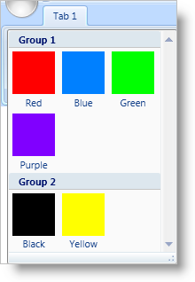

////

|metadata|
{
    "name": "xamribbon-create-groups-of-galleryitems",
    "controlName": ["xamRibbon"],
    "tags": ["Data Presentation","Getting Started","Grouping","How Do I"],
    "guid": "{1D464C70-5B3B-46FA-8419-054C90C35C8A}",  
    "buildFlags": [],
    "createdOn": "2012-01-30T19:39:54.1551841Z"
}
|metadata|
////

= Create Groups of GalleryItems

If you have a large number of link:{ApiPlatform}ribbon.v{ProductVersion}~infragistics.windows.ribbon.galleryitem.html[GalleryItems] in a link:{ApiPlatform}ribbon.v{ProductVersion}~infragistics.windows.ribbon.gallerytool.html[GalleryTool], it may be hard for your end users to find the item that they are interested in. In order to facilitate the search process of your end users, you can create link:{ApiPlatform}ribbon.v{ProductVersion}~infragistics.windows.ribbon.galleryitemgroup.html[GalleryItemGroup] objects to group your GalleryItems into smaller subsets of functionality. By categorizing functionality into groups of GalleryItems, your end users will be able to navigate to a group of GalleryItems instead of scanning the entire drop-down list of GalleryItems.

All GalleryItems that you add to a GalleryTool must have a unique key. You can use the key to find a particular GalleryItem or to add a GalleryItem to a GalleryItemGroup. You do not add a GalleryItem directly to a GalleryItemGroup; instead, you add the key of the GalleryItem to the GalleryItemGroup. You can also add a key to multiple GalleryItemGroups if you want to display a GalleryItem in more than one group. The thing that you have to remember when using groups is that the preview will show all GalleryItems; however, the drop-down list will only show the GalleryItems that belong to GalleryItemGroups. For example, if you have 20 GalleryItems in a GalleryTool and you add 18 of the GalleryItems to a GalleryItemGroup. The GalleryTool will display all 20 GalleryItems in the preview area; however, only 18 of the GalleryItems will be displayed in the drop-down list of the GalleryTool.

The following example code demonstrates how to create groups of GalleryItems. You will have to replace all images referenced in the example code with your own images.

*In XAML:*

----
...
<!--The sys: prefix is mapped to 'clr-namespace:System;assembly=mscorlib'-->
<igRibbon:GalleryTool Name="galleryTool1" ItemBehavior="StateButton">
        <igRibbon:GalleryTool.Items>
                <igRibbon:GalleryItem 
                        Key="Item1" 
                        Text="Red" 
                        Image="GalleryItemImages/Red.png" />
                <igRibbon:GalleryItem 
                        Key="Item2" 
                        Text="Blue" 
                        Image="GalleryItemImages/Blue.png" />
                <igRibbon:GalleryItem 
                        Key="Item3" 
                        Text="Green" 
                        Image="GalleryItemImages/Green.png" />
                <igRibbon:GalleryItem 
                        Key="Item4" 
                        Text="Purple" 
                        Image="GalleryItemImages/Purple.png" />
                <igRibbon:GalleryItem 
                        Key="Item5" 
                        Text="Black" 
                        Image="GalleryItemImages/Black.png" />
                <igRibbon:GalleryItem 
                        Key="Item6" 
                        Text="Yellow" 
                        Image="GalleryItemImages/Yellow.png" />
        </igRibbon:GalleryTool.Items>
        <igRibbon:GalleryTool.Groups>
                <igRibbon:GalleryItemGroup Title="Group 1">
                        <sys:String>Item1</sys:String>
                        <sys:String>Item2</sys:String>
                        <sys:String>Item3</sys:String>
                        <sys:String>Item4</sys:String>
                </igRibbon:GalleryItemGroup>
                <igRibbon:GalleryItemGroup Title="Group 2">
                        <sys:String>Item5</sys:String>
                        <sys:String>Item6</sys:String>
                </igRibbon:GalleryItemGroup>
        </igRibbon:GalleryTool.Groups>
</igRibbon:GalleryTool>
...
----

*In Visual Basic:*

----
Imports Infragistics.Windows.Ribbon;
...
Dim itemGroup1 As New GalleryItemGroup()
Dim itemGroup2 As New GalleryItemGroup()
itemGroup1.Title = "Group 1"
itemGroup2.Title = "Group 2"
Me.galleryTool1.Groups.Add(itemGroup1)
Me.galleryTool1.Groups.Add(itemGroup2)
itemGroup1.ItemKeys.Add("Item1")
itemGroup1.ItemKeys.Add("Item2")
itemGroup1.ItemKeys.Add("Item3")
itemGroup1.ItemKeys.Add("Item4")
itemGroup2.ItemKeys.Add("Item5")
itemGroup2.ItemKeys.Add("Item6")
...
----

*In C#:*

----
using Infragistics.Windows.Ribbon;
...
GalleryItemGroup itemGroup1 = new GalleryItemGroup();
GalleryItemGroup itemGroup2 = new GalleryItemGroup();
itemGroup1.Title = "Group 1";
itemGroup2.Title = "Group 2";
this.galleryTool1.Groups.Add(itemGroup1);
this.galleryTool1.Groups.Add(itemGroup2);
itemGroup1.ItemKeys.Add("Item1");
itemGroup1.ItemKeys.Add("Item2");
itemGroup1.ItemKeys.Add("Item3");
itemGroup1.ItemKeys.Add("Item4");
itemGroup2.ItemKeys.Add("Item5");
itemGroup2.ItemKeys.Add("Item6");
...
----

== Related Topics

link:xamribbon-add-a-galleryitem-to-a-gallerytool.html[Add a GalleryItem to a GalleryTool]

link:xamribbon-add-a-gallerytool-to-a-ribbongroup.html[Add a GalleryTool to a RibbonGroup]

link:xamribbon-creating-a-live-preview.html[Creating a Live Preview]