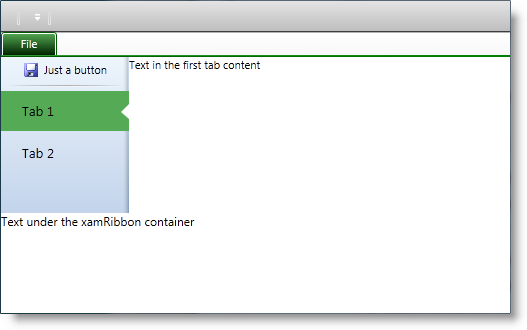

////

|metadata|
{
    "name": "xamribbon-defininganapplicationmenu2010",
    "controlName": ["xamRibbon"],
    "tags": ["Application Scenarios","How Do I"],
    "guid": "17831a2a-4027-4704-a918-96f0fe2f0fd2",  
    "buildFlags": [],
    "createdOn": "2013-03-04T07:13:41.6424069Z"
}
|metadata|
////

= Defining an Application Menu 2010 (xamRibbon)

== Topic Overview

=== Purpose

This topic provides systematic instructions on how to define an Application Menu 2010.

=== Required background

The following topics are prerequisites to understanding this topic:

[options="header", cols="a,a"]
|====
|Topic|Purpose

| link:xamribbon-about-xamribbon.html[About xamRibbon]
|Overview of the _xamRibbon_ control

| link:xamribbon-adding-xamribbon-to-your-application-.html[Adding xamRibbon to Your Application]
|This topic provides step-by-step instruction how to add the control to your application and how to define tabs and groups

| link:xamribbon-applicationmenu2010-overview.html[Application Menu 2010 Overview]
|This topic explains the Application Menu 2010 and its behaviors in general.

|====

=== In this topic

This topic contains the following sections:

* <<_Ref348598532, Define an Application Menu 2010 in the xamRibbon control >>
* <<_Ref348537532, Code Examples >>
* <<_Ref348599040, Related Content >>

[[_Ref348598532]]
== Define an Application Menu 2010 in the  _xamRibbon_  control

=== Introduction

This procedure demonstrates adding a  _xamRibbon_   control to your page and defining an Application Menu 2010 therein.

=== Preview

The following screenshot is a preview of the result.

=== Prerequisites

To complete the procedure, you need the following:

* Know how to add a  _xamRibbon_   control to you page

=== Overview

Following is a conceptual overview of the process:

1. Add a xamRibbon control to your page

2. Add an Application Menu 2010 to the xamRibbon control

3. Add a button to the Application Menu 2010

4. Add a separator to the Application Menu 2010

5. Add two tabs to the Application Menu 2010

=== Steps

The following steps demonstrate how to define an Application Menu 2010.

=== 1. Add the xamRibbon control to your page

Add the  _xamRibbon_   control to your page and set its link:{ApiPlatform}ribbon{ApiVersion}~infragistics.windows.ribbon.xamribbon~applicationmenumode.html[ApplicationMenuMode] property to link:{ApiPlatform}ribbon{ApiVersion}~infragistics.windows.ribbon.applicationmenumode.html[Office2010] . To change the accent color, used by the Application Menu 2010, set the link:{ApiPlatform}ribbon{ApiVersion}~infragistics.windows.ribbon.xamribbon~applicationaccentcolor.html[ApplicationAccentColor] property.

For more information look at the <<_Ref348598962,Code Example: Add a xamRibbon>>

=== 2. Add an Application Menu 2010 to the xamRibbon control

Create an instance of the link:{ApiPlatform}ribbon{ApiVersion}~infragistics.windows.ribbon.applicationmenu2010.html[ApplicationMenu2010] class and set it to the link:{ApiPlatform}ribbon{ApiVersion}~infragistics.windows.ribbon.xamribbon~applicationmenu2010.html[ApplicationMenu2010] property of the  _xamRibbon_   control. The `ApplicationMenu2010` class is an `ItemsControl` derived class adding all of the buttons, tabs and separators to its `Items` collection.

For more information look at the <<_Ref348598974,Code Example: Add an Application Menu 2010>>

.Note
[NOTE]
====
By default, the backstage fills all available space below the  _xamRibbon_   control’s tabs to the end of the parent Window. It is useful to specify another ancestor container for limiting the backstage size using the link:{ApiPlatform}ribbon{ApiVersion}~infragistics.windows.ribbon.applicationmenu2010~setisconstrainingelement.html[IsConstrainingElement] property.

For more information please refer to the <<_Ref348599007,Code Example: Complete Code>>
====

=== 3. Add a button to the Application Menu 2010

Create an instance of the link:{ApiPlatform}ribbon{ApiVersion}~infragistics.windows.ribbon.applicationmenu2010item.html[ApplicationMenu2010Item] class and add it to the `Items` collection of the `ApplicationMenu2010` class instance created in the previous step. Being derived from `HeaderedContentControl` class, the `ApplicationMenuItem` class allowing you to set the `Header` and `Image` properties to customize your button.

For more information refer to the <<_Ref348598984,Code Example: Add a Button>>

.Note
[NOTE]
====
If you set a value to the `Content` property, the item will render as a tab (and not as a button).
====

=== 4. Add a separator to the Application Menu 2010

Create an instance of the link:{ApiPlatform}ribbon{ApiVersion}~infragistics.windows.ribbon.applicationmenu2010separator.html[ApplicationMenu2010Separator] class (derived from the `System.Windows.Controls.Separator` class) and add it to the `ApplicationMenu2010` class’ `Items` collection.

For more information look at the <<_Ref348598991,Code Example: Add a Separator>>

=== 5. Add two tabs to the Application Menu 2010

Create two instances of the `ApplicationMenu2010Item` class and add them to the `ApplicationMenu2010` class’ `Items` collection. Set a name to the tab using the `Header` property. Set the `Content` property of both tabs to a value of your choice. The content renders on the right side of the backstage.

For more information refer to the <<_Ref348599001,Code Example: Add a Tab>>

.Note
[NOTE]
====
By default, the first added tab in the Items collection will be the one initially selected; however, you can use the link:{ApiPlatform}ribbon{ApiVersion}~infragistics.windows.ribbon.applicationmenu2010~initialselectedtabitem.html[InitialSelectedTabItem] property to specify an initial tab of your choice.
====

[[_Ref348537532]]
== Code Examples

=== Code examples summary

The following table lists the code examples included in this topic.

[options="header", cols="a,a"]
|====
|Example|Description

|<<_Ref348598962,Code Example: Add a _xamRibbon_ >>
|Demonstrates adding the _xamRibbon_ control to your page.

|<<_Ref348598974,Code Example: Add an Application Menu 2010>>
|Demonstrates adding the Application Menu 2010 to the _xamRibbon_ .

|<<_Ref348598984,Code Example: Add a Button>>
|Demonstrates adding a button to the Application Menu 2010.

|<<_Ref348598991,Code Example: Add a Separator>>
|Demonstrates adding a separator to the Application Menu 2010.

|<<_Ref348599001,Code Example: Add a Tab>>
|Demonstrates adding a tab to the Application Menu 2010.

|<<_Ref348599007,Code Example: Complete Code>>
|This is the complete code showing how to add an Application Menu 2010 with one button and two tabs.

|====

[[_Ref348598962]]
== Code Example: Add a  _xamRibbon_

=== Description

Demonstrates adding the  _xamRibbon_   control to your page.

=== Code

*In XAML:*

[source,xaml]
----
<igRibbon:XamRibbon
    x:Name="myRibbon"
    Theme="IGTheme"
    ApplicationMenuMode="Office2010"
    ApplicationAccentColor="Green">
<!-- add Application Menu 2010 here -->
</igRibbon:XamRibbon>
----

[[_Ref348598974]]
== Code Example: Add an Application Menu 2010

=== Description

Demonstrates adding the Application Menu 2010 to the  _xamRibbon_  .

=== Code

*In XAML:*

[source,xaml]
----
<igRibbon:XamRibbon.ApplicationMenu2010>
    <igRibbon:ApplicationMenu2010 Caption="File">
        <igRibbon:ApplicationMenu2010.Items>
        <!-- add buttons, tabs and separators here -->
        </igRibbon:ApplicationMenu2010.Items>
    </igRibbon:ApplicationMenu2010>
</igRibbon:XamRibbon.ApplicationMenu2010>
----

[[_Ref348598984]]
== Code Example: Add a Button

=== Description

Demonstrates adding a button to the Application Menu 2010.

=== Code

*In XAML:*

[source,xaml]
----
<igRibbon:ApplicationMenu2010Item
    Image="/Ribbon.WPF;component/Images/Save_16x16.png">
    <igRibbon:ApplicationMenu2010Item.Header>
        <TextBlock Margin="5,0,0,0" Text="Just a button" />
    </igRibbon:ApplicationMenu2010Item.Header>
</igRibbon:ApplicationMenu2010Item>
----

[[_Ref348598991]]
== Code Example: Add a Separator

=== Description

Demonstrates adding a separator to the Application Menu 2010.

=== Code

*In XAML:*

[source,xaml]
----
<igRibbon:ApplicationMenu2010Separator />
----

[[_Ref348599001]]
== Code Example: Add a Tab

=== Description

Demonstrates adding a tab to the Application Menu 2010.

=== Code

*In XAML:*

[source,xaml]
----
<igRibbon:ApplicationMenu2010Item Header="Tab 1">
    <igRibbon:ApplicationMenu2010Item.Content>
        <TextBlock Text="Text in the first tab content" />
    </igRibbon:ApplicationMenu2010Item.Content>
</igRibbon:ApplicationMenu2010Item>
----

[[_Ref348599007]]
== Code Example: Complete Code

=== Description

This is the complete code showing how to add an Application Menu 2010 with one button and two tabs.

=== Code

*In XAML:*

[source,xaml]
----
<Window x:Class="Ribbon.WPF.MainWindow"
        xmlns="http://schemas.microsoft.com/winfx/2006/xaml/presentation"
        xmlns:x="http://schemas.microsoft.com/winfx/2006/xaml"
        xmlns:igRibbon="http://infragistics.com/Ribbon"
        Title="MainWindow" Height="350" Width="525">
    <Grid>
        <Grid.RowDefinitions>
            <RowDefinition Height="*" />
            <RowDefinition Height="100" />
        </Grid.RowDefinitions>
        <Grid Grid.Row="0"
            igRibbon:ApplicationMenu2010.IsConstrainingElement="True">
            <igRibbon:XamRibbon x:Name="myRibbon" Theme="IGTheme"
                ApplicationMenuMode="Office2010" ApplicationAccentColor="Green">
                <igRibbon:XamRibbon.ApplicationMenu2010>
                    <igRibbon:ApplicationMenu2010 Caption="File">
                        <igRibbon:ApplicationMenu2010.Items>
                            <igRibbon:ApplicationMenu2010Item
                            Image="/Ribbon.WPF;component/Images/Save_16x16.png">
                                <igRibbon:ApplicationMenu2010Item.Header>
                                    <TextBlock Margin="5,0,0,0"
                                        Text="Just a button" />
                                </igRibbon:ApplicationMenu2010Item.Header>
                            </igRibbon:ApplicationMenu2010Item>
                            <igRibbon:ApplicationMenu2010Separator />
                            <igRibbon:ApplicationMenu2010Item Header="Tab 1">
                                <igRibbon:ApplicationMenu2010Item.Content>
                                    <TextBlock
                                    Text="Text in the first tab content" />
                                </igRibbon:ApplicationMenu2010Item.Content>
                            </igRibbon:ApplicationMenu2010Item>
                            <igRibbon:ApplicationMenu2010Item Header="Tab 2">
                                <igRibbon:ApplicationMenu2010Item.Content>
                                    <TextBlock
                                    Text="Text in the second tab content" />
                                </igRibbon:ApplicationMenu2010Item.Content>
                            </igRibbon:ApplicationMenu2010Item>
                        </igRibbon:ApplicationMenu2010.Items>
                   </igRibbon:ApplicationMenu2010>
                </igRibbon:XamRibbon.ApplicationMenu2010>
            </igRibbon:XamRibbon>
        </Grid>
        <Grid Grid.Row="1">
            <TextBlock Text="Text under the xamRibbon container" />
        </Grid>
    </Grid>
</Window>
----

[[_Ref348599040]]
== Related Content

=== Topics

The following topics provide additional information related to this topic.

[options="header", cols="a,a"]
|====
|Topic|Purpose

| link:xamribbon-applicationmenu2010-overview.html[Application Menu 2010 Overview]
|This topic explains the Application Menu 2010 and its behaviors in general.

| link:xamribbon-applicationmenu2010keytips.html[Application Menu 2010 KeyTips]
|This topic explains the Application Menu 2010’s KeyTips feature.

|====

=== Samples

The following sample provides additional information related to this topic.

[options="header", cols="a,a"]
|====
|Sample|Purpose

| link:{SamplesURL}/ribbon/application-menu-2010[Application Menu 2010]
|This sample demonstrates how to define a _xamRibbon’s_ Application Menu 2010.

|====