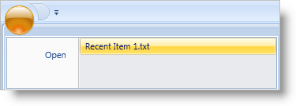

////

|metadata|
{
    "name": "xamribbon-display-a-most-recently-used-items-list",
    "controlName": ["xamRibbon"],
    "tags": ["Application Blocks","Data Presentation","How Do I"],
    "guid": "{D32663F1-AC00-405B-BBFD-1E448D4B06A1}",  
    "buildFlags": [],
    "createdOn": "2012-01-30T19:39:54.1611853Z"
}
|metadata|
////

= Display a Most Recently Used Items List

The xamRibbon™ control's application menu has a section that you can use to display a most recently used items list. You can add items to the list either at design time using Extensible Application Markup Language (XAML) or programmatically at run time. However, you will normally be adding items to the list using procedural code due to the dynamic nature of a recently used items list.

For example, if you are making an application for managing media files, you may want to implement a recently used items list. When your end user opens a media file, you can add that item to the list. The items that you add to the recent items list will depend on the file that the user opens. Implementing this functionality will require you to write procedural code due to its extremely dynamic nature.

The tool of choice for implementing a recently used items list would be the link:{ApiPlatform}ribbon{ApiVersion}~infragistics.windows.ribbon.buttontool.html[ButtonTool]. You add the ButtonTool to the link:{ApiPlatform}ribbon{ApiVersion}~infragistics.windows.ribbon.applicationmenu~recentitems.html[RecentItems] collection in the same way you link:xamribbon-add-tools-to-a-ribbon-group.html[Add Tools to a Ribbon Group]. You can also set the link:{ApiPlatform}ribbon{ApiVersion}~infragistics.windows.ribbon.buttontool~caption.html[Caption] property to display a file name and attach an event handler to the link:{ApiPlatform}ribbon{ApiVersion}~infragistics.windows.ribbon.gallerytool~itemclicked_ev.html[Click] event for executing your application logic for opening files.

The example code below demonstrates how to display a most recently used items list in the application menu.

*In XAML:*

----
<igRibbon:XamRibbon Name="xamRibbon1">
        <igRibbon:XamRibbon.ApplicationMenu>
                <igRibbon:ApplicationMenu>
<!--There has to be at least one tool in the Application Menu’s Items collection-->
                        <igRibbon:ApplicationMenu.Items>
                                <igRibbon:ButtonTool 
                                        Caption="Open" 
                                        Id="btnOpen" />
                        </igRibbon:ApplicationMenu.Items>
                        <igRibbon:ApplicationMenu.RecentItems>
                                <igRibbon:ButtonTool 
                                        Caption="Recent Item 1.txt" 
                                        Id="btnRecent1" />
                        </igRibbon:ApplicationMenu.RecentItems>
                </igRibbon:ApplicationMenu>
        </igRibbon:XamRibbon.ApplicationMenu>
</igRibbon:XamRibbon>
----

*In Visual Basic:*

----
Imports Infragistics.Windows.Ribbon
...
Dim bt As New ButtonTool()
bt.Caption = "Open"
bt.Id = "btnOpen"
Me.xamRibbon1.ApplicationMenu.Items.Add(bt)
Dim btnRecent As New ButtonTool()
btnRecent.Caption = "Recent Item 1.txt"
btnRecent.Id = "btnRecent1"
Me.xamRibbon1.ApplicationMenu.RecentItems.Add(btnRecent)
----

*In C#:*

----
using Infragistics.Windows.Ribbon;
...
ButtonTool bt = new ButtonTool();
bt.Caption = "Open";
bt.Id = "btnOpen";
this.xamRibbon1.ApplicationMenu.Items.Add(bt);
ButtonTool btnRecent = new ButtonTool();
btnRecent.Caption = "Recent Item 1.txt";
btnRecent.Id = "btnRecent1";
this.xamRibbon1.ApplicationMenu.RecentItems.Add(btnRecent);
----

== Related Topics

link:xamribbon-add-an-image-to-the-application-menu.html[Add an Image to the Application Menu]

link:xamribbon-add-tools-to-the-application-menu.html[Add Tools to the Application Menu]

link:xamribbon-add-tools-to-the-footer-toolbar.html[Add Tools to the Footer Toolbar]