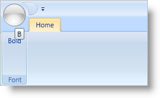

////

|metadata|
{
    "name": "xamribbon-display-custom-key-tips",
    "controlName": ["xamRibbon"],
    "tags": ["Data Presentation","How Do I","Selection"],
    "guid": "{FC9B19D5-4005-4BD8-AE63-3DA6F620AF15}",  
    "buildFlags": [],
    "createdOn": "2012-01-30T19:39:54.1661863Z"
}
|metadata|
////

= Display Custom Key Tips

You can display your own Key Tips on the application menu, a Ribbon Tab, and various Ribbon tools that support user interaction. For example, your end user will primarily interact with your application through Button, Menu, and Toggle Button tools; each displaying their own Key Tip. On the other hand, tools such as the Label and Separator tools are designed for display purposes and will not display Key Tips even if the KeyTip property is set.

Key Tips on the Quick Access Toolbar (QAT) are always auto generated. You cannot set QAT KeyTips. The first tool in the QAT's tools collection will have a KeyTip of '1'. The next tool in the collection will be '2' and so on.

The following example code demonstrates how to customize a Ribbon Tab and Button Tool's Key Tips.

*In XAML:*

----
...
<igRibbon:XamRibbon Name="xamRibbon1">
        <igRibbon:XamRibbon.Tabs>
                <igRibbon:RibbonTabItem Header="Home" KeyTip="H">
                        <igRibbon:RibbonGroup Caption="Font" Id="grpFonts">
                                <igRibbon:ButtonTool 
                                        Caption="Bold" 
                                        KeyTip="B" 
                                        Id="btnBold" />
                        </igRibbon:RibbonGroup>
                </igRibbon:RibbonTabItem>
        </igRibbon:XamRibbon.Tabs>
</igRibbon:XamRibbon>
...
----

*In Visual Basic:*

----
Imports Infragistics.Windows.Ribbon
...
Dim tab As New RibbonTabItem()
tab.Header = "Home"
tab.KeyTip = "H"
Me.xamRibbon1.Tabs.Add(tab)
Dim group As New RibbonGroup()
group.Caption = "Font"
group.Id = "grpFont"
tab.RibbonGroups.Add(group)
Dim bt As New ButtonTool()
bt.Caption = "Bold"
bt.KeyTip = "B"
bt.Id = "btnBold"
group.Items.Add(bt)
----

*In C#:*

----
using Infragistics.Windows.Ribbon;
...
RibbonTabItem tab = new RibbonTabItem();
tab.Header = "Home";
tab.KeyTip = "H";
this.xamRibbon1.Tabs.Add(tab);
RibbonGroup group = new RibbonGroup();
group.Caption = "Font";
group.Id = "grpFont";
tab.RibbonGroups.Add(group);
ButtonTool bt = new ButtonTool();
bt.Caption = "Bold";
bt.KeyTip = "B";
bt.Id = "btnBold";
group.Items.Add(bt);
----

== Related Topics

link:xamribbon-display-a-segmented-key-tip-on-a-menu-tool.html[Display a Segmented Key Tip on a Menu Tool]