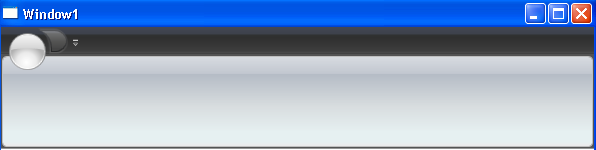
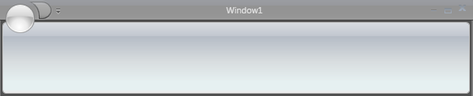

////

|metadata|
{
    "name": "xamribbon-display-xamribbon-in-the-ribbon-window",
    "controlName": ["xamRibbon"],
    "tags": ["Getting Started","How Do I","Layouts"],
    "guid": "{CE8A136B-82D1-4722-BDF2-3610A0A4D74D}",  
    "buildFlags": [],
    "createdOn": "2012-01-30T19:39:54.1691869Z"
}
|metadata|
////

= Display xamRibbon in the Ribbon Window

== Before You Begin

The xamRibbon™ control will normally display inside the client area of a Window just like any other control. This layout will place the xamRibbon below the title bar of the Window. However, you may have noticed that Microsoft® Office® 2007 applications merge the ribbon into the title bar, replacing the Window's icon with the Application Menu. To achieve this same effect, you will have to use xamRibbonWindow in conjunction with xamRibbon. This topic assumes that you know how to link:xamribbon-adding-xamribbon-to-your-application-.html[Adding xamRibbon to Your Application] .

The screen shots below illustrate the difference between using xamRibbon inside a Microsoft® Windows® Presentation Foundation Window and using xamRibbon in conjunction with xamRibbonWindow.

== What You Will Accomplish

You will use xamRibbonWindow to merge xamRibbon into the window's title bar.

== To display xamRibbon in the xamRibbonWindow:

[start=1]
. If you have not already done so, add a namespace declaration for xamRibbon inside the opening Window tag.

*In XAML:*

----
xmlns:igRibbon="http://infragistics.com/Ribbon"
----

[start=2]
. Replace the opening and closing Window tags with igRibbon:XamRibbonWindow.

*In XAML:*

----
<!--Instead of: <Window …></Window>-->
<igRibbon:XamRibbonWindow … >
</igRibbon:XamRibbonWindow>
----

[start=3]
. Add opening and closing tags for the RibbonWindowContentHost element as the first and only child of xamRibbonWindow.

You must declare the RibbonWindowContentHost element outside of any layout panels.

*In XAML:*

----
…
<igRibbon:RibbonWindowContentHost>    
        <Grid>
        <!--
        Microsoft® Windows® Presentation Foundation creates this default layout panel. You can add controls here.
        The xamRibbon control is declared outside of this layout panel.
        -->
        </Grid>
</igRibbon:RibbonWindowContentHost>
…
----

[start=4]
. Declare tags for the RibbonWindowContentHost's Ribbon property within the tags for the RibbonWindowContentHost.

You can now add XAML for a xamRibbon control inside these tags. When you add the xamRibbon control, do not set any alignment or layout related properties. The xamRibbonWindow will automatically take care of merging and situating xamRibbon at the top of the window.

*In XAML:*

----
…
<igRibbon:RibbonWindowContentHost.Ribbon>
        <igRibbon:XamRibbon />        
</igRibbon:RibbonWindowContentHost.Ribbon>
…
----

.Note
[NOTE]
====
If you are using Visual Studio® 2008 and Visual Basic, you can skip step five. In Visual Studio® 2008, any changes made in XAML will automatically update the hidden $$*$$.g.vb code file to reflect the changes you made in XAML.
====

[start=5]
. Open the code-behind and change your Window's class declaration so that you are inheriting from Infragistics.Windows.Ribbon.XamRibbonWindow instead of the default Windows® Presentation Foundation Window.

*In C#:*

----
public partial class Window1 : Infragistics.Windows.Ribbon.XamRibbonWindow
{
}
----

[start=6]
. Run the application to see xamRibbon merged into the title bar of xamRibbonWindow.

== Related Topics

link:xamribbon-add-a-status-bar-to-the-ribbon-window.html[Add a Status Bar to the Ribbon Window]