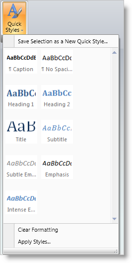
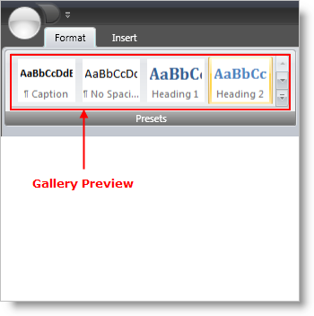
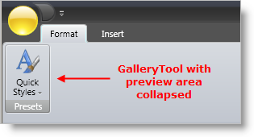
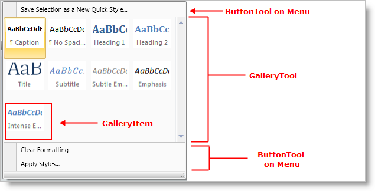
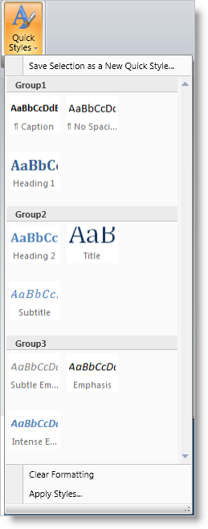

////

|metadata|
{
    "name": "xamribbon-gallery",
    "controlName": ["xamRibbon"],
    "tags": ["Data Presentation","Grouping","How Do I","Selection"],
    "guid": "{89E34047-C291-42D9-A781-D4D14A0F723E}",  
    "buildFlags": [],
    "createdOn": "2012-01-30T19:39:54.1711873Z"
}
|metadata|
////

= Gallery

== Overview

The Gallery tool emulates the functionality found in the Microsoft® Office® 2007 Galleries feature. While menus provide a textual list of selectable actions, Galleries provide a visual list of options.

For example, you could create a QuickStyles Gallery to provide a visual list of potential style settings to choose from, rather than simply providing text based menu options or Ribbon buttons for setting style properties.

== Gallery Preview

Microsoft Office 2007 Galleries can also display a preview of their contained items directly in the Ribbon so that users can select from the Gallery without dropping down the GalleryTool. The Gallery tool supports this optional preview capability.

To display a Preview in the Ribbon for a Gallery tool, set the ShouldDisplayGalleryPreview property to true on the Menu tool that contains the Gallery tool.

== Gallery Preview Resizing

The Gallery tool preview will resize as the Ribbon Group it is contained in is resized. If the Gallery tool is displaying a preview in the Ribbon, GalleryItems will be removed from the preview area display as the Ribbon Group is resized smaller. Once it reaches a certain threshold width, the Gallery tool preview area will disappear completely and just the MenuTool containing the GalleryTool will be visible in the Ribbon area.

There are two ways in which you can control how the Gallery Preview resizes.

* GroupVariants - Each RibbonGroup exposes a GroupVariants property, which is a collection of GroupVariant objects. GroupVariant objects are used to determine the order and type of resize action that will occur when a Ribbon Group is resized. One of the possible resize actions is ReduceGalleryPreviewItems, which reduces the number of GalleryItems for a Gallery tool Preview from the GalleryTool.MaxPreviewColumns to GalleryTool.MinPreviewColumns. By adding a GroupVariant with a ResizeAction of ReduceGalleryPreviewItems to the RibbonGroup.GroupVariants collection, you can determine when the Gallery Preview resizes with respect to other tools in the Ribbon Group.
* Adjust the number of Gallery Preview columns - set the GalleryTool.MinPreviewColumns and the GalleryTool.MaxPreviewColumns properties to control the effective width of the Gallery Preview area.

== GalleryTools and MenuTools

The Gallery tool is designed to be used on Menu tools only. In fact, the Gallery tool will throw an exception if it is placed anywhere else in xamRibbon.

.Note
[NOTE]
====
other tools can be placed on the Menu tool along with the Gallery tool, but they will only be displayed in the drop-down portion of the menu (just as with any menu), not in the preview area.
====

The following screen shot demonstrates a MenuTool containing a Gallery tool with one Button tool above the Gallery and two Button tools below the Gallery.

To display a preview in the Ribbon for a Gallery tool, set the ShouldDisplayGalleryPreview property to True on the Menu tool that contains the Gallery tool.

To control the width of the Gallery tool area in the Menu tool drop-down box, use the MinDropDownColumns, MaxDropDownColumns and PreferredDropDownColumns properties on the Gallery tool.

* MinDropDownColumns - The minimum number of GalleryItem columns to display in the Gallery tool area of the Menu tool drop-down box. The user will not be able to resize the Menu tool drop-down box smaller than the size required to display this many GalleryItem columns.
* MaxDropDownColumns - The maximum number of GalleryItem columns to display in the Gallery tool area of the Menu tool drop-down box.
* PreferredDropDownColumns - The number of GalleryItem columns to display in the Gallery tool area of the Menu tool drop-down box when the drop-down box is first displayed.

== GalleryItems

Each GalleryItem can contain text and/or an image, as well as a GalleryItemSettings object that contains properties that affect the layout and behavior of GalleryItems. The GalleryItemSettings object is exposed on:

* The GalleryItem itself - Any settings specified here take precedence over settings (if any) at a higher level.
* The GalleryItemGroup - Any settings specified here apply to all GalleryItems in the Group and take precedence over settings (if any) at a higher level. Settings made here (if any) will not override corresponding settings (if any) on contained GalleryItems
* The GalleryTool - Any settings specified here apply to all GalleryItems in the Gallery tool. Settings made here (if any) will not override corresponding settings (if any) on contained GalleryGroups and GalleryItems.

The following GalleryItemSettings properties determine how and whether the text and image are displayed in the Galleryitem:

* TextPlacement - determines the placement of the GalleryItem's text with respect to its image. Valid placements are AboveImage, BelowImage, LeftOfImage, and RightOfImage
* TextDisplayMode - determines when the GalleryItem text is displayed. Settings include Always, OnlyInDropDown, and Never.
* HorizontalTextAlignment / VerticalTextAlignment - determines the alignment of the GalleryItem text with respect to the GalleryItem area
* SelectionDisplayMode - determines how a GalleryItem is visually highlighted when it is selected. Settings include None, HighlightImageOnly,and HighlightEntireItem

== GalleryItemGroups

Similar to Microsoft Office 2007, the Gallery tool can display GalleryItems in separate groups, each with its own descriptive header. The following example shows the drop-down portion of a Menu tool that contains:

* One ButtonTool above the GalleryTool.
* Two ButtonTools below the GalleryTool.
* A GalleryTool that contains three GalleryItemGroups (Group1, Group2, and Group3), each with a different set of items.

.Note
[NOTE]
====
A GalleryItem can appear in more than one GalleryItemGroup.
====

The following XAML demonstrates how to create a Menu tool that is similar in structure to the screenshot above:

*In XAML:*

----
xmlns:igRibbon="http://infragistics.com/Ribbon"
  xmlns:s="clr-namespace:System;assembly=mscorlib"
<igRibbon:MenuTool Caption="Quick Styles" 
  LargeImage="\Images\QuickStyles_32x32.png">
        <igRibbon:CheckBoxTool Caption="XamRibbon CheckBox Tool" 
          SmallImage="\Images\BlueQuestionMark.png"/>
        <igRibbon:ButtonTool Caption="Save Selection as a New Quick Style" 
          SmallImage="\Images\16x16.png"/>
                <igRibbon:GalleryTool Id="galleryTool1">
                <igRibbon:GalleryTool.Groups>
                        <igRibbon:GalleryItemGroup Title="Group1">
                                <s:String>Item1</s:String>
                                <s:String>Item2</s:String>
                                <s:String>Item3</s:String>
                        </igRibbon:GalleryItemGroup>
                        <igRibbon:GalleryItemGroup Title="Group2">
                                <s:String>Item4</s:String>
                                <s:String>Item5</s:String>
                                <s:String>Item6</s:String>
                        </igRibbon:GalleryItemGroup>
                        <igRibbon:GalleryItemGroup Title="Group3">
                                <s:String>Item7</s:String>
                                <s:String>Item8</s:String>
                                <s:String>Item9</s:String>
                                <s:String>Item10</s:String>
                                <s:String>Item11</s:String>
                        </igRibbon:GalleryItemGroup>
                </igRibbon:GalleryTool.Groups>
        <igRibbon:GalleryTool.Items>
                <igRibbon:GalleryItem Key="Item1" Text="Item1 - Extra Long Text"  
                  Image="\Images\GalleryItem1.png"/>
                <igRibbon:GalleryItem Key="Item2" Text="Item2" 
                  Image="\Images\GalleryItem2.png"/>
                <igRibbon:GalleryItem Key="Item3" Text="Item3" 
                  Image="\Images\GalleryItem3.png"/>
                <igRibbon:GalleryItem Key="Item4" Text="Item4" 
                  Image="\Images\GalleryItem4.png"/>
                <igRibbon:GalleryItem Key="Item5" Text="Item5" 
                  Image="\Images\GalleryItem5.png"/>
                <igRibbon:GalleryItem Key="Item6" Text="Item6" 
                  Image="\Images\GalleryItem6.png"/>
                <igRibbon:GalleryItem Key="Item7" Text="Item7" 
                  Image="\Images\GalleryItem7.png"/>
                <igRibbon:GalleryItem Key="Item8" Text="Item8" 
                  Image="\Images\GalleryItem8.png"/>
                <igRibbon:GalleryItem Key="Item9" Text="Item9" 
                  Image="\Images\GalleryItem9.png"/>
                <igRibbon:GalleryItem Key="Item10" Text="Item10" 
                  Image="\Images\GalleryItem10.png"/>
                <igRibbon:GalleryItem Key="Item11" Text="Item11" 
                  Image="\Images\GalleryItem11.png"/>
        </igRibbon:GalleryTool.Items>
</igRibbon:GalleryTool>
----

== GalleryItem Selection and Activation

The Gallery tool supports both Activation and Selection of the GalleryItems contained within it.

Selection is a persistent state for a GalleryItem and there can only be one GalleryItem selected in a Gallery tool at any given time. A GalleryItem becomes selected when:

[start=1]
. The user clicks on a GalleryItem in the UI
[start=2]
. The SelectedItem property of the GalleryTool is set to a GalleryItem
[start=3]
. The IsSelected property of a GalleryItem is set to True.

When a GalleryItem is selected by any of the above methods, the Gallery tool's ItemSelected event is raised.

Activation is a temporary state for a GalleryItem and occurs when the user moves the mouse pointer over the GalleryItem and it remains there for a certain period of time as specified by the Gallery tool's ActivationActionDelay and ActivationInitialActionDelay properties. Once the specified delay period has expired with the mouse remaining over the GalleryItem, the GalleryTool.ItemActivated event is fired.

The usage of the two Gallery tool properties mentioned above can be described as follows:

* ActivationInitialActionDelay - the delay threshold used when the mouse pointer hovers over an item for the first time after entering the Gallery preview area or the Gallery drop down area.
* ActivationActionDelay - the delay threshold is used when the mouse pointer hovers over subsequent items.

When the mouse exits the overall Gallery tool area, the Gallery tool reverts to using the ActivationInitialActionDelay property the next time the mouse pointer enters the Gallery tool area and hovers over an item for the first time.

* link:xamribbon-add-a-galleryitem-to-a-gallerytool.html[Add a GalleryItem to a GalleryTool]
* link:xamribbon-add-a-gallerytool-to-a-ribbongroup.html[Add a GalleryTool to a RibbonGroup]
* link:xamribbon-create-groups-of-galleryitems.html[Create Groups of GalleryItems]
* link:xamribbon-creating-a-live-preview.html[Creating a Live Preview]