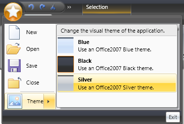

////

|metadata|
{
    "name": "xamribbon-menu",
    "controlName": ["xamRibbon"],
    "tags": ["Data Presentation","Events","Getting Started","How Do I","Navigation","Selection"],
    "guid": "{D54E8797-B6E3-4BF0-8B72-4B8340BA92F6}",  
    "buildFlags": [],
    "createdOn": "2012-01-30T19:39:54.1821895Z"
}
|metadata|
////

= Menu

== Overview

The Menu tool is an ItemsControl-derived control that displays its contained tool items inside a pop-up. It can be added to a RibbonGroup directly or nested inside a ToolVerticalWrapPanel, ToolHorizontalWrapPanel, or ButtonGroup. It can also be added as a tool item in another Menu tool, in the Application Menu, in the Application Menu's RecentItems collection, or the Application Menu's Footer toolbar.

In addition to the standard tool properties, MenuTool exposes the MenuItemDescription and HasMenuItemDescription attached properties, which apply to its contained items.

For example, the following screen shot shows an example of a MenuTool inside of the ApplicationMenu.

In order to accomplish this in your application using the xamRibbon control, you would add four ButtonTools (New, Open, Save, Close) followed by one MenuTool (Theme) to xamRibbon's Application Menu.

Inside the 'Theme' MenuTool, you would add three ButtonTools. You would set each ButtonTool’s LargeImage property to supply its icon, Caption property to supply its title (e.g. 'Blue') and MenuTool.MenuItemDescription attached property to supply the description (e.g. 'Use an Office2007 Blue theme').

The Menu tool's MenuItemDescriptionMinWidth property could also be set to control how wide the description area will be.

The following XAML illustrates how to set these properties:

*In XAML:*

----
<igRibbon:XamRibbonWindow x:Class="MyRibbonApp.Window1"
  xmlns="http://schemas.microsoft.com/winfx/2006/xaml/presentation"
  xmlns:x="http://schemas.microsoft.com/winfx/2006/xaml"
  xmlns:igRibbon="http://infragistics.com/Ribbon"
  xmlns:igEditors="http://infragistics.com/Editors"
  xmlns:igWindows="http://infragistics.com/Windows"
  Title="MyRibbonWindow" Height="300" Width="300"
  >
        <igRibbon:XamRibbonWindow.Ribbon>
                <igRibbon:XamRibbon>
                        <igRibbon:XamRibbon.ApplicationMenu>
                                <igRibbon:ApplicationMenu>
                                        <igRibbon:ButtonTool
                                          Caption="_New"
                                          Command="{x:Static ApplicationCommands.New}"/>
                                        <igRibbon:MenuTool
                                          Caption="_Theme"
                                          ButtonType="Segmented"
                                          LargeImage="\Images\Theme.png"
                                          MenuItemDescriptionMinWidth="220">
                                                <igRibbon:ButtonTool
                                                  Caption="Blue"
                                                  LargeImage="\Images\BlueTheme.png"
                                                  igRibbon:MenuToolBase.MenuItemDescription="Use an Office2007 Blue theme"
                                                  />
                                        </igRibbon:MenuTool>
                                </igRibbon:ApplicationMenu>
                        </igRibbon:XamRibbon.ApplicationMenu>
                </igRibbon:XamRibbon>
        </igRibbon:XamRibbonWindow.Ribbon>
        <Grid>
                ...
        </Grid>
        <igRibbon:XamRibbonWindow.StatusBar>
                <StatusBar>
                </StatusBar>
        </igRibbon:XamRibbonWindow.StatusBar>
</igRibbon:XamRibbonWindow>
----

== Properties:

In addition to the standard tool properties (e.g. Caption, HasCaption, Id, KeyTip, LargeImage etc.), the Menu tool exposes the following additional properties:

* ButtonType - MenuToolButtonType enumeration with the following values:

** DropDown (default) - Pressing the left mouse down anywhere on the menu tool will toggle the tool’s IsOpen property, raising either the Closed event or the Opening/Opened event pair.

** Segmented - The tool is segmented into two button areas. Pressing the left mouse down on one area will toggle the tool's IsOpen property, raising either the Closed event or the Opening/Opened event pair. Clicking on the other area with the left mouse button will raise the tool’s Click event.

.Note
[NOTE]
====
this event is raised on the mouse up.
====

** SegmentedState - The tool is segmented into two button areas. Pressing the left mouse down on one area will toggle the tool's IsOpen property raising either the Closed event or the Opening/Opened event pair. Clicking on the other area with the left mouse button will raise the tool's Checked or Unchecked event.

.Note
[NOTE]
====
these events are raised on the mouse up.
====

* Command, CommandTarget, CommandParameter -- these correspond to the same properties of the standard ButtonBase class.
* IsChecked - This Boolean property only applies if the ButtonType property is set to 'SegmentedState'.
* IsOpen - This Boolean property reflects the pop-up's open state.
* KeyTipForSegmentedButton - Since segmented buttons have two key tips, this property sets the key tip that applies to the button that raises the Click event or toggles the 'IsChecked' state if the ButtonType is 'SegmentedState'.
* MenuItemDescription - This attached string property is used to set the description for tool items within the menu. There is a corresponding read-only Boolean 'HasMenuItemDescription' property that can be used in template triggers to show/hide the description area.
* MenuItemDescriptionMinWidth - This property of type Double helps determine how wide the child menu items will be. The width of all items will be the width of the widest item taking into account each item's Image and Caption. If the widest caption is less than the MenuItemDescriptionMinWidth then the MenuItemDescriptionMinWidth value will be used to size the caption area.
* ShouldDisplayGalleryPreview - If this Boolean property is set to True (it defaults to False), the gallery tool preview will be displayed if the MenuTool is within a RibbonGroup.

.Note
[NOTE]
====
a MenuTool can contain no more than one GalleryTool.
====

* If the MenuTool does not contain a GalleryTool then this property is ignored.
* UseLargeImages - This property determines if large or small images will be used for every contained menu item. By default, small images are used for menu items, except for menu items in the Application Menu or a submenu off the Application Menu.

== Events:

The Menu tool raises the following events:

* Checked - this event is raised only for Menu tools whose ButtonType property is set to 'SegmentedState'. It occurs when the Menu tool's IsChecked property is toggled to True, usually as a result of the user clicking the left mouse button over the segmented button part of the tool. This state change occurs on the mouse up.
* Clicked - this event is raised only for Menu tools whose ButtonType property is set to 'Segmented'. It occurs when the user clicks the left mouse button over the segmented button part of the tool. It is raised on the mouse up.
* Cloned - this event is raised when the Menu tool is cloned. For example, when the user adds the Menu tool to the Quick Access Toolbar from the tool's context menu or adds the RibbonGroup that contains the Menu tool to the Quick Access Toolbar.

.Note
[NOTE]
====
In addition to the OriginalTool and the ClonedTool, the event arguments expose a read-only EventHandlersAttached boolean property. The part of the cloning process that copies event handlers from the original tool to the clone requires reflection rights. Therefore, in an XBAP application that is sandboxed, we don't have those rights. In this case you could wire up the appropriate event handlers here.
====

* CloneDiscarded - this event occurs when a clone of a Menu tool has been discarded.
* Closed - this event occurs when the Menu tool's Popup has closed.
* Opening - this event occurs when the Menu tool's pop-up is about to open. It can be used to delay the population of the contents of the Menu tool until it is about to open. However, you can only modify the Items collection of an original MenuTool, not a clone. Therefore, the Tool property exposed by the event arguments returns the original tool even if a clone is being opened.

.Note
[NOTE]
====
The Menu tool must have at least one item that is enabled in order for it to open. If the Menu tool doesn't contain at least one enabled tool, it will not open and will appear disabled. This is in accordance with the Microsoft Office 2007 UI Guideline requirements.
====

* Opened - this event occurs when the Menu tool's pop-up has opened.
* Unchecked - this event is raised only for Menu tools whose ButtonType property is set to 'SegmentedState'. The event occurs when the Menu tool's IsChecked property is toggled to False, usually as a result of the user clicking the left mouse button over the segmented button part of the tool. This state change occurs on the mouse up.